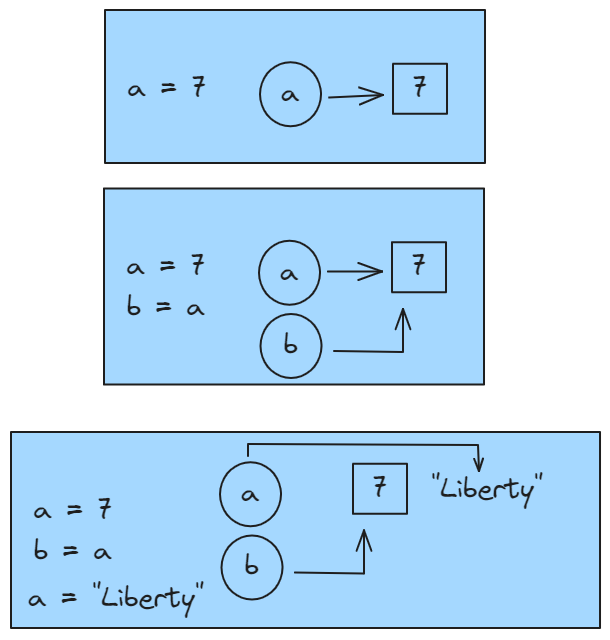

<h1 align="center"> Python </h1>

# Content

1. [Chapter 1: Rapid Introduction to Procedural Programming](#chapter1)
    - [Chapter 1 - Part 1: Creating and Running Python Programs](#chapter1part1)
    - [Chapter 1 - Part 2: Data Types in Python](#chapter1part2)
    - [Chapter 1 - Part 3: Object References in Python](#chapter1part3)
    - [Chapter 1 - Part 4: Collection Data Types in Python](#chapter1part4)
    - [Chapter 1 - Part 5: Logical Operations in Python](#chapter1part5)
      - [Chapter 1 - Part 5.1: The Identity Operator](#chapter1part5.1)
      - [Chapter 1 - Part 5.2: Comparison Operators](#chapter1part5.2)
      - [Chapter 1 - Part 5.3: The Membership Operator](#chapter1part5.3)
      - [Chapter 1 - Part 5.4: Logical Operators](#chapter1part5.4)
    - [Chapter 1 - Part 6: Control Flow Statements in Python](#chapter1part6)
      - [Chapter 1 - Part 6.1: The if Statement](#chapter1part6.1)
      - [Chapter 1 - Part 6.2: The while Statement](#chapter1part6.2)
      - [Chapter 1 - Part 6.3: The for …in Statement](#chapter1part6.3)
      - [Chapter 1 - Part 6.4: Basic Exception Handling](#chapter1part6.4)
    - [Chapter 1 - Part 7: Arithmetic Operators in Python](#chapter1part7)
    - [Chapter 1 - Part 8: Input/Output in Python](#chapter1part8)
    - [Chapter 1 - Part 9: Creating and Calling Functions in Python](#chapter1part9)
2. [Chapter 2: Data Types](#chapter2)
    - [Chapter 2 - Part 1: Identifiers and Keywords](#chapter2part1)
    - [Chapter 2 - Part 2: Integral Types](#chapter2part2)
      - [Chapter 2 - Part 2.1: Integers](#chapter2part2.1)
      - [Chapter 2 - Part 2.2: Booleans](#chapter2part2.2)
      - [Chapter 2 - Part 2.3: Integer Bitwise Operators](#chapter2part2.3)
    - [Chapter 2 - Part 3: Floating-Point Types](#chapter2part3)
      - [Chapter 2 - Part 3.1: Floating-Point Numbers](#chapter2part3.1)
      - [Chapter 2 - Part 3.2: Complex Numbers](#chapter2part3.2)
      - [Chapter 2 - Part 3.3: Decimal Numbers](#chapter2part3.3)
    - [Chapter 2 - Part 4: Strings](#chapter2part4)
      - [Chapter 2 - Part 4.1: Comparing Strings](#chapter2part4.1)
      - [Chapter 2 - Part 4.2: Slicing and Striding Strings](#chapter2part4.2)
      - [Chapter 2 - Part 4.3: String Operators and Methods](#chapter2part4.3)
      - [Chapter 2 - Part 4.4: String Formatting with the str.format() Method](#chapter2part4.4)
      - [Chapter 2 - Part 4.5: Field Names](#chapter2part4.5)
      - [Chapter 2 - Part 4.6: Conversions](#chapter2part4.6)
      - [Chapter 2 - Part 4.7: Format Specifications](#chapter2part4.7)
      - [Chapter 2 - Part 4.8: Character Encodings](#chapter2part4.8)
3. [Chapter 3: Collection Data Types](#chapter3)
    - [Chapter 3 - Part 1: Sequence Types](#chapter3part1)
      - [Chapter 3 - Part 1.1: Tuples](#chapter3part1.1)
      - [Chapter 3 - Part 1.2: Named Tuples](#chapter3part1.2)
      - [Chapter 3 - Part 1.3: Lists](#chapter3part1.3)
      - [Chapter 3 - Part 1.4: List Comprehensions](#chapter3part1.4)
    - [Chapter 3 - Part 2: Set Types](#chapter3part2)
      - [Chapter 3 - Part 2.1: Sets](#chapter3part2.1)
      - [Chapter 3 - Part 2.2: Set Comprehensions](#chapter3part2.2)
      - [Chapter 3 - Part 2.3: Frozen Sets](#chapter3part2.3) 
    - [Chapter 3 - Part 3: Mapping Types](#chapter3part3)
      - [Chapter 3 - Part 3.1: Dictionaries](#chapter3part3.1)
      - [Chapter 3 - Part 3.2: Dictionary Comprehensions](#chapter3part3.2)
      - [Chapter 3 - Part 3.3: Default Dictionaries](#chapter3part3.3)
      - [Chapter 3 - Part 3.4: Ordered Dictionaries](#chapter3part3.4)
    - [Chapter 3 - Part 4: Iterating and Copying Collections](#chapter3part4)
      - [Chapter 3 - Part 4.1: Iterators and Iterable Operations and Functions](#chapter3part4.1)
      - [Chapter 3 - Part 4.2: Copying Collections](#chapter3part4.2)
4. [Chapter 4: Control Structures and Functions](#chapter4)
    - [Chapter 4 - Part 1: Control Structures](#chapter4part1)
      - [Chapter 4 - Part 1.1: Conditional Branching](#chapter4part1.1)
      - [Chapter 4 - Part 1.2: Looping](#chapter4part1.2)
      - [Chapter 4 - Part 1.3: While Loops](#chapter4part1.3)
      - [Chapter 4 - Part 1.4: For Loops](#chapter4part1.4)
    - [Chapter 4 - Part 2: Exception Handling](#chapter4part2)
      - [Chapter 4 - Part 2.1: Catching and Raising Exceptions](#chapter4part2.1)
      - [Chapter 4 - Part 2.2: Raising Exceptions](#chapter4part2.2)
      - [Chapter 4 - Part 2.3: Custom Exceptions](#chapter4part2.3)
    - [Chapter 4 - Part 3: Custom Functions](#chapter4part3)
      - [Chapter 4 - Part 3.1: Names and Docstrings](#chapter4part3.1)
      - [Chapter 4 - Part 3.2: Argument and Parameter Unpacking](#chapter4part3.2)
      - [Chapter 4 - Part 3.3: Accessing Variables in the Global Scope](#chapter4part3.3)
      - [Chapter 4 - Part 3.4: Lambda Functions](#chapter4part3.4)
      - [Chapter 4 - Part 3.5: Assertions](#chapter4part3.5)
5. [Chapter 5: Modules](#chapter5)
    - [Chapter 5 - Part 1: Modules and Packages](#chapter5part1)
      - [Chapter 5 - Part 1.1: Packages](#chapter5part1.1)
      - [Chapter 5 - Part 1.2: Custom Modules](#chapter5part1.2)
      - [Chapter 5 - Part 1.3: The TextUtil Module](#chapter5part1.3)
      - [Chapter 5 - Part 1.4: The CharGrid Module](#chapter5part1.4)
    - [Chapter 5 - Part 2: Overview of Python’s Standard Library](#chapter5part2)
      - [Chapter 5 - Part 2.1: String Handling](#chapter5part2.1)
      - [Chapter 5 - Part 2.2: Command-Line Programming](#chapter5part2.2)
      - [Chapter 5 - Part 2.3: Mathematics and Numbers](#chapter5part2.3)
      - [Chapter 5 - Part 2.4: Times and Dates](#chapter5part2.4)
      - [Chapter 5 - Part 2.5: Algorithms and Collection Data Types](#chapter5part2.5)
      - [Chapter 5 - Part 2.6: File Formats, Encodings, and Data Persistence](#chapter5part2.6)
      - [Chapter 5 - Part 2.7: File, Directory, and Process Handling](#chapter5part2.7)
      - [Chapter 5 - Part 2.8: Networking and Internet Programming](#chapter5part2.8)
      - [Chapter 5 - Part 2.9: XML](#chapter5part2.9)
      - [Chapter 5 - Part 2.10: Other Modules](#chapter5part2.10)  
6. [Chapter 6: Object-Oriented Programming](#chapter6)
    - [Chapter 6 - Part 1: The Object-Oriented Approach](#chapter6part1)
      - [Chapter 6 - Part 1.1: Object-Oriented Concepts and Terminology](#chapter6part1.1)
    - [Chapter 6 - Part 2: Custom Classes](#chapter6part2)
      - [Chapter 6 - Part 2.1: Attributes and Methods](#chapter6part2.1)
      - [Chapter 6 - Part 2.2: Inheritance and Polymorphism](#chapter6part2.2)
      - [Chapter 6 - Part 2.3: Using Properties to Control Attribute Access](#chapter6part2.3)
      - [Chapter 6 - Part 2.4: Creating Complete Fully Integrated Data Types](#chapter6part2.4)
      - [Chapter 6 - Part 2.5: Creating Data Types from Scratch](#chapter6part2.5)
      - [Chapter 6 - Part 2.6: Creating Data Types from Other Data Types](#chapter6part2.6)
    - [Chapter 6 - Part 3: Custom Collection Classes](#chapter6part3)
      - [Chapter 6 - Part 3.1: Creating Classes That Aggregate Collections](#chapter6part3.1)
      - [Chapter 6 - Part 3.2: Creating Collection Classes Using Aggregation](#chapter6part3.2)
      - [Chapter 6 - Part 3.3: Creating Collection Classes Using Inheritance](#chapter6part3.3)
7. [Chapter 7: File Handling](#chapter7)
    - [Chapter 7 - Part 1: Writing and Reading Binary Data](#chapter7part1)
      - [Chapter 7 - Part 1.1: Pickles with Optional Compression](#chapter7part1.1)
      - [Chapter 7 - Part 1.2: Raw Binary Data with Optional Compression](#chapter7part1.2)
    - [Chapter 7 - Part 2: Writing and Parsing Text Files](#chapter7part2)
      - [Chapter 7 - Part 2.1: Writing Text](#chapter7part2.1)
      - [Chapter 7 - Part 2.2: Parsing Text](#chapter7part2.2)
      - [Chapter 7 - Part 2.3: Parsing Text Using Regular Expressions](#chapter7part2.3)
    - [Chapter 7 - Part 3: Writing and Parsing XML Files](#chapter7part3)
      - [Chapter 7 - Part 3.1: Element Trees](#chapter7part3.1)
      - [Chapter 7 - Part 3.2: DOM (Document Object Model)](#chapter7part3.2)
      - [Chapter 7 - Part 3.3: Manually Writing XML](#chapter7part3.3)
      - [Chapter 7 - Part 3.4: Parsing XML with SAX (Simple API for XML)](#chapter7part3.4)
    - [Chapter 7 - Part 4: Random Access Binary Files](#chapter7part4)
      - [Chapter 7 - Part 4.1: A Generic BinaryRecordFile Class](#chapter7part4.1)
      
    
## <a name="chapter1"></a>Chapter 1: Rapid Introduction to Procedural Programming

#### <a name="chapter1part1"></a>Chapter 1 - Part 1: Creating and Running Python Programs

Python code can be written using any plain text editor that can load and save text using either the ASCII or the UTF-8 Unicode character encoding.

By default, Python files are assumed to use the UTF-8 character encoding, a superset of ASCII that can represent pretty well every character in every language. 

Python files normally have an extension of .py, although on some Unix-like systems (e.g., Linux and Mac OS X) some Python applications have no extension, and Python GUI (Graphical User Interface) programs usually have an extension of .pyw, particularly onWindows and Mac OSX.

Create a file called hello.py in a plain text editor with the following contents:

```py
#!/usr/bin/env python3

print("Hello", "World!")
```

The first line is a comment. In Python,commentsbegin with a # and continue to the end of the line.

The second line is blank—outside quoted strings, Python ignores blank lines, but they are often useful to humans to break up large blocks of code to make them easier to read.

The third line is Python code. Here, the print() function is called with two arguments, each of type str (string; i.e., a sequence of characters).

Each statement encountered in a .py file is executed in turn, starting with the first one and progressing line by line. This is different from some other languages, for example, C++ and Java, which have a particular function or method with a special name where they start from.

We will assume that Windows users keep their Python code in the C:\py3eg directory and that Unix (i.e., Unix, Linux, and Mac OS X) users keep their code in the $HOME/py3eg directory. Save hello.py into the py3eg directory and close the text editor.

Now that we have a program, we can run it. Python programs are executed by the Python interpreter, and normally this is done inside a console window.

On Windows the console is called "Command Prompt"

On Mac OS X the console is provided by the Terminal.app program (located in Applications/Utilities by default), available using Finder, and on other Unixes,we can use an xterm or the console provided by the windowing environment, for example, konsole or gnome-terminal.

Start up a console, and on Windows enter the following commands

```
C:\>cd c:\py3eg
C:\py3eg\>c:\python31\python.exe hello.py
```

Unix users enter this instead (assuming that Python 3 is in the PATH):*

```
$ cd $HOME/py3eg
$ python3 hello.py
```

In both cases the output should be the same:

```
Hello World!
```

Although the program has just one executable statement, by running it we can infer some information about the print() function. For one thing, print() is a built-in part of the Python language—we didn’t need to “import” or “include” it from a library to make use of it. Also, it separates each item it prints with a single space, and prints a newline after the last item is printed.

#### <a name="chapter1part2"></a>Chapter 1 - Part 2: Data Types in Python

In programming, data type is an important concept.

Variables can store data of different types, and different types can do different things.

Python has the following data types built-in by default, in these categories:

- Text Type: ```str```
- Numeric Types: ```int```, ```float```, ```complex```
- Sequence Types: ```list```, ```tuple```, ```range```
- Mapping Type: ```dict```
- Set Types: ```set```, ```frozenset```
- Boolean Type: ```bool```
- Binary Types: ```bytes```, ```bytearray```, ```memoryview```
- None Type: ```NoneType```

Python represents integers (positive and negative whole numbers) using the int type, and it represents strings (sequences of Unicode characters) using the str type.

**Integers Examples**

```
-973
210624583337114373395836055367340864637790190801098222508621955072
0
```

Incidentally, the second number shown is the size of Python’s integers is limited only by machine memory, not by a fixed number of bytes.

**Strings Examples**

```
"Infinitely Demanding"
'Simon Critchley'
'positively αβγ ÷©'
''
```

Strings can be delimited by double or single quotes, as long as the same kind are used at both ends, and since Python uses Unicode, strings are not limited to ASCII characters, as the penultimate string shows. An empty string is simply one with nothing between the delimiters.

Python uses square brackets ([]) to access an item from a sequence such as
a string.

```py
print("Hard Times"[5])
```

```
T
```

```py
print("giraffe"[0])
```

```
g
```

In Python, both str and the basic numeric types such as int are immutable, that is, once set, their value cannot be changed.

To convert a data item from one type to another we can use the syntax datatype(item).

```py
int("45")
```

```py
str(912)
```

The int() conversion is tolerant of leading and trailing whitespace, so int(" 45 ") would have worked just as well. The str() conversion can be
applied to almost any data item. We can easily make our own custom data types support str() conversion, and also int() or other conversions if they make sense.
If a conversion fails, an exception is raised

#### <a name="chapter1part3"></a>Chapter 1 - Part 3: Object References in Python

Python doesn’t have variables as such, but instead has object references.

When it comes to immutable objects like ints and strs, there is no discernable difference between a variable and an object reference.

As for mutable objects, there is a difference, but it rarely matters in practice.

Let’s look at a few tiny examples, and then discuss some of the details.

```py
x = "blue"
y = "green"
z = x
```

The syntax is simply objectReference = value.

When Python executes the first statement it creates a str object with the text “blue”, and creates an object reference called x that refers to the str object.

For all practical purposes we can say that “variable x has been assigned the ‘blue’ string”. The second statement is similar. The third statement creates a new object reference called z and sets it to refer to the same object that the x object reference refers to (in this case the str containing the text “blue”).

The = operator is not the same as the variable assignment operator in some other languages. The = operator binds an object reference to an object in memory. If the object reference already exists, it is simply re-bound to refer to the object on the right of the = operator if the object reference does not exist it is created by the = operator.

```py
print(x, y, z) # prints: blue green blue
z = y
print(x, y, z) # prints: blue green green
x = z
print(x, y, z) # prints: green green green
```

After the fourth statement (x = z), all three object references are referring to the same str. Since there are no more object references to the “blue” string, Python is free to garbage-collect it.

<br>

<div align="center"><br><sub>Object references and objects (The circles represent object references.The rectangles represent objects in memory.) - (<a href='https://github.com/vitorstabile'>Work by Vitor Garcia</a>) </sub></div>

<br>

The names used for object references (called identifiers) have a few restrictions. In particular, they may not be the same as any of Python’s keywords, and must start with a letter or an underscore and be followed by zero or more nonwhitespace letter, underscore, or digit characters. There is no length limit, and the letters and digits are those defined by Unicode, that is, they include, but are not limited to, ASCII’s letters and digits (“a”, “b”, …, “z”, “A”, “B”,…, “Z”, “0”, “1”, …, “9”). Python identifiers are case-sensitive, so for example, LIMIT, Limit, and limit are three different identifiers.

Python uses dynamic typing, which means that an object reference can be rebound to refer to a different object (which may be of a different data type) at any time. Languages that use strong typing (such as C++ and Java) allow only those operations that are defined for the data types involved to be performed. Python also applies this constraint, but it isn’t called strong typing in Python’s case because the valid operations can change—for example, if an object reference is re-bound to an object of a different data type.

```py
route = 866
print(route, type(route)) # prints: 866 <class 'int'>
```

```py
route = "North"
print(route, type(route)) # prints: North <class 'str'>
```

Here we create a new object reference called route and set it to refer to a new int of value 866. At this point we could use / with route since division is a valid operation for integers. Then we reuse the route object reference to refer to a new str of value “North”, and the int object is scheduled for garbage collection since now no object reference refers to it. At this point using / with route would cause a TypeError to be raised since / is not a valid operation for a string.

The type() function returns the data type (also known as the "class”) of the data item it is given—this function can be very useful for testing and debugging.

#### <a name="chapter1part4"></a>Chapter 1 - Part 4: Collection Data Types in Python

There are four collection data types in the Python programming language:

- List: is a collection which is ordered and changeable. Allows duplicate members.
- Tuple: is a collection which is ordered and unchangeable. Allows duplicate members.
- Set: is a collection which is unordered, unchangeable*, and unindexed. No duplicate members.
- Dictionary: is a collection which is ordered** and changeable. No duplicate members.

But here we will introduce just two: tuple and list. Python tuples and lists can be used to hold any number of data items of any data types. Tuples are immutable, so once they are created we cannot change them. Lists are mutable, so we can easily insert items and remove items whenever we want.

Tuples are created using commas (,), as these examples show

```py
print("Denmark", "Finland", "Norway", "Sweden") # prints: ('Denmark', 'Finland', 'Norway', 'Sweden')
```

```py
print("one",) # prints: ('one',)
```

An empty tuple is created by using empty parentheses, (). The comma is also used to separate arguments in function calls, so if we want to pass a tuple literal as an argument we must enclose it in parentheses to avoid confusion.

Here are some example lists:

```py
print([1, 4, 9, 16, 25, 36, 49])
print(['alpha', 'bravo', 'charlie', 'delta', 'echo'])
print(['zebra', 49, -879, 'aardvark', 200])
print([])
```

One way to create a list is to use square brackets ([]). The fourth list shown is an empty list.

When lists and tuples are created (and when items are inserted in the case of lists), they take copies of the object references they are given. In the case of literal items such as integers or strings, an object of the appropriate
data type is created in memory and suitably initialized, and then an object reference referring to the object is created, and it is this object reference that is put in the list or tuple.

Tuples, lists, and strings are “sized”, that is, they are data types that have a notion of size, and data items of any such data type can be meaningfully passed to the len() function. (An exception is raised if a nonsized data item is passed to len().)

```py
len(("one",)) # 1
```

```py
len([3, 5, 1, 2, "pause", 5]) # 6
```

```py
len("automatically") # 13
```

All Python data items are objects (also called instances) of a particular data type (also called a class)

Essentially, a method is simply a function that is called for a particular object. For example, the list type has an append() method, so we can append an object to a list like this:

```py
x = ["zebra", 49, -879, "aardvark", 200]
x.append("more")
print(x) # ['zebra', 49, -879, 'aardvark', 200, 'more']
``` 

The append() method mutates, that is, changes, the original list. This is possible because lists are mutable.

The list type has many other methods, including insert() which is used to insert an item at a given index position,and remove() which removes an item at a given index position. As noted earlier, Python indexes are always 0-based.

```py
x = ['zebra', 49, -879, 'aardvark', 200, 'more', 'extra']
print(x[0]) # print: zebra
print(x[4]) # print: 200
```

Tuples are also sequences, so if x had been a tuple we could retrieve items using square brackets in exactly the same way aswe have done for the x list. But since lists are mutable (unlike strings and tuples which are immutable),we can also use the square brackets operator to set list elements.

```py
x = ['zebra', 49, -879, 'aardvark', 200, 'more', 'extra']
x[1] = "forty nine"
print(x) # print: ['zebra', 'forty nine', -879, 'aardvark', 200, 'more', 'extra']
```

#### <a name="chapter1part5"></a>Chapter 1 - Part 5: Logical Operations in Python

###### <a name="chapter1part5.1"></a>Chapter 1 - Part 5.1: The Identity Operator

The is operator is a binary operator that returns True if its left-hand object reference is referring to the same object as its right-hand object reference.

```py
a = ["Retention", 3, None]
b = ["Retention", 3, None]
print(a is b) # print: False
b = a
print(a is b) # print: True
```

One benefit of identity comparisons is that they are very fast. This is because the objects referred to do not have to be examined themselves. The is operator needs to compare only the memory addresses of the objects—the same address means the same object.

The most common use case for is is to compare a data item with the built-in null object, None, which is often used as a place-marking value to signify “unknown” or “nonexistent”:

```py
a = "Something"
b = None
print(a is not None, b is None) # print: (True, True)
```

To invert the identity test we use ```is not```.

###### <a name="chapter1part5.2"></a>Chapter 1 - Part 5.2: Comparison Operators

- ```<``` less than
- ```<=``` less than or equal to,
- ```==``` equal to
- ```!=``` not equal
- ```>=``` greater than or equal to
- ```>``` greater than

```py
a = 2
b = 6
print(a == b) # print: False
print(a < b) # print: True
print(a <= b, a != b, a >= b, a > b) # print: (True, True, False, False)
```

```py
a = ["many paths"]
b = ["many paths"]
print(a is b) # print: False
print(a == b) # print: True
```

The moral of this is to use == and != when comparing values, and to use ```is``` and ```is not``` only when comparing with ```None``` or when we really do want to see if two object references, rather than their values, are the same.

###### <a name="chapter1part5.3"></a>Chapter 1 - Part 5.3: The Membership Operator

For data types that are sequences or collections such as strings, lists, and tuples, we can test for membership using the ```in``` operator,and for nonmembership using the ```not in``` operator.

```py
p = (4, "frog", 9, -33, 9, 2)
print(2 in p) # print: True
print("dog" not in p) # print: True
```

```py
phrase = "Wild Swans by Jung Chang"
print("J" in phrase) # print: True
print("han" in phrase) # print: True
```

###### <a name="chapter1part5.4"></a>Chapter 1 - Part 5.4: Logical Operators

Python provides three logical operators: ```and```, ```or```, and ```not```. Both ```and``` and ```or``` use short-circuit logic and return the operand that determined the result—they do not return a Boolean (unless they actually have Boolean operands).

```py
five = 5
two = 2
zero = 0
print(five and two) # print: 2
print(two and five) # print: 5 
print(five and zero) # print: 0
```

If the expression occurs in a Boolean context, the result is evaluated as a Boolean, so the preceding expressions would come out as ```True```, ```True```, and ```False``` in, say, an ```if``` statement.

```py
nought = 0
five = 5
two = 2
zero = 0
print(five or two) # print: 5
print(two or five) # print: 2
print(zero or five) # print: 5
print(zero or nought) # print: 0
```

The ```or``` operator is similar; here the results in a Boolean context would be ```True```, ```True```, ```True```, and ```False```.

The ```not``` unary operator evaluates its argument in a Boolean context and always returns a Boolean result, so to continue the earlier example, ```not (zero or nought)``` would produce ```True```, and ```not two``` would produce ```False```.

#### <a name="chapter1part6"></a>Chapter 1 - Part 6: Control Flow Statements in Python

###### <a name="chapter1part6.1"></a>Chapter 1 - Part 6.1: The if Statement

The general syntax for Python’s if statement is this:

```
if boolean_expression1:
    suite1
elif boolean_expression2:
    suite2
...
elif boolean_expressionN:
    suiteN
else:
    else_suite
```

There can be zero or more ```elif``` clauses, and the final ```else``` clause is optional. If we want to account for a particular case, but want to do nothing if it occurs,we can use ```pass``` as that branch’s suite.

Unlike most other programming languages, Python uses indentation to signify its block structure. The Python style guidelines recommend four spaces per level of indentation, and only spaces (no tabs).

```py
if x:
    print("x is nonzero")
```

```py
if lines < 1000:
    print("small")
elif lines < 10000:
    print("medium")
else:
    print("large")
```

###### <a name="chapter1part6.2"></a>Chapter 1 - Part 6.2: The while Statement

The ```while``` statement is used to execute a suite zero or more times, the number of times depending on the state of the ```while``` loop’s Boolean expression.

```
while boolean_expression:
    suite
```

The ```break``` statement switches control to the statement following the innermost loop in which the break statement appears—that is, it breaks out of the loop. The ```continue``` statement switches control to the start of the loop. Both ```break``` and ```continue``` are normally used inside if statements to conditionally change a loop’s behavior.

```py
while True:
    item = get_next_item()
    if not item:
        break
    process_item(item)
```

###### <a name="chapter1part6.3"></a>Chapter 1 - Part 6.3: The for …in Statement

Python’s ```for``` loop reuses the ```in``` keyword (which in other contexts is the membership operator), and has the following syntax:

```
for variable in iterable:
    suite
```

Just like the ```while``` loop, the ```for``` loop supports both ```break``` and ```continue```, and also has an optional ```else``` clause.

The ```variable``` is set to refer to each object in the ```iterable``` in turn. An ```iterable``` is any data type that can be iterated over, and includes strings (where the iteration is character by character), lists, tuples, and Python’s other collection data types.

```py
for country in ["Denmark", "Finland", "Norway", "Sweden"]:
    print(country)
```

```py
for letter in "ABCDEFGHIJKLMNOPQRSTUVWXYZ":
    if letter in "AEIOU":
        print(letter, "is a vowel")
    else:
        print(letter, "is a consonant")
```

In this snippet the first use of the ```in``` keyword is part of a ```for``` statement, with the variable ```letter``` taking on the values "A", "B", and so on up to "Z", changing at each iteration of the loop. On the snippet’s second line we use ```in``` again, but this time as the membership testing operator.

```
('A', 'is a vowel')
('B', 'is a consonant')
('C', 'is a consonant')
('D', 'is a consonant')
('E', 'is a vowel')
('F', 'is a consonant')
('G', 'is a consonant')
('H', 'is a consonant')
('I', 'is a vowel')
('J', 'is a consonant')
('K', 'is a consonant')
('L', 'is a consonant')
('M', 'is a consonant')
('N', 'is a consonant')
('O', 'is a vowel')
('P', 'is a consonant')
('Q', 'is a consonant')
('R', 'is a consonant')
('S', 'is a consonant')
('T', 'is a consonant')
('U', 'is a vowel')
('V', 'is a consonant')
('W', 'is a consonant')
('X', 'is a consonant')
('Y', 'is a consonant')
('Z', 'is a consonant')
```

###### <a name="chapter1part6.4"></a>Chapter 1 - Part 6.4: Basic Exception Handling

Many of Python’s functions and methods indicate errors or other important events by raising an exception. An exception is an object like any other Python object, and when converted to a string (e.g., when printed), the exception produces a message text.

```
try:
    try_suite
except exception1 as variable1:
    exception_suite1
…
except exceptionN as variableN:
    exception_suiteN
```

Note that the ```as variable``` part is optional; we may care only that a particular exception was raised and not be interested in its message text.

The logic works like this. If the statements in the ```try``` block’s suite all execute without raising an exception, the except blocks are skipped. If an exception is raised inside the ```try``` block, control is immediately passed to the suite corresponding to the first matching ```exception```—this means that any statements in the suite that follow the one that caused the exception will not be executed. If this occurs and if the ```as variable``` part is given, then inside the exception-handling suite, ```variable``` refers to the exception object.

If an exception occurs in the handling ```except``` block, or if an exception is raised that does not match any of the ```except``` blocks in the first place, Python looks for a matching ```except``` block in the next enclosing scope. The search for a suitable exception handler works outward in scope and up the call stack until either a match is found and the exception is handled, or no match is found, in which case the program terminates with an unhandled exception. In the case of an unhandled exception, Python prints a traceback as well as the exception’s message text.

```py
s = input("enter an integer: ")
try:
    i = int(s)
    print("valid integer entered:", i)
except ValueError as err:
    print(err)
```

If the user enters “3.5”, the output will be:

```
invalid literal for int() with base 10: '3.5'
```

But if they were to enter “13”, the output will be:

```
valid integer entered: 13
```

#### <a name="chapter1part7"></a>Chapter 1 - Part 7: Arithmetic Operators in Python

Python provides a full set of arithmetic operators, including binary operators for the four basic mathematical operations:```+ addition```, ```- subtraction```,```* multiplication```, and ```/ division```. In addition, many Python data types can be used with augmented assignment operators such as ```+=``` and ```*=```. The ```+```, ```-```, and ```*``` operators all behave as expected when both of their operands are integers:

```py
print(5+6) # print: 11
```

```py
print(3-7) # print: -4
```

```py
print(4*8) # print: 32
```

The division operator produces a floating-point value, not an integer; many other languages will produce an integer, truncating any fractional part. If we need an integer result, we can always convert using ```int()``` (or use the truncating division operator ```//```.

```py
print(12/3) # print: 4.0
```

```py
print(3/2) # print: 1.5
```

```py
a = 5
print(a) # print: 5
a += 8
print(a) # print: 13
```

The first point to remember is that the int data type is immutable—that is, once assigned, an int’s value cannot be changed. So, what actually happens behind the scenes when an augmented assignment operator is used on an immutable object is that the operation is performed, and an object holding the result is created; and then the target object reference is re-bound to refer to the result object rather than the object it referred to before. So, in the preceding case when the statement a += 8 is encountered, Python computes a + 8, stores the result in a new int object, and then rebinds a to refer to this new int. (And if the original object a was referring to has no more object references referring to it, it will be scheduled for garbage collection.) Figure 1.3 illustrates this point.

Python overloads (i.e., reuses for a different data type) the + and += operators for both strings and lists, the former meaning concatenation and the latter meaning append for strings and extend (append another list) for lists:

```py
name = "John"
print(name + "Doe") # print: 'JohnDoe'
name += " Doe"
print(name) # print: 'John Doe'
```

Like integers, strings are immutable, so when += is used a new string is created and the expression’s left-hand object reference is re-bound to it, exactly as described earlier for ints.

Lists support the same syntax but are different behind the scenes:

```py
seeds = ["sesame", "sunflower"]
seeds += ["pumpkin"]
print(seeds) # print: ['sesame', 'sunflower', 'pumpkin']
```

Since lists are mutable, when += is used the original list object is modified, so no rebinding of seeds is necessary.

The right-hand operand for the list += operator must be an iterable; if it is not an exception is raised:

```py
seeds += 5
```

```
Traceback (most recent call last):
...
TypeError: 'int' object is not iterable
```

The correct way to extend a list is to use an iterable object, such as a list:

```py
seeds += [5]
print(seeds) # print: ['sesame', 'sunflower', 'pumpkin', 5]

And of course, the iterable object used to extend the list can itself have more than one item:

```py
seeds += [9, 1, 5, "poppy"]
print(seeds) # print: ['sesame', 'sunflower', 'pumpkin', 5, 9, 1, 5, 'poppy'] 
```

Appending a plain string—for example, "durian"—rather than a list containing a string, ["durian"], leads to a logical but perhaps surprising result:

```py
seeds = ["sesame", "sunflower", "pumpkin"]
seeds += "durian"
print(seeds) # print: ['sesame', 'sunflower', 'pumpkin', 'd', 'u', 'r', 'i', 'a', 'n']
```

The list += operator extends the list by appending each item of the iterable it is provided with; and since a string is an iterable, this leads to each character in the string being appended individually. If we use the list append() method, the argument is always added as a single item.

#### <a name="chapter1part8"></a>Chapter 1 - Part 8: Input/Output in Python

Python provides the built-in ```input()``` function to accept input from the user. This function takes an optional string argument (which it prints on the console); it then waits for the user to type in a response and to finish by pressing ```Enter (or Return)```. If the user does not type any text but just presses Enter, the ```input()``` function returns an empty string; otherwise, it returns a string containing what the user typed, without any line terminator.

```py
print("Type integers, each followed by Enter; or just Enter to finish")
total = 0
count = 0
while True:
    try:
        line = input("integer: ")
        if line:
            try:
                number = int(line)
            except ValueError as err:
                break
                continue
            total += number
            count += 1
    except Exception:
        break

if count:
    print("count =", count, "total =", total, "mean =", total / count)
```

```
integer: 1
integer: 2
integer: 3
integer: 
('count =', 3, 'total =', 6, 'mean =', 2)
```

#### <a name="chapter1part9"></a>Chapter 1 - Part 9: Creating and Calling Functions in Python

Python provides a means of encapsulating suites as functions which can be parameterized by the arguments they
are passed. Here is the general syntax for creating a function:

```
def functionName(arguments):
    suite
```

The ```arguments``` are optional and multiple arguments must be comma-separated.
Every Python function has a return value; this defaults to ```None``` unlesswe return
from the function using the syntax ```return value```, in which case ```value``` is returned.
The return value can be just one value or a tuple of values. The return value can be ignored by the caller, in which case it is simply thrown away.

Note that ```def``` is a statement that works in a similar way to the assignment operator. When def is executed a function object is created and an object reference with the specified name is created and set to refer to the function object. Since functions are objects, they can be stored in collection data types and passed as arguments to other functions, as we will see in later chapters.

One frequent need when writing interactive console applications is to obtain an integer from the user. Here is a function that does just that:

```py
def get_int(msg):
    while True:
        try:
            i = int(input(msg))
            return i
        except ValueError as err:
            print(err)
```

This function takes one argument, ```msg```. Inside the ```while``` loop the user is prompted to enter an integer. If they enter something invalid a ```ValueError``` exception will be raised, the error message will be printed, and the loop will repeat. Once a valid integer is entered, it is returned to the caller. Here is how we would call it:

```py
age = get_int("enter your age: ")
```

A Python module is just a .py file that contains Python code, such as custom function and class (custom data type) definitions, and sometimes variables. To access the functionality in a module we must import it.

```py
import sys
```

Once a module has been imported, we can access any functions, classes, or variables that it contains. For example:

```py
print(sys.argv)
```

Let us look at just one example, the random module (in the standard library’s random.py file), which provides many useful functions:

```py
import random
x = random.randint(1, 6)
y = random.choice(["apple", "banana", "cherry", "durian"])
```

## <a name="chapter2"></a>Chapter 2: Data Types

#### <a name="chapter2part1"></a>Chapter 2 - Part 1: Identifiers and Keywords

The names we give to our object references are called ```identifiers``` or just ```plain names```.

Identifiers are case sensitive, so for example, ```TAXRATE```, ```Taxrate```, ```TaxRate```, ```taxRate```, and ```taxrate``` are five different identifiers.

The second rule is that no identifier can have the same name as one of Python’s keywords, so we cannot use any of the names shown bellow

| Keywords          | Description                                                                                                                                                 | 
| :---------------- | :----------------------------------------------------------------------------------------------------------------------------------------------------------:|
| and               | This is a logical operator which returns true if both the operands are true else returns false.                                                             |
| or                | This is also a logical operator which returns true if anyone operand is true else returns false.                                                            |             
| not               | This is again a logical operator it returns True if the operand is false else returns false.                                                                |
| if                | This is used to make a conditional statement.                                                                                                               |
| elif              | Elif is a condition statement used with an if statement. The elif statement is executed if the previous conditions were not true.                           |
| else              | Else is used with if and elif conditional statements. The else block is executed if the given condition is not true.                                        |
| for               | This is used to create a loop.                                                                                                                              |
| while             | This keyword is used to create a while loop.                                                                                                                |
| break             | This is used to terminate the loop.                                                                                                                         |
| as                | This is used to create an alternative.                                                                                                                      |
| def               | It helps us to define functions.                                                                                                                            |
| lambda            | It is used to define the anonymous function.                                                                                                                |
| pass              | This is a null statement which means it will do nothing.                                                                                                    |
| return            | It will return a value and exit the function.                                                                                                               |
| True              | This is a boolean value.                                                                                                                                    |
| False             | This is also a boolean value.                                                                                                                               |
| try               | It makes a try-except statement.                                                                                                                            |
| with              | The with keyword is used to simplify exception handling.                                                                                                    |
| assert            | This function is used for debugging purposes. Usually used to check the correctness of code                                                                 |
| class             | It helps us to define a class.                                                                                                                              |
| continue          | It continues to the next iteration of a loop                                                                                                                |
| del               | It deletes a reference to an object.                                                                                                                        |
| except            | Used with exceptions, what to do when an exception occurs                                                                                                   |
| finally           | Finally is used with exceptions, a block of code that will be executed no matter if there is an exception or not.                                           |
| from              | It is used to import specific parts of any module.                                                                                                          |
| global            | This declares a global variable.                                                                                                                            |
| import            | This is used to import a module.                                                                                                                            |
| in                | It’s used to check whether a value is present in a list, range, tuple, etc.                                                                                 |
| is                | This is used to check if the two variables are equal or not.                                                                                                |
| none              | This is a special constant used to denote a null value or avoid. It’s important to remember, 0, any empty container(e.g empty list) do not compute to None  |
| nonlocal          | It’s declared a non-local variable.                                                                                                                         |
| raise             | This raises an exception.                                                                                                                                   |
| yield             | It ends a function and returns a generator.                                                                                                                 |
| async             | It is used to create asynchronous coroutine.                                                                                                                |
| await             | It releases the flow of control back to the event loop.                                                                                                     |

The first convention is: Don’t use the names of any of Python’s predefined identifiers for your own identifiers. So, avoid using ```NotImplemented``` and ```Ellipsis```, and the name of any of Python’s built-in data types (such as ```int```, ```float```, ```list```, ```str```, and ```tuple```), and any of Python’s built-in functions or exceptions. How can we tell whether an identifier falls into one of these categories? Python has a built-in function called ```dir()``` that returns a list of an object’s attributes. If it is called with no arguments it returns the list of Python’s built-in attributes. For example:

```py
print(dir())
```

```
['__builtins__', '__doc__', '__file__', '__name__', '__package__']
```


#### <a name="chapter2part2"></a>Chapter 2 - Part 2: Integral Types

###### <a name="chapter2part2.1"></a>Chapter 2 - Part 2.1: Integers

###### <a name="chapter2part2.2"></a>Chapter 2 - Part 2.2: Booleans

###### <a name="chapter2part2.3"></a>Chapter 2 - Part 2.3: Integer Bitwise Operators

#### <a name="chapter2part3"></a>Chapter 2 - Part 3: Floating-Point Types

###### <a name="chapter2part3.1"></a>Chapter 2 - Part 3.1: Floating-Point Numbers

###### <a name="chapter2part3.2"></a>Chapter 2 - Part 3.2: Complex Numbers

###### <a name="chapter2part3.3"></a>Chapter 2 - Part 3.3: Decimal Numbers

#### <a name="chapter2part4"></a>Chapter 2 - Part 4: Strings

###### <a name="chapter2part4.1"></a>Chapter 2 - Part 4.1: Comparing Strings

###### <a name="chapter2part4.2"></a>Chapter 2 - Part 4.2: Slicing and Striding Strings

###### <a name="chapter2part4.3"></a>Chapter 2 - Part 4.3: String Operators and Methods

###### <a name="chapter2part4.4"></a>Chapter 2 - Part 4.4: String Formatting with the str.format() Method

###### <a name="chapter2part4.5"></a>Chapter 2 - Part 4.5: Field Names

###### <a name="chapter2part4.6"></a>Chapter 2 - Part 4.6: Conversions

###### <a name="chapter2part4.7"></a>Chapter 2 - Part 4.7: Format Specifications

###### <a name="chapter2part4.8"></a>Chapter 2 - Part 4.8: Character Encodings

## <a name="chapter3"></a>Chapter 3: Collection Data Types

#### <a name="chapter3part1"></a>Chapter 3 - Part 1: Sequence Types

###### <a name="chapter3part1.1"></a>Chapter 3 - Part 1.1: Tuples

###### <a name="chapter3part1.2"></a>Chapter 3 - Part 1.2: Named Tuples

###### <a name="chapter3part1.3"></a>Chapter 3 - Part 1.3: Lists

###### <a name="chapter3part1.4"></a>Chapter 3 - Part 1.4: List Comprehensions

#### <a name="chapter3part2"></a>Chapter 3 - Part 2: Set Types

###### <a name="chapter3part2.1"></a>Chapter 3 - Part 2.1: Sets

###### <a name="chapter3part2.2"></a>Chapter 3 - Part 2.2: Set Comprehensions

###### <a name="chapter3part2.3"></a>Chapter 3 - Part 2.3: Frozen Sets

#### <a name="chapter3part3"></a>Chapter 3 - Part 3: Mapping Types

###### <a name="chapter3part3.1"></a>Chapter 3 - Part 3.1: Dictionaries

###### <a name="chapter3part3.2"></a>Chapter 3 - Part 3.2: Dictionary Comprehensions

###### <a name="chapter3part3.3"></a>Chapter 3 - Part 3.3: Default Dictionaries

###### <a name="chapter3part3.4"></a>Chapter 3 - Part 3.4: Ordered Dictionaries

#### <a name="chapter3part4"></a>Chapter 3 - Part 4: Iterating and Copying Collections

###### <a name="chapter3part4.1"></a>Chapter 3 - Part 4.1: Iterators and Iterable Operations and Functions

###### <a name="chapter3part4.2"></a>Chapter 3 - Part 4.2: Copying Collections

## <a name="chapter4"></a>Chapter 4: Control Structures and Functions

#### <a name="chapter4part1"></a>Chapter 4 - Part 1: Control Structures

###### <a name="chapter4part1.1"></a>Chapter 4 - Part 1.1: Conditional Branching

###### <a name="chapter4part1.2"></a>Chapter 4 - Part 1.2: Looping

###### <a name="chapter4part1.3"></a>Chapter 4 - Part 1.3: While Loops

###### <a name="chapter4part1.4"></a>Chapter 4 - Part 1.4: For Loops

#### <a name="chapter4part2"></a>Chapter 4 - Part 2: Exception Handling

###### <a name="chapter4part2.1"></a>Chapter 4 - Part 2.1: Catching and Raising Exceptions

###### <a name="chapter4part2.2"></a>Chapter 4 - Part 2.2: Raising Exceptions

###### <a name="chapter4part2.3"></a>Chapter 4 - Part 2.3: Custom Exceptions

#### <a name="chapter4part3"></a>Chapter 4 - Part 3: Custom Functions

###### <a name="chapter4part3.1"></a>Chapter 4 - Part 3.1: Names and Docstrings

###### <a name="chapter4part3.2"></a>Chapter 4 - Part 3.2: Argument and Parameter Unpacking

###### <a name="chapter4part3.3"></a>Chapter 4 - Part 3.3: Accessing Variables in the Global Scope

###### <a name="chapter4part3.4"></a>Chapter 4 - Part 3.4: Lambda Functions

###### <a name="chapter4part3.5"></a>Chapter 4 - Part 3.5: Assertions

## <a name="chapter5"></a>Chapter 5: Modules

#### <a name="chapter5part1"></a>Chapter 5 - Part 1: Modules and Packages

###### <a name="chapter5part1.1"></a>Chapter 5 - Part 1.1: Packages

###### <a name="chapter5part1.2"></a>Chapter 5 - Part 1.2: Custom Modules

###### <a name="chapter5part1.3"></a>Chapter 5 - Part 1.3: The TextUtil Module

###### <a name="chapter5part1.4"></a>Chapter 5 - Part 1.4: The CharGrid Module

#### <a name="chapter5part2"></a>Chapter 5 - Part 2: Overview of Python’s Standard Library

###### <a name="chapter5part2.1"></a>Chapter 5 - Part 2.1: String Handling

###### <a name="chapter5part2.2"></a>Chapter 5 - Part 2.2: Command-Line Programming

###### <a name="chapter5part2.3"></a>Chapter 5 - Part 2.3: Mathematics and Numbers

###### <a name="chapter5part2.4"></a>Chapter 5 - Part 2.4: Times and Dates

###### <a name="chapter5part2.5"></a>Chapter 5 - Part 2.5: Algorithms and Collection Data Types

###### <a name="chapter5part2.6"></a>Chapter 5 - Part 2.6: File Formats, Encodings, and Data Persistence

###### <a name="chapter5part2.7"></a>Chapter 5 - Part 2.7: File, Directory, and Process Handling

###### <a name="chapter5part2.8"></a>Chapter 5 - Part 2.8: Networking and Internet Programming

###### <a name="chapter5part2.9"></a>Chapter 5 - Part 2.9: XML

###### <a name="chapter5part2.10"></a>Chapter 5 - Part 2.10: Other Modules

## <a name="chapter6"></a>Chapter 6: Object-Oriented Programming

#### <a name="chapter6part1"></a>Chapter 6 - Part 1: The Object-Oriented Approach

###### <a name="chapter6part1.1"></a>Chapter 6 - Part 1.1: Object-Oriented Concepts and Terminology

#### <a name="chapter6part2"></a>Chapter 6 - Part 2: Custom Classes

###### <a name="chapter6part2.1"></a>Chapter 6 - Part 2.1: Attributes and Methods

###### <a name="chapter6part2.2"></a>Chapter 6 - Part 2.2: Inheritance and Polymorphism

###### <a name="chapter6part2.3"></a>Chapter 6 - Part 2.3: Using Properties to Control Attribute Access

###### <a name="chapter6part2.4"></a>Chapter 6 - Part 2.4: Creating Complete Fully Integrated Data Types

###### <a name="chapter6part2.5"></a>Chapter 6 - Part 2.5: Creating Data Types from Scratch

###### <a name="chapter6part2.6"></a>Chapter 6 - Part 2.6: Creating Data Types from Other Data Types

#### <a name="chapter6part3"></a>Chapter 6 - Part 3: Custom Collection Classes

###### <a name="chapter6part3.1"></a>Chapter 6 - Part 3.1: Creating Classes That Aggregate Collections

###### <a name="chapter6part3.2"></a>Chapter 6 - Part 3.2: Creating Collection Classes Using Aggregation

###### <a name="chapter6part3.3"></a>Chapter 6 - Part 3.3: Creating Collection Classes Using Inheritance

## <a name="chapter7"></a>Chapter 7: File Handling

#### <a name="chapter7part1"></a>Chapter 7 - Part 1: Writing and Reading Binary Data

###### <a name="chapter7part1.1"></a>Chapter 7 - Part 1.1: Pickles with Optional Compression

###### <a name="chapter7part1.2"></a>Chapter 7 - Part 1.2: Raw Binary Data with Optional Compression

#### <a name="chapter7part2"></a>Chapter 7 - Part 2: Writing and Parsing Text Files

###### <a name="chapter7part2.1"></a>Chapter 7 - Part 2.1: Writing Text

###### <a name="chapter7part2.2"></a>Chapter 7 - Part 2.2: Parsing Text

###### <a name="chapter7part2.3"></a>Chapter 7 - Part 2.3: Parsing Text Using Regular Expressions

#### <a name="chapter7part3"></a>Chapter 7 - Part 3: Writing and Parsing XML Files

###### <a name="chapter7part3.1"></a>Chapter 7 - Part 3.1: Element Trees

###### <a name="chapter7part3.2"></a>Chapter 7 - Part 3.2: DOM (Document Object Model

###### <a name="chapter7part3.3"></a>Chapter 7 - Part 3.3: Manually Writing XML

###### <a name="chapter7part3.4"></a>Chapter 7 - Part 3.4: Parsing XML with SAX (Simple API for XML)

#### <a name="chapter7part4"></a>Chapter 7 - Part 4: Random Access Binary Files

###### <a name="chapter7part4.1"></a>Chapter 7 - Part 4.1: A Generic BinaryRecordFile Class
