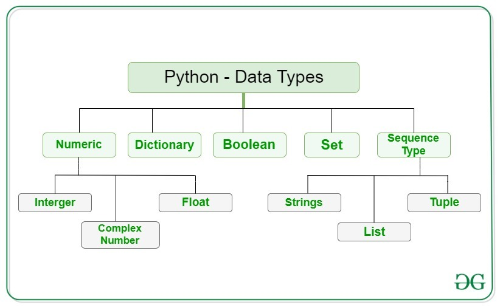
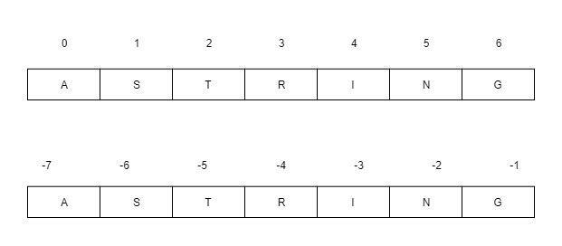
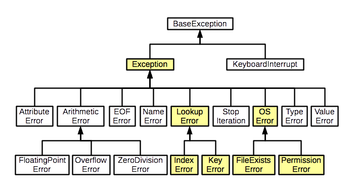

<h1 align="center"> Python </h1>

# Content


0. [Chapter 0: Getting Started with Python](#chapter0)
    - [Chapter 0 - Part 1: Introduction to Python and its Applications](#chapter0part1)
      - [Chapter 0 - Part 1.1: What is Python?](#chapter0part1.1)
      - [Chapter 0 - Part 1.2: Applications of Python](#chapter0part1.2)
      - [Chapter 0 - Part 1.3: Setting Up Your Python Environment (Brief Overview)](#chapter0part1.3)
    - [Chapter 0 - Part 2: Installing Python and Setting up Your Development Environment](#chapter0part2)
      - [Chapter 0 - Part 2.1: Installing Python](#chapter0part2.1)
      - [Chapter 0 - Part 2.2: Setting up a Development Environment](#chapter0part2.2)
      - [Chapter 0 - Part 2.3: Using Virtual Environments](#chapter0part2.3)
1. [Chapter 1: Rapid Introduction to Procedural Programming](#chapter1)
    - [Chapter 1 - Part 1: Creating and Running Python Programs](#chapter1part1)
    - [Chapter 1 - Part 2: Data Types in Python](#chapter1part2)
    - [Chapter 1 - Part 3: Object References in Python](#chapter1part3)
    - [Chapter 1 - Part 4: Collection Data Types in Python](#chapter1part4)
    - [Chapter 1 - Part 5: Logical Operations in Python](#chapter1part5)
      - [Chapter 1 - Part 5.1: The Identity Operator](#chapter1part5.1)
      - [Chapter 1 - Part 5.2: Comparison Operators](#chapter1part5.2)
      - [Chapter 1 - Part 5.3: The Membership Operator](#chapter1part5.3)
      - [Chapter 1 - Part 5.4: Logical Operators](#chapter1part5.4)
    - [Chapter 1 - Part 6: Control Flow Statements in Python](#chapter1part6)
      - [Chapter 1 - Part 6.1: The if Statement](#chapter1part6.1)
      - [Chapter 1 - Part 6.2: The while Statement](#chapter1part6.2)
      - [Chapter 1 - Part 6.3: The for …in Statement](#chapter1part6.3)
      - [Chapter 1 - Part 6.4: Basic Exception Handling](#chapter1part6.4)
    - [Chapter 1 - Part 7: Arithmetic Operators in Python](#chapter1part7)
    - [Chapter 1 - Part 8: Input/Output in Python](#chapter1part8)
    - [Chapter 1 - Part 9: Creating and Calling Functions in Python](#chapter1part9)
2. [Chapter 2: Data Types](#chapter2)
    - [Chapter 2 - Part 1: Identifiers and Keywords](#chapter2part1)
    - [Chapter 2 - Part 2: Integral Types](#chapter2part2)
      - [Chapter 2 - Part 2.1: Integers](#chapter2part2.1)
      - [Chapter 2 - Part 2.2: Booleans](#chapter2part2.2)
      - [Chapter 2 - Part 2.3: Integer Bitwise Operators](#chapter2part2.3)
    - [Chapter 2 - Part 3: Floating-Point Types](#chapter2part3)
      - [Chapter 2 - Part 3.1: Floating-Point Numbers](#chapter2part3.1)
      - [Chapter 2 - Part 3.2: Complex Numbers](#chapter2part3.2)
      - [Chapter 2 - Part 3.3: Decimal Numbers](#chapter2part3.3)
    - [Chapter 2 - Part 4: Strings](#chapter2part4)
      - [Chapter 2 - Part 4.1: Comparing Strings](#chapter2part4.1)
      - [Chapter 2 - Part 4.2: Slicing and Striding Strings](#chapter2part4.2)
      - [Chapter 2 - Part 4.3: String Operators and Methods](#chapter2part4.3)
      - [Chapter 2 - Part 4.4: String Formatting with the str.format() Method](#chapter2part4.4)
      - [Chapter 2 - Part 4.5: Field Names](#chapter2part4.5)
3. [Chapter 3: Collection Data Types](#chapter3)
    - [Chapter 3 - Part 1: Sequence Types](#chapter3part1)
      - [Chapter 3 - Part 1.1: Tuples](#chapter3part1.1)
      - [Chapter 3 - Part 1.2: Named Tuples](#chapter3part1.2)
      - [Chapter 3 - Part 1.3: Lists](#chapter3part1.3)
      - [Chapter 3 - Part 1.4: List Comprehensions](#chapter3part1.4)
    - [Chapter 3 - Part 2: Set Types](#chapter3part2)
      - [Chapter 3 - Part 2.1: Sets](#chapter3part2.1)
      - [Chapter 3 - Part 2.2: Set Comprehensions](#chapter3part2.2)
      - [Chapter 3 - Part 2.3: Frozen Sets](#chapter3part2.3) 
    - [Chapter 3 - Part 3: Mapping Types](#chapter3part3)
      - [Chapter 3 - Part 3.1: Dictionaries](#chapter3part3.1)
      - [Chapter 3 - Part 3.2: Dictionary Comprehensions](#chapter3part3.2)
      - [Chapter 3 - Part 3.3: Default Dictionaries](#chapter3part3.3)
      - [Chapter 3 - Part 3.4: Ordered Dictionaries](#chapter3part3.4)
    - [Chapter 3 - Part 4: Iterating and Copying Collections](#chapter3part4)
      - [Chapter 3 - Part 4.1: Iterators and Iterable Operations and Functions](#chapter3part4.1)
      - [Chapter 3 - Part 4.2: Copying Collections](#chapter3part4.2)
4. [Chapter 4: Control Structures and Functions](#chapter4)
    - [Chapter 4 - Part 1: Control Structures](#chapter4part1)
      - [Chapter 4 - Part 1.1: Conditional Branching](#chapter4part1.1)
      - [Chapter 4 - Part 1.2: Looping](#chapter4part1.2)
      - [Chapter 4 - Part 1.3: While Loops](#chapter4part1.3)
      - [Chapter 4 - Part 1.4: For Loops](#chapter4part1.4)
    - [Chapter 4 - Part 2: Exception Handling](#chapter4part2)
      - [Chapter 4 - Part 2.1: Catching and Raising Exceptions](#chapter4part2.1)
      - [Chapter 4 - Part 2.2: Raising Exceptions](#chapter4part2.2)
      - [Chapter 4 - Part 2.3: Custom Exceptions](#chapter4part2.3)
    - [Chapter 4 - Part 3: Custom Functions](#chapter4part3)
      - [Chapter 4 - Part 3.1: Names and Docstrings](#chapter4part3.1)
      - [Chapter 4 - Part 3.2: Argument and Parameter Unpacking](#chapter4part3.2)
      - [Chapter 4 - Part 3.3: Accessing Variables in the Global Scope](#chapter4part3.3)
      - [Chapter 4 - Part 3.4: Lambda Functions](#chapter4part3.4)
      - [Chapter 4 - Part 3.5: Assertions](#chapter4part3.5)
5. [Chapter 5: Modules](#chapter5)
    - [Chapter 5 - Part 1: Modules and Packages](#chapter5part1)
      - [Chapter 5 - Part 1.1: Packages](#chapter5part1.1)
      - [Chapter 5 - Part 1.2: Custom Modules](#chapter5part1.2)
      - [Chapter 5 - Part 1.3: Good Practice to Create Python Projects](#chapter5part1.3)
    - [Chapter 5 - Part 2: Overview of Python’s Standard Library](#chapter5part2)
      - [Chapter 5 - Part 2.1: String Handling](#chapter5part2.1)
      - [Chapter 5 - Part 2.2: Command-Line Programming](#chapter5part2.2)
      - [Chapter 5 - Part 2.3: Mathematics and Numbers](#chapter5part2.3)
      - [Chapter 5 - Part 2.4: Times and Dates](#chapter5part2.4)
      - [Chapter 5 - Part 2.5: Algorithms and Collection Data Types](#chapter5part2.5)
      - [Chapter 5 - Part 2.6: File Formats, Encodings, and Data Persistence](#chapter5part2.6)
      - [Chapter 5 - Part 2.7: File, Directory, and Process Handling](#chapter5part2.7)
      - [Chapter 5 - Part 2.8: Networking and Internet Programming](#chapter5part2.8)
      - [Chapter 5 - Part 2.9: XML](#chapter5part2.9)
      - [Chapter 5 - Part 2.10: Data Handling and Persistence](#chapter5part2.10)
      - [Chapter 5 - Part 2.11: Debugging and Profiling](#chapter5part2.11)
      - [Chapter 5 - Part 2.12: Unit Testing](#chapter5part2.12)
      - [Chapter 5 - Part 2.13: Web Programming](#chapter5part2.13)
      - [Chapter 5 - Part 2.14: Data Compression and Archiving](#chapter5part2.14)
      - [Chapter 5 - Part 2.15: Cryptography](#chapter5part2.15)
      - [Chapter 5 - Part 2.16: Parsing and Formatting](#chapter5part2.16)
      - [Chapter 5 - Part 2.17: Random Number Generation](#chapter5part2.17)
      - [Chapter 5 - Part 2.18: Operating System and System Information](#chapter5part2.18)
      - [Chapter 5 - Part 2.19: Concurrent Programming](#chapter5part2.19)
      - [Chapter 5 - Part 2.20: Logging](#chapter5part2.20)
6. [Chapter 6: Object-Oriented Programming](#chapter6)
    - [Chapter 6 - Part 1: The Object-Oriented Approach](#chapter6part1)
      - [Chapter 6 - Part 1.1: Object-Oriented Concepts and Terminology](#chapter6part1.1)
    - [Chapter 6 - Part 2: Custom Classes](#chapter6part2)
      - [Chapter 6 - Part 2.1: Attributes and Methods](#chapter6part2.1)
      - [Chapter 6 - Part 2.2: Inheritance and Polymorphism](#chapter6part2.2)
      - [Chapter 6 - Part 2.3: Using Properties to Control Attribute Access](#chapter6part2.3)
      - [Chapter 6 - Part 2.4: Creating Complete Fully Integrated Data Types](#chapter6part2.4)
      - [Chapter 6 - Part 2.5: Creating Data Types from Scratch](#chapter6part2.5)
      - [Chapter 6 - Part 2.6: Creating Data Types from Other Data Types](#chapter6part2.6)
    - [Chapter 6 - Part 3: Custom Collection Classes](#chapter6part3)
7. [Chapter 7: File Handling](#chapter7)
    - [Chapter 7 - Part 1: Writing and Reading Binary Data](#chapter7part1)
      - [Chapter 7 - Part 1.1: Pickles with Optional Compression](#chapter7part1.1)
      - [Chapter 7 - Part 1.2: Raw Binary Data with Optional Compression](#chapter7part1.2)
    - [Chapter 7 - Part 2: Writing and Parsing Text Files](#chapter7part2)
      - [Chapter 7 - Part 2.1: Writing Text](#chapter7part2.1)
      - [Chapter 7 - Part 2.2: Parsing Text](#chapter7part2.2)
      - [Chapter 7 - Part 2.3: Parsing Text Using Regular Expressions](#chapter7part2.3)
    - [Chapter 7 - Part 3: Writing and Parsing CSV Files](#chapter7part3)
      - [Chapter 7 - Part 3.1: Writing a CSV File](#chapter7part3.1)
      - [Chapter 7 - Part 3.2: Parsing CSV Files](#chapter7part3.2)
    - [Chapter 7 - Part 4: Writing and Parsing JSON Files](#chapter7part4)
      - [Chapter 7 - Part 4.1: Writing a JSON File](#chapter7part4.1)
      - [Chapter 7 - Part 4.2: Parsing JSON Files](#chapter7part4.2)
    - [Chapter 7 - Part 5: Writing and Parsing XML Files](#chapter7part5)
      - [Chapter 7 - Part 5.1: Writing a XML File](#chapter7part5.1)
      - [Chapter 7 - Part 5.2: Parsing XML Files](#chapter7part5.2)
    - [Chapter 7 - Part 6: Writing and Parsing Compressed Files](#chapter7part6)
      - [Chapter 7 - Part 6.1: Working with ZIP Files](#chapter7part6.1)
      - [Chapter 7 - Part 6.2: Working with TAR Files](#chapter7part6.2)
      - [Chapter 7 - Part 6.3: Working with GZIP Files](#chapter7part6.3)
8. [Chapter 8: Threads](#chapter8)
    - [Chapter 8 - Part 1: Using Threads in Python](#chapter8part1)
    - [Chapter 8 - Part 2: Preventing Race Conditions with threading.Lock](#chapter8part2)
    - [Chapter 8 - Part 3: Limiting the Number of Threads with ThreadPoolExecutor](#chapter8part3)
    - [Chapter 8 - Part 4: Passing Additional Arguments to Threads](#chapter8part4)
    - [Chapter 8 - Part 5: Creating Background Threads with daemon=True](#chapter8part5)
    - [Chapter 8 - Part 6: Handling Exceptions Globally in Threads](#chapter8part6)
9. [Chapter 9: Subprocess](#chapter9)
    - [Chapter 9 - Part 1: Using Subprocess in Python](#chapter9part1)
    - [Chapter 9 - Part 2:Capturing and Handling Errors](#chapter9part2)
    - [Chapter 9 - Part 3: Redirecting Output to a File](#chapter9part3)
    - [Chapter 9 - Part 4: Running Commands with User Input (subprocess.Popen)](#chapter9part4)
    - [Chapter 9 - Part 5: Running a Background Process](#chapter9part5)
    - [Chapter 9 - Part 6: Running a Python Script as a Subprocess](#chapter9part6)
    - [Chapter 9 - Part 7: Using Shell Commands (shell=True)](#chapter9part7)
    - [Chapter 9 - Part 8: Killing a Running Subprocess](#chapter9part8)
10. [Chapter 10: Design Patterns](#chapter10)
    - [Chapter 10 - Part 1: SOLID Principles Overview](#chapter10part1)
      - [Chapter 10 - Part 1.1: Single Responsibility Principle (SRP)](#chapter10part1.1)
      - [Chapter 10 - Part 1.2: Open/Closed Principle (OCP)](#chapter10part1.2)
      - [Chapter 10 - Part 1.3: Liskov Substitution Principle (LSP)](#chapter10part1.3)
      - [Chapter 10 - Part 1.4: Interface Segregation Principle (ISP)](#chapter10part1.4)
      - [Chapter 10 - Part 1.5: Dependency Inversion Principle (DIP)](#chapter10part1.5)
    - [Chapter 10 - Part 2: Creational Design Patterns](#chapter10part2)
      - [Chapter 10 - Part 2.1: Factory Pattern](#chapter10part2.1)
      - [Chapter 10 - Part 2.2: Singleton Pattern](#chapter10part2.2)
      - [Chapter 10 - Part 2.3: Abstract Factory Pattern](#chapter10part2.3)
      - [Chapter 10 - Part 2.4: Builder Pattern](#chapter10part2.4)
      - [Chapter 10 - Part 2.5: Prototype Pattern](#chapter10part2.5)
12. [Appendix A: Useful Python Code Snippet](#appendixa)
    - [Appendix A - Part 1: Setting Up a Python Project and Properly Calling from Command Line](#appendixapart1)
    - [Appendix A - Part 2: Create a Log file](#appendixapart2)
    - [Appendix A - Part 3: List all files of a directory based in a extension](#appendixapart3)
    - [Appendix A - Part 4: List all files of a directory based in a regex](#appendixapart4)
    - [Appendix A - Part 5: Move file to a directory](#appendixapart5)
    - [Appendix A - Part 6: Read a Config Json File](#appendixapart6)
    - [Appendix A - Part 7: Read and Parse a CSV file with Pandas based in a Config Json File](#appendixapart7)
    - [Appendix A - Part 8: Read a CSV file with Pandas and iteract over the rows with custom functions using apply()](#appendixapart8)
    - [Appendix A - Part 9: Bubble Sort Algorithm in Python](#appendixapart9)

## <a name="chapter0"></a>Chapter 0: Getting Started with Python

### <a name="chapter0part1"></a>Chapter 0 - Part 1: Introduction to Python and its Applications

Python is a versatile and powerful programming language that has gained immense popularity in recent years. Its simple syntax and extensive libraries make it an excellent choice for beginners and experienced developers alike. This lesson will introduce you to Python, its core principles, and the diverse range of applications it supports. Understanding these fundamentals will provide a solid foundation for your journey into the world of Python programming.

#### <a name="chapter0part1.1"></a>Chapter 1 - Part 1.1: What is Python?

Python is a high-level, interpreted, general-purpose programming language. Let's break down what each of these terms means:

- **High-level:** Python abstracts away many of the complexities of lower-level languages like C or Assembly. This means you don't have to worry about memory management or other low-level details, allowing you to focus on the logic of your program.

- **Interpreted:** Python code is executed line by line by an interpreter, rather than being compiled into machine code beforehand. This makes Python development faster and more flexible, as you can easily test and modify your code without recompilation.

- **General-purpose:** Python can be used for a wide variety of tasks, from web development and data science to scripting and automation. This versatility is one of the key reasons for Python's popularity.

**Key Features of Python**

Python boasts several features that contribute to its widespread adoption:

- **Readability:** Python's syntax is designed to be clear and easy to understand, resembling plain English. This makes Python code more readable and maintainable.

- **Dynamic Typing:** Python is dynamically typed, meaning you don't have to explicitly declare the data type of a variable. The interpreter infers the type at runtime. This simplifies coding and reduces boilerplate.

- **Extensive Libraries:** Python has a vast collection of libraries and modules that provide pre-built functionality for a wide range of tasks. These libraries save you time and effort by providing ready-to-use solutions for common problems.

- **Cross-Platform Compatibility:** Python runs on various operating systems, including Windows, macOS, and Linux. This allows you to write code once and run it on different platforms without modification.

- **Large Community:** Python has a large and active community of developers who contribute to its development and provide support to users. This means you can easily find help and resources when you need them.

**The Zen of Python**

The guiding principles of Python's design are encapsulated in "The Zen of Python," a set of aphorisms written by Tim Peters. You can access these principles by typing ```import this``` in a Python interpreter. Some key principles include:

- Beautiful is better than ugly.

- Explicit is better than implicit.

- Simple is better than complex.

- Complex is better than complicated.

- Readability counts.

These principles emphasize the importance of writing clear, concise, and maintainable code.

#### <a name="chapter0part1.2"></a>Chapter 1 - Part 1.2: Applications of Python

Python's versatility makes it suitable for a wide range of applications. Here are some of the most common:

**Web Development**

Python is a popular choice for web development, thanks to frameworks like Django and Flask. These frameworks provide tools and libraries that simplify the process of building web applications.

- **Django:** A high-level framework that follows the "batteries-included" philosophy, providing a comprehensive set of features for building complex web applications. It's often used for large-scale projects requiring security and scalability.

- **Flask:** A lightweight and flexible framework that gives you more control over the structure of your application. It's suitable for smaller projects and APIs.

Example: Building a simple blog using Flask. You can define routes, create templates, and interact with a database to manage blog posts.

**Data Science and Machine Learning**

Python has become the dominant language in data science and machine learning, thanks to libraries like NumPy, pandas, scikit-learn, and TensorFlow.

- **NumPy:** Provides support for numerical computations and arrays, essential for data manipulation.

- **pandas:** Offers data structures and tools for data analysis and manipulation, making it easy to clean, transform, and analyze data.

- **scikit-learn:** A comprehensive library for machine learning algorithms, including classification, regression, clustering, and dimensionality reduction.

- **TensorFlow:** A powerful framework for building and training machine learning models, particularly deep learning models.

Example: Using pandas to analyze a dataset of customer transactions, identifying patterns and trends in customer behavior.

**Scripting and Automation**

Python is an excellent choice for scripting and automation tasks, such as automating repetitive tasks, system administration, and network management.

- **Automating file management:** Writing a script to automatically rename, move, or delete files based on certain criteria.

- **System administration:** Creating scripts to monitor system performance, manage user accounts, and automate backups.

- **Network management:** Using libraries like netmiko to automate network device configuration and monitoring.

Example: Writing a Python script to automatically back up important files to an external hard drive on a regular schedule.

**Game Development**

While not as common as C++ or C#, Python can be used for game development, particularly for prototyping and smaller games. Libraries like Pygame provide tools for creating 2D games.

- **Pygame:** A library that provides functions for handling graphics, sound, and input, making it easier to create 2D games.

Example: Creating a simple platformer game using Pygame, with features like character movement, collision detection, and basic enemy AI.

**Desktop Applications**

Python can be used to create desktop applications with graphical user interfaces (GUIs) using libraries like Tkinter, PyQt, and Kivy.

- **Tkinter:** Python's standard GUI library, providing a simple and easy-to-use interface for creating basic desktop applications.

- **PyQt:** A more powerful and feature-rich GUI library that provides a wide range of widgets and tools for creating complex desktop applications.

- **Kivy:** A library for creating cross-platform applications with a focus on touch-based interfaces.

Example: Building a simple calculator application using Tkinter, with buttons for numbers, operators, and a display for the result.

#### <a name="chapter0part1.3"></a>Chapter 1 - Part 1.3: Setting Up Your Python Environment (Brief Overview)

While the next lesson will cover installation in detail, it's helpful to briefly touch on setting up your environment. You'll need to:

- **Install Python:** Download the latest version of Python from the official website (https://www.python.org/downloads/) and follow the installation instructions.

- **Install a Text Editor or IDE:** Choose a text editor or integrated development environment (IDE) for writing your Python code. Popular options include VS Code, Sublime Text, and PyCharm.

- **Verify Installation:** Open a terminal or command prompt and type ```python --version``` to verify that Python is installed correctly.

### <a name="chapter0part2"></a>Chapter 0 - Part 2: Installing Python and Setting up Your Development Environment

Installing Python and setting up your development environment are the crucial first steps in your Python programming journey. A properly configured environment ensures a smooth and efficient coding experience. This lesson will guide you through the process of installing Python, choosing a suitable code editor, and configuring your environment for optimal productivity. We'll cover different installation methods, explore popular code editors, and provide tips for troubleshooting common issues.

#### <a name="chapter0part2.1"></a>Chapter 0 - Part 2.1: Installing Python

Python is available for various operating systems, including Windows, macOS, and Linux. The installation process differs slightly depending on your OS. We'll cover the most common methods for each.

**Windows Installation**

- **Download the Installer:** Go to the official Python website (https://www.python.org/downloads/windows/) and download the latest stable version of Python for Windows. Choose the appropriate installer (32-bit or 64-bit) based on your system architecture. If you are unsure, choose the 64-bit version.

- **Run the Installer:** Double-click the downloaded ```.exe``` file to start the installation process.

- **Important:** Add Python to PATH: During the installation, make sure to check the box that says "Add Python to PATH" This is crucial because it allows you to run Python from the command line without specifying the full path to the Python executable.

- **Choose Installation Type:** You can choose between "Install Now" (which installs Python with default settings) or "Customize installation" (which allows you to choose the installation location and optional features). For beginners, "Install Now" is usually sufficient. If you choose "Customize installation", ensure that "pip" is selected to be installed. ```pip``` is the package installer for Python, which you'll use to install external libraries.

- **Complete the Installation:** Follow the on-screen instructions to complete the installation.

- **Verify the Installation:** Open a command prompt (search for "cmd" in the Start menu) and type ```python --version``` or ```python3 --version``` and press Enter. If Python is installed correctly, it will display the Python version number. You can also type ```pip --version``` to verify that ```pip``` is installed.

**macOS Installation**

macOS often comes with a pre-installed version of Python 2. However, it's highly recommended to install the latest version of Python 3, as Python 2 is no longer supported.

- **Download the Installer:** Go to the official Python website (https://www.python.org/downloads/macos/) and download the latest stable version of Python for macOS.

- **Run the Installer:** Double-click the downloaded ```.pkg``` file to start the installation process.

- **Follow the Instructions:** Follow the on-screen instructions to complete the installation. The installer will guide you through the process.

- Verify the Installation: Open a terminal (search for "Terminal" in Spotlight) and type ```python3 --version``` and press Enter. This should display the Python 3 version number. Also, type ```pip3 --version``` to verify that ```pip``` is installed. Note that on macOS, you typically use ```python3``` and ```pip3``` to refer to Python 3 and its package manager, respectively, to avoid conflicts with the older Python 2 version.

**Linux Installation**

On most Linux distributions, Python is either pre-installed or can be easily installed using the distribution's package manager.

- **Using the Package Manager:** Open a terminal and use the appropriate command for your distribution:
  - **Debian/Ubuntu:** ```sudo apt update && sudo apt install python3 python3-pip```
  - **Fedora/CentOS/RHEL:** ```sudo dnf install python3 python3-pip```
  - **Arch Linux:** ```sudo pacman -S python python-pip```

- **Verify the Installation:** After the installation is complete, type ```python3 --version``` and ```pip3 --version``` in the terminal to verify that Python 3 and ```pip``` are installed correctly.

**Installing Python using Anaconda**

Anaconda is a popular Python distribution that includes Python, pip, and a collection of pre-installed packages commonly used in data science and machine learning. It also provides a convenient environment management system.

- **Download Anaconda:** Go to the Anaconda website (https://www.anaconda.com/products/distribution) and download the installer for your operating system.

- **Run the Installer:** Double-click the downloaded file and follow the on-screen instructions.

- **Verify the Installation:** Open the Anaconda Navigator (a graphical user interface) or the Anaconda Prompt (a command-line interface) and type ```python --version``` or ```conda --version``` to verify the installation.

**Common Installation Issues and Troubleshooting**

- **"python" is not recognized as an internal or external command:** This usually happens when Python is not added to the PATH environment variable during installation. Re-run the installer and make sure to check the "Add Python to PATH" box. If you already installed Python without adding it to PATH, you can manually add it by following these steps:
  - Open System Properties (search for "environment variables" in the Start menu).
  - Click "Environment Variables".
  - In the "System variables" section, find the "Path" variable and click "Edit".
  - Add the paths to your Python installation directory (e.g., C:\Python39) and the Scripts directory (e.g., C:\Python39\Scripts).
  - Restart your command prompt.
 
- **Permission errors during package installation:** This can happen when you don't have the necessary permissions to install packages globally. Try using a virtual environment (explained later) or running the installation command with administrator privileges (e.g., sudo pip install <package> on Linux/macOS).

- **Conflicting Python versions:** If you have multiple Python versions installed, make sure the correct version is being used. You can use the python --version command to check the version. You can also use virtual environments to isolate different projects with different Python versions.

#### <a name="chapter0part2.2"></a>Chapter 0 - Part 2.2: Setting up a Development Environment

A development environment is the set of tools and configurations you use to write, test, and debug your code. A well-configured environment can significantly improve your productivity and reduce errors.

**Choosing a Code Editor or IDE**

A code editor is a software application that allows you to write and edit code. An Integrated Development Environment (IDE) is a more comprehensive tool that includes a code editor, debugger, compiler, and other features.

Here are some popular code editors and IDEs for Python:

- **VS Code (Code Editor):** A free, open-source code editor with excellent Python support through extensions. It's lightweight, customizable, and has a large community.

- **PyCharm (IDE):** A powerful IDE specifically designed for Python development. It offers advanced features like code completion, debugging, testing, and version control integration. PyCharm comes in two editions: a free Community Edition and a paid Professional Edition.

- **Sublime Text (Code Editor):** A popular code editor known for its speed, flexibility, and extensive plugin ecosystem. It's not free, but it offers a free trial.

- **Atom (Code Editor):** A free, open-source code editor developed by GitHub. It's highly customizable and has a large community.

- **Jupyter Notebook (Web-Based IDE):** An interactive web-based environment that allows you to write and execute code in cells. It's particularly popular for data science and machine learning.

For beginners, VS Code or PyCharm Community Edition are excellent choices. VS Code is lightweight and easy to set up, while PyCharm offers more advanced features out of the box.

**Configuring VS Code for Python Development**

- **Install VS Code:** Download and install VS Code from the official website (https://code.visualstudio.com/).

- **Install the Python Extension:** Open VS Code and go to the Extensions view (click the square icon on the left sidebar or press Ctrl+Shift+X). Search for "Python" and install the official Microsoft Python extension.

- **Select a Python Interpreter:** VS Code needs to know which Python interpreter to use. Click on the Python version in the bottom-right corner of the VS Code window. A list of available Python interpreters will appear. Select the Python interpreter you want to use for your project. If you have multiple Python versions installed, make sure to select the correct one.

- **Install Linters and Formatters (Optional):** Linters and formatters help you write clean and consistent code. Popular linters for Python include pylint and flake8. A popular formatter is black. You can install them using pip:

```
pip install pylint flake8 black
```

To configure VS Code to use these tools, go to File > Preferences > Settings and search for "python.linting.pylintEnabled", "python.linting.flake8Enabled", and "python.formatting.provider". Set them to true and black, respectively.

**Configuring PyCharm for Python Development**

- **Install PyCharm:** Download and install PyCharm from the JetBrains website (https://www.jetbrains.com/pycharm/download/). Choose the Community Edition for a free, open-source version.

- **Create a New Project:** Open PyCharm and click "Create New Project".

- **Select a Python Interpreter:** PyCharm will automatically detect the Python interpreters installed on your system. You can choose an existing interpreter or create a new virtual environment (explained later).

- **Configure Code Style (Optional):** PyCharm has built-in code style settings that help you write consistent code. Go to File > Settings > Editor > Code Style > Python to configure the code style settings.

#### <a name="chapter0part2.3"></a>Chapter 0 - Part 2.3: Using Virtual Environments

A virtual environment is a self-contained directory that contains a specific Python interpreter and its associated packages. This allows you to isolate different projects with different dependencies, preventing conflicts between packages.

It's highly recommended to use virtual environments for all your Python projects.

**Virtual environment with Venv**

- **Create a Virtual Environment:** Open a terminal or command prompt and navigate to your project directory. Then, use the venv module to create a virtual environment:

```
python3 -m venv .venv  # Creates a virtual environment named ".venv"
```

- **Activate the Virtual Environment:** Before you can use the virtual environment, you need to activate it. The activation command depends on your operating system:
  - **Windows:**
 
  ```
  .venv\Scripts\activate
  ```

  - **macOS/Linux:**
 
  ```
  source .venv/bin/activate
  ```

When the virtual environment is activated, you'll see its name in parentheses at the beginning of your command prompt (e.g., (.venv) C:\myproject>).

- **Install Packages:** With the virtual environment activated, you can install packages using pip. The packages will be installed in the virtual environment, isolated from the global Python installation.

  ```
  pip install requests
  ```

- **Deactivate the Virtual Environment:** When you're finished working on the project, you can deactivate the virtual environment:

  ```
  deactivate
  ```

**Package Management with pip**

```pip``` is the package installer for Python. It allows you to easily install, upgrade, and uninstall Python packages.

- **Installing Packages:**

Installs the latest version of the package
```
pip install <package_name>
```

Installs a specific version of the package
```
pip install <package_name>==<version>
```

Installs packages from a requirements file
```
pip install -r requirements.txt
```

- **Upgrading Packages:**

Upgrades the package to the latest version
```
pip install --upgrade <package_name>
```

- **Uninstalling Packages:**

```
pip uninstall <package_name>
```

- Listing Installed Packages:

Lists all installed packages
```
pip list
```

Creates a requirements file containing the list of installed packages
```
pip freeze > requirements.txt
```

The ```requirements.txt``` file is a text file that lists all the packages required for a project. It's commonly used to share the project's dependencies with others or to recreate the environment on a different machine.

**Virtual environment with Poetry**

- **Installing Poetry:** Poetry can be installed using a custom installer, which is the recommended method.
  - **Windows:**
    - Open PowerShell and run the following command:
 
  ```
  (Invoke-WebRequest -Uri https://install.python-poetry.org -UseBasicParsing).Content | py -
  ```

  - **macOS/Linux:**
    - Open your terminal and run the following command:
 
  ```
  curl -sSL https://install.python-poetry.org | python3 -
  ```

  After the installation is complete, you might need to add Poetry's executable to your system's PATH environment variable. The installer usually provides instructions on how to do this.

- **add Poetry's executable to your system's PATH:**
  - **Windows:**
    - The installer usually adds Poetry to your PATH, but if not, you'll need to add it manually.  Search for "Edit the system environment variables" in Windows, and add  ```%APPDATA%\Python\Scripts``` to your Path.

  - **macOS/Linux:**
    - The installer usually adds Poetry to your PATH, but if not, you'll need to add it manually.  Add this line to your shell's configuration file (```~/.bashrc```, ```~/.zshrc```, or ```~/.profile```):
 
  ```
  export PATH="$HOME/.local/bin:$PATH"
  ```
- **Verifying the Installation**
To verify that Poetry is installed correctly, open a new terminal or command prompt window and run:
 
   ```
  poetry --version
  ```

This should display the installed Poetry version.

- **Creating a New Project with Poetry**
  - Create a Project Directory:

   ```
  mkdir my-project
  ```

  ```
  cd my-project
  ```

  - Initialize Poetry:

   ```
  poetry init
  ```
This command will guide you through the process of creating a pyproject.toml file, which is the configuration file for your project. You'll be prompted to enter information such as the project name, version, description, and dependencies. You can accept the defaults or customize the values as needed.

Here's an example of what ```pyproject.toml``` might look like:

```
[tool.poetry]
name = "my-project"
version = "0.1.0"
description = "My new Python project"
authors = ["Your Name <your.email@example.com>"]

[tool.poetry.dependencies]
python = "^3.8"  # Minimum Python version

[build-system]
requires = ["poetry-core>=1.0.0"]
build-backend = "poetry.core.masonry.api"
```

- **Adding Dependencies**

To add a new dependency to your project, use the ```poetry add``` command:

```
poetry add requests
```

This will install the ```requests``` library and add it to the ```pyproject.toml``` file. Poetry automatically resolves the correct version of the package and any other dependencies it may have.  Poetry also creates a ```poetry.lock``` file, which ensures that the exact versions of the dependencies are used in your project. This lock file is crucial for ensuring consistent environments across different machines.

You can specify version constraints when adding dependencies. For example:

- ```poetry add requests``` - Installs the latest version.

- ```poetry add requests@^2.20.0``` - Installs a version compatible with >=2.20.0 and <3.0.0

- ```poetry add "requests>=2.20.0,<3.0.0"``` -  Installs a version compatible with >=2.20.0 and <3.0.0

- **Updating Dependencies**

To update dependencies to their latest compatible versions, use the ```poetry update``` command:

```
poetry update
```

To update a specific dependency:

```
poetry update requests
```

This will update the specified packages and update the ```poetry.lock``` file.

- **Removing Dependencies**

To remove a dependency, use the ```poetry remove``` command:

```
poetry remove requests
```

This will uninstall the ```requests``` library and remove it from the ```pyproject.toml``` file.  Poetry will also update the ```poetry.lock``` file.

- **Using the Virtual Environment: Activating the Environment**

Although Poetry manages the virtual environment, you don't always need to explicitly activate it. You can run commands directly within the Poetry environment using ```poetry run```.

To run a Python script:

```
poetry run python your_script.py
```

To run a command like ```pytest```:

```
poetry run pytest
```

If you need a shell inside the virtual environment, you can use:

```
poetry shell
```

This command activates the virtual environment, and you'll see its name in your terminal prompt.  When you're finished, you can deactivate it by typing ```exit```.

- **Using the Virtual Environment: Installing Project Dependencies**

If you have an existing ```pyproject.toml``` file (e.g., when you clone a project from a repository), you can create and install the virtual environment and its dependencies by running:

```
poetry install
```

This command reads the ```pyproject.toml``` and ```poetry.lock``` files (if it exists) to create a consistent environment. If ```poetry.lock``` exists, Poetry will install the exact versions specified in the lock file. If it doesn't exist, Poetry will resolve the dependencies and create the lock file.

Step 5: Managing Environments
You can list the environments associated with your project:

```
poetry env list
```

You can also get information about the current environment:

```
poetry env info
```

To deactivate an environment (when you have used ```poetry shell```):

```
exit
```

To delete an environment:

```
poetry env remove python3.9 # specify the python version
```

- **Using Poetry with an Existing Project**

If you want to start using Poetry with an existing project that already has a ```requirements.txt``` file, you can do the following:

- Initialize Poetry: Run ```poetry init``` in the project root.  Poetry will create a ```pyproject.toml``` file.
- Import Dependencies (Optional): You can manually copy the dependencies from your ```requirements.txt``` file into the ```pyproject.toml``` file under the ```[tool.poetry.dependencies]``` section, or use a tool to convert the ```requirements.txt``` to toml.
- Install Dependencies: Run ```poetry install```.  Poetry will create a virtual environment and install the dependencies listed in ```pyproject.toml```.  It will also create a ```poetry.lock``` file.

## <a name="chapter1"></a>Chapter 1: Rapid Introduction to Procedural Programming

### <a name="chapter1part1"></a>Chapter 1 - Part 1: Creating and Running Python Programs

Python code can be written using any plain text editor that can load and save text using either the ASCII or the UTF-8 Unicode character encoding.

By default, Python files are assumed to use the UTF-8 character encoding, a superset of ASCII that can represent pretty well every character in every language. 

Python files normally have an extension of .py, although on some Unix-like systems (e.g., Linux and Mac OS X) some Python applications have no extension, and Python GUI (Graphical User Interface) programs usually have an extension of .pyw, particularly onWindows and Mac OSX.

Create a file called hello.py in a plain text editor with the following contents:

```py
#!/usr/bin/env python3

print("Hello", "World!")
```

The first line is a comment. In Python,commentsbegin with a # and continue to the end of the line.

The second line is blank—outside quoted strings, Python ignores blank lines, but they are often useful to humans to break up large blocks of code to make them easier to read.

The third line is Python code. Here, the print() function is called with two arguments, each of type str (string; i.e., a sequence of characters).

Each statement encountered in a .py file is executed in turn, starting with the first one and progressing line by line. This is different from some other languages, for example, C++ and Java, which have a particular function or method with a special name where they start from.

We will assume that Windows users keep their Python code in the C:\py3eg directory and that Unix (i.e., Unix, Linux, and Mac OS X) users keep their code in the $HOME/py3eg directory. Save hello.py into the py3eg directory and close the text editor.

Now that we have a program, we can run it. Python programs are executed by the Python interpreter, and normally this is done inside a console window.

On Windows the console is called "Command Prompt"

On Mac OS X the console is provided by the Terminal.app program (located in Applications/Utilities by default), available using Finder, and on other Unixes,we can use an xterm or the console provided by the windowing environment, for example, konsole or gnome-terminal.

Start up a console, and on Windows enter the following commands

```
C:\>cd c:\py3eg
C:\py3eg\>c:\python31\python.exe hello.py
```

Unix users enter this instead (assuming that Python 3 is in the PATH):*

```
$ cd $HOME/py3eg
$ python3 hello.py
```

In both cases the output should be the same:

```
Hello World!
```

Although the program has just one executable statement, by running it we can infer some information about the print() function. For one thing, print() is a built-in part of the Python language—we didn’t need to “import” or “include” it from a library to make use of it. Also, it separates each item it prints with a single space, and prints a newline after the last item is printed.

### <a name="chapter1part2"></a>Chapter 1 - Part 2: Data Types in Python

In programming, data type is an important concept.

Variables can store data of different types, and different types can do different things.

Python has the following data types built-in by default, in these categories:

- Text Type: ```str```
- Numeric Types: ```int```, ```float```, ```complex```
- Sequence Types: ```list```, ```tuple```, ```range```
- Mapping Type: ```dict```
- Set Types: ```set```, ```frozenset```
- Boolean Type: ```bool```
- Binary Types: ```bytes```, ```bytearray```, ```memoryview```
- None Type: ```NoneType```

Python represents integers (positive and negative whole numbers) using the int type, and it represents strings (sequences of Unicode characters) using the str type.

**Integers Examples**

```
-973
210624583337114373395836055367340864637790190801098222508621955072
0
```

Incidentally, the second number shown is the size of Python’s integers is limited only by machine memory, not by a fixed number of bytes.

**Strings Examples**

```
"Infinitely Demanding"
'Simon Critchley'
'positively αβγ ÷©'
''
```

Strings can be delimited by double or single quotes, as long as the same kind are used at both ends, and since Python uses Unicode, strings are not limited to ASCII characters, as the penultimate string shows. An empty string is simply one with nothing between the delimiters.

Python uses square brackets ([]) to access an item from a sequence such as
a string.

```py
print("Hard Times"[5])
```

```
T
```

```py
print("giraffe"[0])
```

```
g
```

In Python, both str and the basic numeric types such as int are immutable, that is, once set, their value cannot be changed.

To convert a data item from one type to another we can use the syntax datatype(item).

```py
int("45")
```

```py
str(912)
```

The int() conversion is tolerant of leading and trailing whitespace, so int(" 45 ") would have worked just as well. The str() conversion can be
applied to almost any data item. We can easily make our own custom data types support str() conversion, and also int() or other conversions if they make sense.
If a conversion fails, an exception is raised

### <a name="chapter1part3"></a>Chapter 1 - Part 3: Object References in Python

Python doesn’t have variables as such, but instead has object references.

When it comes to immutable objects like ints and strs, there is no discernable difference between a variable and an object reference.

As for mutable objects, there is a difference, but it rarely matters in practice.

Let’s look at a few tiny examples, and then discuss some of the details.

```py
x = "blue"
y = "green"
z = x
```

The syntax is simply objectReference = value.

When Python executes the first statement it creates a str object with the text “blue”, and creates an object reference called x that refers to the str object.

For all practical purposes we can say that “variable x has been assigned the ‘blue’ string”. The second statement is similar. The third statement creates a new object reference called z and sets it to refer to the same object that the x object reference refers to (in this case the str containing the text “blue”).

The = operator is not the same as the variable assignment operator in some other languages. The = operator binds an object reference to an object in memory. If the object reference already exists, it is simply re-bound to refer to the object on the right of the = operator if the object reference does not exist it is created by the = operator.

```py
print(x, y, z) # prints: blue green blue
z = y
print(x, y, z) # prints: blue green green
x = z
print(x, y, z) # prints: green green green
```

After the fourth statement (x = z), all three object references are referring to the same str. Since there are no more object references to the “blue” string, Python is free to garbage-collect it.

<br>

<div align="center"><br><sub>Object references and objects (The circles represent object references.The rectangles represent objects in memory.) - (<a href='https://github.com/vitorstabile'>Work by Vitor Garcia</a>) </sub></div>

<br>

The names used for object references (called identifiers) have a few restrictions. In particular, they may not be the same as any of Python’s keywords, and must start with a letter or an underscore and be followed by zero or more nonwhitespace letter, underscore, or digit characters. There is no length limit, and the letters and digits are those defined by Unicode, that is, they include, but are not limited to, ASCII’s letters and digits (“a”, “b”, …, “z”, “A”, “B”,…, “Z”, “0”, “1”, …, “9”). Python identifiers are case-sensitive, so for example, LIMIT, Limit, and limit are three different identifiers.

Python uses dynamic typing, which means that an object reference can be rebound to refer to a different object (which may be of a different data type) at any time. Languages that use strong typing (such as C++ and Java) allow only those operations that are defined for the data types involved to be performed. Python also applies this constraint, but it isn’t called strong typing in Python’s case because the valid operations can change—for example, if an object reference is re-bound to an object of a different data type.

```py
route = 866
print(route, type(route)) # prints: 866 <class 'int'>
```

```py
route = "North"
print(route, type(route)) # prints: North <class 'str'>
```

Here we create a new object reference called route and set it to refer to a new int of value 866. At this point we could use / with route since division is a valid operation for integers. Then we reuse the route object reference to refer to a new str of value “North”, and the int object is scheduled for garbage collection since now no object reference refers to it. At this point using / with route would cause a TypeError to be raised since / is not a valid operation for a string.

The type() function returns the data type (also known as the "class”) of the data item it is given—this function can be very useful for testing and debugging.

### <a name="chapter1part4"></a>Chapter 1 - Part 4: Collection Data Types in Python

There are four collection data types in the Python programming language:

- List: is a collection which is ordered and changeable. Allows duplicate members.
- Tuple: is a collection which is ordered and unchangeable. Allows duplicate members.
- Set: is a collection which is unordered, unchangeable*, and unindexed. No duplicate members.
- Dictionary: is a collection which is ordered** and changeable. No duplicate members.

But here we will introduce just two: tuple and list. Python tuples and lists can be used to hold any number of data items of any data types. Tuples are immutable, so once they are created we cannot change them. Lists are mutable, so we can easily insert items and remove items whenever we want.

Tuples are created using commas (,), as these examples show

```py
print("Denmark", "Finland", "Norway", "Sweden") # prints: ('Denmark', 'Finland', 'Norway', 'Sweden')
```

```py
print("one",) # prints: ('one',)
```

An empty tuple is created by using empty parentheses, (). The comma is also used to separate arguments in function calls, so if we want to pass a tuple literal as an argument we must enclose it in parentheses to avoid confusion.

Here are some example lists:

```py
print([1, 4, 9, 16, 25, 36, 49])
print(['alpha', 'bravo', 'charlie', 'delta', 'echo'])
print(['zebra', 49, -879, 'aardvark', 200])
print([])
```

One way to create a list is to use square brackets ([]). The fourth list shown is an empty list.

When lists and tuples are created (and when items are inserted in the case of lists), they take copies of the object references they are given. In the case of literal items such as integers or strings, an object of the appropriate
data type is created in memory and suitably initialized, and then an object reference referring to the object is created, and it is this object reference that is put in the list or tuple.

Tuples, lists, and strings are “sized”, that is, they are data types that have a notion of size, and data items of any such data type can be meaningfully passed to the len() function. (An exception is raised if a nonsized data item is passed to len().)

```py
len(("one",)) # 1
```

```py
len([3, 5, 1, 2, "pause", 5]) # 6
```

```py
len("automatically") # 13
```

All Python data items are objects (also called instances) of a particular data type (also called a class)

Essentially, a method is simply a function that is called for a particular object. For example, the list type has an append() method, so we can append an object to a list like this:

```py
x = ["zebra", 49, -879, "aardvark", 200]
x.append("more")
print(x) # ['zebra', 49, -879, 'aardvark', 200, 'more']
``` 

The append() method mutates, that is, changes, the original list. This is possible because lists are mutable.

The list type has many other methods, including insert() which is used to insert an item at a given index position,and remove() which removes an item at a given index position. As noted earlier, Python indexes are always 0-based.

```py
x = ['zebra', 49, -879, 'aardvark', 200, 'more', 'extra']
print(x[0]) # print: zebra
print(x[4]) # print: 200
```

Tuples are also sequences, so if x had been a tuple we could retrieve items using square brackets in exactly the same way aswe have done for the x list. But since lists are mutable (unlike strings and tuples which are immutable),we can also use the square brackets operator to set list elements.

```py
x = ['zebra', 49, -879, 'aardvark', 200, 'more', 'extra']
x[1] = "forty nine"
print(x) # print: ['zebra', 'forty nine', -879, 'aardvark', 200, 'more', 'extra']
```

### <a name="chapter1part5"></a>Chapter 1 - Part 5: Logical Operations in Python

#### <a name="chapter1part5.1"></a>Chapter 1 - Part 5.1: The Identity Operator

The is operator is a binary operator that returns True if its left-hand object reference is referring to the same object as its right-hand object reference.

```py
a = ["Retention", 3, None]
b = ["Retention", 3, None]
print(a is b) # print: False
b = a
print(a is b) # print: True
```

One benefit of identity comparisons is that they are very fast. This is because the objects referred to do not have to be examined themselves. The is operator needs to compare only the memory addresses of the objects—the same address means the same object.

The most common use case for is is to compare a data item with the built-in null object, None, which is often used as a place-marking value to signify “unknown” or “nonexistent”:

```py
a = "Something"
b = None
print(a is not None, b is None) # print: (True, True)
```

To invert the identity test we use ```is not```.

#### <a name="chapter1part5.2"></a>Chapter 1 - Part 5.2: Comparison Operators

- ```<``` less than
- ```<=``` less than or equal to,
- ```==``` equal to
- ```!=``` not equal
- ```>=``` greater than or equal to
- ```>``` greater than

```py
a = 2
b = 6
print(a == b) # print: False
print(a < b) # print: True
print(a <= b, a != b, a >= b, a > b) # print: (True, True, False, False)
```

```py
a = ["many paths"]
b = ["many paths"]
print(a is b) # print: False
print(a == b) # print: True
```

The moral of this is to use == and != when comparing values, and to use ```is``` and ```is not``` only when comparing with ```None``` or when we really do want to see if two object references, rather than their values, are the same.

#### <a name="chapter1part5.3"></a>Chapter 1 - Part 5.3: The Membership Operator

For data types that are sequences or collections such as strings, lists, and tuples, we can test for membership using the ```in``` operator,and for nonmembership using the ```not in``` operator.

```py
p = (4, "frog", 9, -33, 9, 2)
print(2 in p) # print: True
print("dog" not in p) # print: True
```

```py
phrase = "Wild Swans by Jung Chang"
print("J" in phrase) # print: True
print("han" in phrase) # print: True
```

#### <a name="chapter1part5.4"></a>Chapter 1 - Part 5.4: Logical Operators

Python provides three logical operators: ```and```, ```or```, and ```not```. Both ```and``` and ```or``` use short-circuit logic and return the operand that determined the result—they do not return a Boolean (unless they actually have Boolean operands).

```py
five = 5
two = 2
zero = 0
print(five and two) # print: 2
print(two and five) # print: 5 
print(five and zero) # print: 0
```

If the expression occurs in a Boolean context, the result is evaluated as a Boolean, so the preceding expressions would come out as ```True```, ```True```, and ```False``` in, say, an ```if``` statement.

```py
nought = 0
five = 5
two = 2
zero = 0
print(five or two) # print: 5
print(two or five) # print: 2
print(zero or five) # print: 5
print(zero or nought) # print: 0
```

The ```or``` operator is similar; here the results in a Boolean context would be ```True```, ```True```, ```True```, and ```False```.

The ```not``` unary operator evaluates its argument in a Boolean context and always returns a Boolean result, so to continue the earlier example, ```not (zero or nought)``` would produce ```True```, and ```not two``` would produce ```False```.

### <a name="chapter1part6"></a>Chapter 1 - Part 6: Control Flow Statements in Python

#### <a name="chapter1part6.1"></a>Chapter 1 - Part 6.1: The if Statement

The general syntax for Python’s if statement is this:

```
if boolean_expression1:
    suite1
elif boolean_expression2:
    suite2
...
elif boolean_expressionN:
    suiteN
else:
    else_suite
```

There can be zero or more ```elif``` clauses, and the final ```else``` clause is optional. If we want to account for a particular case, but want to do nothing if it occurs,we can use ```pass``` as that branch’s suite.

Unlike most other programming languages, Python uses indentation to signify its block structure. The Python style guidelines recommend four spaces per level of indentation, and only spaces (no tabs).

```py
if x:
    print("x is nonzero")
```

```py
if lines < 1000:
    print("small")
elif lines < 10000:
    print("medium")
else:
    print("large")
```

#### <a name="chapter1part6.2"></a>Chapter 1 - Part 6.2: The while Statement

The ```while``` statement is used to execute a suite zero or more times, the number of times depending on the state of the ```while``` loop’s Boolean expression.

```
while boolean_expression:
    suite
```

The ```break``` statement switches control to the statement following the innermost loop in which the break statement appears—that is, it breaks out of the loop. The ```continue``` statement switches control to the start of the loop. Both ```break``` and ```continue``` are normally used inside if statements to conditionally change a loop’s behavior.

```py
while True:
    item = get_next_item()
    if not item:
        break
    process_item(item)
```

#### <a name="chapter1part6.3"></a>Chapter 1 - Part 6.3: The for …in Statement

Python’s ```for``` loop reuses the ```in``` keyword (which in other contexts is the membership operator), and has the following syntax:

```
for variable in iterable:
    suite
```

Just like the ```while``` loop, the ```for``` loop supports both ```break``` and ```continue```, and also has an optional ```else``` clause.

The ```variable``` is set to refer to each object in the ```iterable``` in turn. An ```iterable``` is any data type that can be iterated over, and includes strings (where the iteration is character by character), lists, tuples, and Python’s other collection data types.

```py
for country in ["Denmark", "Finland", "Norway", "Sweden"]:
    print(country)
```

```py
for letter in "ABCDEFGHIJKLMNOPQRSTUVWXYZ":
    if letter in "AEIOU":
        print(letter, "is a vowel")
    else:
        print(letter, "is a consonant")
```

In this snippet the first use of the ```in``` keyword is part of a ```for``` statement, with the variable ```letter``` taking on the values "A", "B", and so on up to "Z", changing at each iteration of the loop. On the snippet’s second line we use ```in``` again, but this time as the membership testing operator.

```
('A', 'is a vowel')
('B', 'is a consonant')
('C', 'is a consonant')
('D', 'is a consonant')
('E', 'is a vowel')
('F', 'is a consonant')
('G', 'is a consonant')
('H', 'is a consonant')
('I', 'is a vowel')
('J', 'is a consonant')
('K', 'is a consonant')
('L', 'is a consonant')
('M', 'is a consonant')
('N', 'is a consonant')
('O', 'is a vowel')
('P', 'is a consonant')
('Q', 'is a consonant')
('R', 'is a consonant')
('S', 'is a consonant')
('T', 'is a consonant')
('U', 'is a vowel')
('V', 'is a consonant')
('W', 'is a consonant')
('X', 'is a consonant')
('Y', 'is a consonant')
('Z', 'is a consonant')
```

#### <a name="chapter1part6.4"></a>Chapter 1 - Part 6.4: Basic Exception Handling

Many of Python’s functions and methods indicate errors or other important events by raising an exception. An exception is an object like any other Python object, and when converted to a string (e.g., when printed), the exception produces a message text.

```
try:
    try_suite
except exception1 as variable1:
    exception_suite1
…
except exceptionN as variableN:
    exception_suiteN
```

Note that the ```as variable``` part is optional; we may care only that a particular exception was raised and not be interested in its message text.

The logic works like this. If the statements in the ```try``` block’s suite all execute without raising an exception, the except blocks are skipped. If an exception is raised inside the ```try``` block, control is immediately passed to the suite corresponding to the first matching ```exception```—this means that any statements in the suite that follow the one that caused the exception will not be executed. If this occurs and if the ```as variable``` part is given, then inside the exception-handling suite, ```variable``` refers to the exception object.

If an exception occurs in the handling ```except``` block, or if an exception is raised that does not match any of the ```except``` blocks in the first place, Python looks for a matching ```except``` block in the next enclosing scope. The search for a suitable exception handler works outward in scope and up the call stack until either a match is found and the exception is handled, or no match is found, in which case the program terminates with an unhandled exception. In the case of an unhandled exception, Python prints a traceback as well as the exception’s message text.

```py
s = input("enter an integer: ")
try:
    i = int(s)
    print("valid integer entered:", i)
except ValueError as err:
    print(err)
```

If the user enters “3.5”, the output will be:

```
invalid literal for int() with base 10: '3.5'
```

But if they were to enter “13”, the output will be:

```
valid integer entered: 13
```

### <a name="chapter1part7"></a>Chapter 1 - Part 7: Arithmetic Operators in Python

Python provides a full set of arithmetic operators, including binary operators for the four basic mathematical operations:```+ addition```, ```- subtraction```,```* multiplication```, and ```/ division```. In addition, many Python data types can be used with augmented assignment operators such as ```+=``` and ```*=```. The ```+```, ```-```, and ```*``` operators all behave as expected when both of their operands are integers:

```py
print(5+6) # print: 11
```

```py
print(3-7) # print: -4
```

```py
print(4*8) # print: 32
```

The division operator produces a floating-point value, not an integer; many other languages will produce an integer, truncating any fractional part. If we need an integer result, we can always convert using ```int()``` (or use the truncating division operator ```//```.

```py
print(12/3) # print: 4.0
```

```py
print(3/2) # print: 1.5
```

```py
a = 5
print(a) # print: 5
a += 8
print(a) # print: 13
```

The first point to remember is that the int data type is immutable—that is, once assigned, an int’s value cannot be changed. So, what actually happens behind the scenes when an augmented assignment operator is used on an immutable object is that the operation is performed, and an object holding the result is created; and then the target object reference is re-bound to refer to the result object rather than the object it referred to before. So, in the preceding case when the statement a += 8 is encountered, Python computes a + 8, stores the result in a new int object, and then rebinds a to refer to this new int. (And if the original object a was referring to has no more object references referring to it, it will be scheduled for garbage collection.) Figure 1.3 illustrates this point.

Python overloads (i.e., reuses for a different data type) the + and += operators for both strings and lists, the former meaning concatenation and the latter meaning append for strings and extend (append another list) for lists:

```py
name = "John"
print(name + "Doe") # print: 'JohnDoe'
name += " Doe"
print(name) # print: 'John Doe'
```

Like integers, strings are immutable, so when += is used a new string is created and the expression’s left-hand object reference is re-bound to it, exactly as described earlier for ints.

Lists support the same syntax but are different behind the scenes:

```py
seeds = ["sesame", "sunflower"]
seeds += ["pumpkin"]
print(seeds) # print: ['sesame', 'sunflower', 'pumpkin']
```

Since lists are mutable, when += is used the original list object is modified, so no rebinding of seeds is necessary.

The right-hand operand for the list += operator must be an iterable; if it is not an exception is raised:

```py
seeds += 5
```

```
Traceback (most recent call last):
...
TypeError: 'int' object is not iterable
```

The correct way to extend a list is to use an iterable object, such as a list:

```py
seeds += [5]
print(seeds) # print: ['sesame', 'sunflower', 'pumpkin', 5]

And of course, the iterable object used to extend the list can itself have more than one item:

```py
seeds += [9, 1, 5, "poppy"]
print(seeds) # print: ['sesame', 'sunflower', 'pumpkin', 5, 9, 1, 5, 'poppy'] 
```

Appending a plain string—for example, "durian"—rather than a list containing a string, ["durian"], leads to a logical but perhaps surprising result:

```py
seeds = ["sesame", "sunflower", "pumpkin"]
seeds += "durian"
print(seeds) # print: ['sesame', 'sunflower', 'pumpkin', 'd', 'u', 'r', 'i', 'a', 'n']
```

The list += operator extends the list by appending each item of the iterable it is provided with; and since a string is an iterable, this leads to each character in the string being appended individually. If we use the list append() method, the argument is always added as a single item.

### <a name="chapter1part8"></a>Chapter 1 - Part 8: Input/Output in Python

Python provides the built-in ```input()``` function to accept input from the user. This function takes an optional string argument (which it prints on the console); it then waits for the user to type in a response and to finish by pressing ```Enter (or Return)```. If the user does not type any text but just presses Enter, the ```input()``` function returns an empty string; otherwise, it returns a string containing what the user typed, without any line terminator.

```py
print("Type integers, each followed by Enter; or just Enter to finish")
total = 0
count = 0
while True:
    try:
        line = input("integer: ")
        if line:
            try:
                number = int(line)
            except ValueError as err:
                break
                continue
            total += number
            count += 1
    except Exception:
        break

if count:
    print("count =", count, "total =", total, "mean =", total / count)
```

```
integer: 1
integer: 2
integer: 3
integer: 
('count =', 3, 'total =', 6, 'mean =', 2)
```

### <a name="chapter1part9"></a>Chapter 1 - Part 9: Creating and Calling Functions in Python

Python provides a means of encapsulating suites as functions which can be parameterized by the arguments they
are passed. Here is the general syntax for creating a function:

```
def functionName(arguments):
    suite
```

The ```arguments``` are optional and multiple arguments must be comma-separated.
Every Python function has a return value; this defaults to ```None``` unlesswe return
from the function using the syntax ```return value```, in which case ```value``` is returned.
The return value can be just one value or a tuple of values. The return value can be ignored by the caller, in which case it is simply thrown away.

Note that ```def``` is a statement that works in a similar way to the assignment operator. When def is executed a function object is created and an object reference with the specified name is created and set to refer to the function object. Since functions are objects, they can be stored in collection data types and passed as arguments to other functions, as we will see in later chapters.

One frequent need when writing interactive console applications is to obtain an integer from the user. Here is a function that does just that:

```py
def get_int(msg):
    while True:
        try:
            i = int(input(msg))
            return i
        except ValueError as err:
            print(err)
```

This function takes one argument, ```msg```. Inside the ```while``` loop the user is prompted to enter an integer. If they enter something invalid a ```ValueError``` exception will be raised, the error message will be printed, and the loop will repeat. Once a valid integer is entered, it is returned to the caller. Here is how we would call it:

```py
age = get_int("enter your age: ")
```

A Python module is just a .py file that contains Python code, such as custom function and class (custom data type) definitions, and sometimes variables. To access the functionality in a module we must import it.

```py
import sys
```

Once a module has been imported, we can access any functions, classes, or variables that it contains. For example:

```py
print(sys.argv)
```

Let us look at just one example, the random module (in the standard library’s random.py file), which provides many useful functions:

```py
import random
x = random.randint(1, 6)
y = random.choice(["apple", "banana", "cherry", "durian"])
```

## <a name="chapter2"></a>Chapter 2: Data Types

Python Data types are the classification or categorization of data items. It represents the kind of value that tells what operations can be performed on a particular data. Since everything is an object in Python programming, Python data types are classes and variables are instances (objects) of these classes. The following are the standard or built-in data types in Python:

<br>

<div align="center"><br><sub>Python Data Types - (<a href='https://www.geeksforgeeks.org/python-data-types/'>Work by Geeks for Geeks</a>) </sub></div>

<br>

- Text Type: ```str```
- Numeric Types: ```int```, ```float```, ```complex```
- Sequence Types: ```list```, ```tuple```, ```range```
- Mapping Type: ```dict```
- Set Types: ```set```, ```frozenset```
- Boolean Type: ```bool```
- Binary Types: ```bytes```, ```bytearray```, ```memoryview```
- None Type: ```NoneType```

To define the values ​​of various data types of Python and check their data types we use the ```type()``` function.

```py
route = 866
print(route, type(route)) # prints: 866 <class 'int'>
```

```py
route = "North"
print(route, type(route)) # prints: North <class 'str'>
```

### <a name="chapter2part1"></a>Chapter 2 - Part 1: Identifiers and Keywords

The names we give to our object references are called ```identifiers``` or just ```plain names```.

Identifiers are case sensitive, so for example, ```TAXRATE```, ```Taxrate```, ```TaxRate```, ```taxRate```, and ```taxrate``` are five different identifiers.

The second rule is that no identifier can have the same name as one of Python’s keywords, so we cannot use any of the names shown bellow

| Keywords          | Description                                                                                                                                                 | 
| :---------------- | :----------------------------------------------------------------------------------------------------------------------------------------------------------:|
| and               | This is a logical operator which returns true if both the operands are true else returns false.                                                             |
| or                | This is also a logical operator which returns true if anyone operand is true else returns false.                                                            |             
| not               | This is again a logical operator it returns True if the operand is false else returns false.                                                                |
| if                | This is used to make a conditional statement.                                                                                                               |
| elif              | Elif is a condition statement used with an if statement. The elif statement is executed if the previous conditions were not true.                           |
| else              | Else is used with if and elif conditional statements. The else block is executed if the given condition is not true.                                        |
| for               | This is used to create a loop.                                                                                                                              |
| while             | This keyword is used to create a while loop.                                                                                                                |
| break             | This is used to terminate the loop.                                                                                                                         |
| as                | This is used to create an alternative.                                                                                                                      |
| def               | It helps us to define functions.                                                                                                                            |
| lambda            | It is used to define the anonymous function.                                                                                                                |
| pass              | This is a null statement which means it will do nothing.                                                                                                    |
| return            | It will return a value and exit the function.                                                                                                               |
| True              | This is a boolean value.                                                                                                                                    |
| False             | This is also a boolean value.                                                                                                                               |
| try               | It makes a try-except statement.                                                                                                                            |
| with              | The with keyword is used to simplify exception handling.                                                                                                    |
| assert            | This function is used for debugging purposes. Usually used to check the correctness of code                                                                 |
| class             | It helps us to define a class.                                                                                                                              |
| continue          | It continues to the next iteration of a loop                                                                                                                |
| del               | It deletes a reference to an object.                                                                                                                        |
| except            | Used with exceptions, what to do when an exception occurs                                                                                                   |
| finally           | Finally is used with exceptions, a block of code that will be executed no matter if there is an exception or not.                                           |
| from              | It is used to import specific parts of any module.                                                                                                          |
| global            | This declares a global variable.                                                                                                                            |
| import            | This is used to import a module.                                                                                                                            |
| in                | It’s used to check whether a value is present in a list, range, tuple, etc.                                                                                 |
| is                | This is used to check if the two variables are equal or not.                                                                                                |
| none              | This is a special constant used to denote a null value or avoid. It’s important to remember, 0, any empty container(e.g empty list) do not compute to None  |
| nonlocal          | It’s declared a non-local variable.                                                                                                                         |
| raise             | This raises an exception.                                                                                                                                   |
| yield             | It ends a function and returns a generator.                                                                                                                 |
| async             | It is used to create asynchronous coroutine.                                                                                                                |
| await             | It releases the flow of control back to the event loop.                                                                                                     |

The first convention is: Don’t use the names of any of Python’s predefined identifiers for your own identifiers. So, avoid using ```NotImplemented``` and ```Ellipsis```, and the name of any of Python’s built-in data types (such as ```int```, ```float```, ```list```, ```str```, and ```tuple```), and any of Python’s built-in functions or exceptions. How can we tell whether an identifier falls into one of these categories? Python has a built-in function called ```dir()``` that returns a list of an object’s attributes. If it is called with no arguments it returns the list of Python’s built-in attributes. For example:

```py
print(dir())
```

```
['__builtins__', '__doc__', '__file__', '__name__', '__package__']
```

The ```__builtins__``` attribute is, in effect, a module that holds all of Python’s built-in attributes. We can use it as an argument to the dir() function:

```py
print(dir(__builtins__))
```

```
['ArithmeticError', 'AssertionError', 'AttributeError', 'BaseException', 'BufferError', 'BytesWarning', 'DeprecationWarning', 'EOFError', 'Ellipsis', 'EnvironmentError', 'Exception', 'False', 'FloatingPointError', 'FutureWarning', 'GeneratorExit', 'IOError', 'ImportError', 'ImportWarning', 'IndentationError', 'IndexError', 'KeyError', 'KeyboardInterrupt', 'LookupError', 'MemoryError', 'NameError', 'None', 'NotImplemented', 'NotImplementedError', 'OSError', 'OverflowError', 'PendingDeprecationWarning', 'ReferenceError', 'RuntimeError', 'RuntimeWarning', 'StandardError', 'StopIteration', 'SyntaxError', 'SyntaxWarning', 'SystemError', 'SystemExit', 'TabError', 'True', 'TypeError', 'UnboundLocalError', 'UnicodeDecodeError', 'UnicodeEncodeError', 'UnicodeError', 'UnicodeTranslateError', 'UnicodeWarning', 'UserWarning', 'ValueError', 'Warning', 'WindowsError', 'ZeroDivisionError', '__debug__', '__doc__', '__import__', '__name__', '__package__', 'abs', 'all', 'any', 'apply', 'basestring', 'bin', 'bool', 'buffer', 'bytearray', 'bytes', 'callable', 'chr', 'classmethod', 'cmp', 'coerce', 'compile', 'complex', 'copyright', 'credits', 'delattr', 'dict', 'dir', 'divmod', 'enumerate', 'eval', 'execfile', 'exit', 'file', 'filter', 'float', 'format', 'frozenset', 'getattr', 'globals', 'hasattr', 'hash', 'help', 'hex', 'id', 'input', 'int', 'intern', 'isinstance', 'issubclass', 'iter', 'len', 'license', 'list', 'locals', 'long', 'map', 'max', 'memoryview', 'min', 'next', 'object', 'oct', 'open', 'ord', 'pow', 'print', 'property', 'quit', 'range', 'raw_input', 'reduce', 'reload', 'repr', 'reversed', 'round', 'set', 'setattr', 'slice', 'sorted', 'staticmethod', 'str', 'sum', 'super', 'tuple', 'type', 'unichr', 'unicode', 'vars', 'xrange', 'zip']
```

The second convention concerns the use of underscores (_). Names that begin and end with two underscores (such as ```__lt__```) should not be used. Python defines various special methods and variables that use such names

### <a name="chapter2part2"></a>Chapter 2 - Part 2: Integral Types

Python provides two built-in integral types, ```int``` and ```bool```. Both integers and Booleans are immutable.

When used in Boolean expressions, ```0``` and ```False``` are ```False```, and any other ```integer``` and ```True``` are ```True```. When used in numerical expressions ```True``` evaluates to ```1``` and ```False``` to ```0```.

#### <a name="chapter2part2.1"></a>Chapter 2 - Part 2.1: Integers

The size of an integer is limited only by the machine’s memory.

Above, we can check the numeric operations

| Syntax        | Description                                                                                                                                                                            | 
| :------------ | :-------------------------------------------------------------------------------------------------------------------------------------------------------------------------------------:|
| x + y         | Adds number x and number y                                                                                                                                                             |
| x - y         | Subtracts y from x                                                                                                                                                                     |
| x * y         | Multiplies x by y                                                                                                                                                                      |
| x / y         | Divides x by y; always produces a ```float``` (or a complex if x or y is ```complex```)                                                                                                |
| x // y        | Divides x by y; truncates any fractional part so always produces an ```int``` result; see also the ```round()``` function                                                              |
| x % y         | Produces the modulus (remainder) of dividing x by y                                                                                                                                    |
| x ** y        | Raises x to the power of y; see also the ```pow()``` functions                                                                                                                         |
| -x            | Negates x; changes x’s sign if nonzero, does nothing if zero                                                                                                                           |
| +x            | Does nothing; is sometimes used to clarify code                                                                                                                                        |
| abs(x)        | Returns the absolute value of x                                                                                                                                                        |
| divmod(x, y)  | Returns the quotient and remainder of dividing x by y as a tuple of two ```ints```                                                                                                     |
| pow(x, y)     | Raises x to the power of y; the same as the ** operator                                                                                                                                |
| pow(x, y, z)  | A faster alternative to (x ** y) % z                                                                                                                                                   |
| round(x, n)   | Returns x rounded to n integral digits if n is a negative int or returns x rounded to n decimal places if n is a positive int; the returned value has the same type as x; see the text |

Integer Conversion Functions

| Syntax        | Description                                                                                                                                                                                    | 
| :------------ | :---------------------------------------------------------------------------------------------------------------------------------------------------------------------------------------------:|
| bin(i)        | Returns the binary representation of int i as a string, e.g., ```bin(1980) == '0b11110111100'```                                                                                               |
| hex(i)        | Returns the hexadecimal representation of i as a string, e.g., ```hex(1980) == '0x7bc'```                                                                                                      |             
| int(x)        | Converts object x to an integer; raises ```ValueError``` on failure—or ```TypeError``` if x’s data type does not support integer conversion. If x is a floating-point number it is truncated.  |
| int(s, base)  | Converts ```str s``` to an integer; raises ```ValueError``` on failure. If the optional ```base``` argument is given it should be an integer between 2 and 36 inclusive.                       |
| oct(i)        | Returns the octal representation of i as a string, e.g., ```oct(1980) == '0o3674'```                                                                                                           |

Binary numbers are written with a leading 0b, octal numbers with a leading 0o, and hexadecimal numbers with a leading 0x. Uppercase letters can also be used.

```py
print(14600926) # decimal 14600926
print(0b110111101100101011011110) # binary 14600926
print(0o67545336) # octal 14600926
print(0xDECADE) # hexadecimal 14600926
```

Objects can be created by assigning literals to variables, for example, x = 17, or by calling the relevant data type as a function, for example, x = int(17). Some objects (e.g., those of type decimal.Decimal) can be created only by using the data type since they have no literal representation. When an object is created using its data type there are three possible use cases.

An object with a default value is created—for example, x = int() creates an integer of value 0. All the built-in types can be called with no arguments.

#### <a name="chapter2part2.2"></a>Chapter 2 - Part 2.2: Booleans

There are two built-in Boolean objects: True and False. Like all other Python data types (whether built-in, library, or custom), the bool data type can be called as a function. With no arguments it returns False, with a bool argument
it returns a copy of the argument, and with any other argument it attempts to convert the given object to a bool.

All the built-in and standard library data types can be converted to produce a Boolean value.

Python provides three logical operators: ```and```, ```or```, and ```not```.

```py
t = True
f = False
print(t and f) # False
print(t and True) # True
```

#### <a name="chapter2part2.3"></a>Chapter 2 - Part 2.3: Integer Bitwise Operators

Integer Bitwise Operators

| Syntax      | Description                                                                                           | 
| :---------- | :----------------------------------------------------------------------------------------------------:|
| i &#166; j  | Bitwise OR of int i and int j; negative numbers are assumed to b represented using 2’s complement     |
| i ^ j       | Bitwise XOR (exclusive or) of i and j                                                                 |             
| i & j       | Bitwise AND of i and j                                                                                |
| i << j      | Shifts i left by j bits; like i * (2 ** j) without overflow checking                                  |
| i >> j      | Shifts i right by j bits; like i // (2 ** j) without overflow checking                                |
| ~i          | Inverts i’s bits                                                                                      |

### <a name="chapter2part3"></a>Chapter 2 - Part 3: Floating-Point Types

Python provides three kinds of floating-point values: the built-in ```float``` and ```complex``` types,and the ```decimal.Decimal``` type from the standard library.

All three are immutable.

```py
print(0.0) # 0.0
print(5.4) # 5.4
print(-2.5) # -2.5
print(8.9e-4) # 0.00089
```

#### <a name="chapter2part3.1"></a>Chapter 2 - Part 3.1: Floating-Point Numbers

The float data type can be called as a function with no arguments it returns 0.0,

```py
x = float()
print(x) # 0.0
```

With any other argument it attempts to convert the given object to a float

```py
x = float(1)
print(x) # 1.0
```

We can convert strings to floats

```py
x = float('1')
print(x) # 1.0
```

It is possible that NaN (“not a number”) or “infinity” may be produced by a calculation involving floats

Here is a simple function for comparing floats for equality to the limit of the machine’s accuracy:

```py
import sys

def equal_float(a, b):
    return abs(a - b) <= sys.float_info.epsilon

print(sys.float_info.epsilon) # 2.22044604925e-16

print(equal_float(1.0, 0.9999999999999999999999999999999999999999999999)) # True

print(equal_float(1.0, 0.99999999)) # False
```

```sys.float_info.epsilon``` is effectively the smallest difference that the machine can distinguish between two floating-point numbers.

Floating-point numbers can be converted to integers using the ```int()``` function which returns the whole part and throws away the fractional part, or using ```round()``` which accounts for the fractional part, or using ```math.floor()``` or ```math.ceil()``` which convert down to or up to the nearest integer.

```py
import math

y = 1.6

print(int(y)) # 1
print(round(y)) # 2.0
print(math.ceil(y)) # 2.0
```

For more Mathematical functions provided by Python, you can check her

[math — Mathematical functions](https://docs.python.org/3/library/math.html)

#### <a name="chapter2part3.2"></a>Chapter 2 - Part 3.2: Complex Numbers

The ```complex``` data type is an immutable type that holds a pair of ```floats```, one representing the real part and the other the imaginary part of a complex number.

```py
z = -89.5+2.125j

print(z.real) # -89.5
print(z.imag) #  2.125
```

Except for ```//, %, divmod()```, and the three-argument ```pow()```, all the numeric operators and functions in numeric operations table

The functions in the ```math module``` do not work with complex numbers. Users of complex numbers can import the ```cmath``` module

#### <a name="chapter2part3.3"></a>Chapter 2 - Part 3.3: Decimal Numbers

There are several different numeric data types in Python, including int, float, and complex numbers, but due to floating point numbers' machine-dependent nature, we need a more precise data type.

With the Python decimal module, decimal floating point arithmetic is carried out at high speed. In Python, numbers that contain decimal points are always treated as double-precision floating-point numbers. Decimal points have a smaller range than floats, but more precision. For monetary and financial calculations, it is appropriate. Also, it is more similar to how humans handle numbers.

Decimal modules have a precision that can be adjusted to any size necessary for a given problem, unlike hardware-based binary floating points.

```py
from decimal import Decimal
i = 8
j = 9
k = i / j
d = Decimal(i) / Decimal(j)
print (k, type(k)) # 0.8888888888888888 <class 'float'>
print (d, type(d)) # (Decimal('0.8888888888888888888888888889'), <class 'decimal.Decimal'>)
```
This output shows that float type objects have less precision than decimal type objects because their approximation method is much more aggressive. 

Unlike hardware based binary floating point, the decimal module has a user alterable precision (defaulting to 28 places) which can be as large as needed for a given problem:

```py
from decimal import *

getcontext().prec = 6
print(Decimal(1) / Decimal(7)) # 0.142857

getcontext().prec = 28
print(Decimal(1) / Decimal(7)) # 0.1428571428571428571428571429
```

### <a name="chapter2part4"></a>Chapter 2 - Part 4: Strings

Strings are represented by the immutable ```str``` data type which holds a sequence of Unicode characters.

The str data type can be called as a function to create string objects

- with no arguments it returns an empty string
- with a nonstring argument it returns the string form of the argument
- with a string argument it returns a copy of the string

```py
x = str() 

y = str(1) 

z = str('abc') 

print(x) #
print(y) # 1
print(z) # abc
```

Strings can be delimited by double or single quotes, as long as the same kind are used at both ends, and since Python uses Unicode, strings are not limited to ASCII characters, as the penultimate string shows. An empty string is simply one with nothing between the delimiters.

```
"Infinitely Demanding"
'Simon Critchley'
'positively αβγ ÷©'
''
```

we can use a triple quoted string

```
text = """A triple quoted string like this can include 'quotes' and "quotes" without formality. We can also escape 
newlines \ so this particular string is actually only two lines long."""
```

If we want to use quotes inside a normal quoted string we can do so without formality if they are different from the delimiting quotes; otherwise, we must escape them:

```py
a = "Single 'quotes' are fine; \"doubles\" must be escaped."
b = 'Single \'quotes\' must be escaped; "doubles" are fine.'

print(a) # Single 'quotes' are fine; "doubles" must be escaped.
print(b) # Single 'quotes' must be escaped; "doubles" are fine.
```

Since ```.py``` files default to using the UTF-8 Unicode encoding, we can write any Unicode characters in our string literals without formality.

```py
print u'\u0420\u043e\u0441\u0441\u0438\u044f' # Россия
```

If we want to know the Unicode code point (the integer assigned to the character in the Unicode encoding) for a particular character in a string, we can use the built-in ```ord()```

```py
print(ord('t')) # 116

print(hex(ord('t'))) # 0x74
```

Similarly, we can convert any integer that represents a valid code point into the corresponding Unicode character using the built-in ```chr()``` function

```py
s = "anarchists are " + chr(8734) + chr(0x23B7)

print(s)
```

Python’s String Escapes

| Syntax      | Meaning                                                              | 
| :---------- | :-------------------------------------------------------------------:|
| \newline    | Escape (i.e., ignore) the newline                                    |
| \\          | Backslash (\)                                                        |             
| \'          | Single quote (’)                                                     |
| \"          | Double quote (")                                                     |
| \a          | ASCII bell (BEL)                                                     |
| \b          | ASCII backspace (BS)                                                 |
| \f          | ASCII formfeed (FF)                                                  |
| \n          | ASCII linefeed (LF)                                                  |
| \N{name}    | Unicode character with the given name                                |
| \ooo        | Character with the given octal value                                 |
| \r          | ASCII carriage return (CR)                                           |
| \t          | ASCII tab (TAB)                                                      |
| \uhhhh      | Unicode character with the given 16-bit hexadecimal value            |
| \Uhhhhhhhh  | Unicode character with the given 32-bit hexadecimal value            |
| \v          | ASCII vertical tab (VT)                                              |
| \xhh        | Character with the given 8-bit hexadecimal value                     |

#### <a name="chapter2part4.1"></a>Chapter 2 - Part 4.1: Comparing Strings

There is six ways to comparing strings in Python (```<, <=, ==, !=, >, and >=.```)

```py
print("Geek" == "Geek") # True
print("Geek" < "geek") # True
print("Geek" > "geek") # False
print("Geek" != "Geek") # False
```

- The ```==``` operator compares the values of both operands and checks for value equality. The same is the case for ```!=```

```py
print("Geek" == "Geek") # True
print("Geek" != "Geek") # False
```

- Whereas ```is``` operator checks whether both the operands refer to the same object or not. In this case, the id(). The same for ```is not```

```py
str1 = "Geek"
str2 = "Geek"
str3 = str1
 
print("ID of str1 =", hex(id(str1))) # ID of str1 = 0x7f6037051570
print("ID of str2 =", hex(id(str2))) # ID of str2 = 0x7f6037051570
print("ID of str3 =", hex(id(str3))) # ID of str3 = 0x7f6037051570
print(str1 is str1) # True
print(str1 is str2) # True
print(str1 is str3) # True
 
str1 += "s"
str4 = "Geeks"
 
print("\nID of changed str1 =", hex(id(str1))) # ID of changed str1 = 0x7f60356137d8
print("ID of str4 =", hex(id(str4))) # ID of str4 = 0x7f60356137a0
print(str1 is str4) # False
```

The operators <, <=, >, and >= returns True if the first string is lexicographically larger than the second string.

```py
str1="Hello"
str2="World"

print(str1>str2) # False
print(str1<str2) # True
print(str1>=str2) # False
print(str1<=str2) # True
```

#### <a name="chapter2part4.2"></a>Chapter 2 - Part 4.2: Slicing and Striding Strings

Index positions into a string begin at 0 and go up to the length of the string minus 1.

<br>

<div align="center"><br><sub>Python String Index - (<a href='https://www.geeksforgeeks.org/string-slicing-in-python/?ref=lbp'>Work by Geeks for Geeks</a>) </sub></div>

<br>

The slice operator has three syntaxes:

```
seq[start]
seq[start:end]
seq[start:end:step]
```

```py
# Python program to demonstrate
# string slicing
 
# String slicing
String = 'ASTRING'
 
# Using slice constructor
s1 = slice(3)
s2 = slice(1, 5, 2)
s3 = slice(-1, -12, -2)
 
print("String slicing") # String slicing
print(String[s1]) # AST
print(String[s2]) # SR
print(String[s3]) # GITA
```

```
arr[start:stop]         # items start through stop-1
arr[start:]             # items start through the rest of the array
arr[:stop]              # items from the beginning through stop-1
arr[:]                  # a copy of the whole array
arr[start:stop:step]    # start through not past stop, by step
```

```py
# Python program to demonstrate
# string slicing
 
# String slicing
String = 'GEEKSFORGEEKS'
 
# Using indexing sequence
print(String[:3]) # GEE
```

```py
s = "The waxwork man"

s = s[:12] + "wo" + s[12:]

print(s) # 'The waxwork woman'
```

#### <a name="chapter2part4.3"></a>Chapter 2 - Part 4.3: String Operators and Methods

Since strings are immutable sequences, all the functionality that can be used with immutable sequences can be used with strings.

As strings are sequences they are “sized” objects, and therefore we can call ```len()``` with a string as the argument.

```py
text = 'abcdf'

print(len(text)) # 5
```

We have seen that the + operator is overloaded to provide string concatenation.

```py


# Defining strings
var1 = "Hello "
var2 = "Geek"
 
# + Operator is used to combine strings
var3 = var1 + var2
print(var3) # Hello Geek
```

In cases where we want to concatenate lots of strings the str.join() method offers a better solution.

The method takes a sequence as an argument list or tuple of strings), and joins them together into a single string with the string the method was called on between each one.

```py
treatises = ["Arithmetica", "Conics", "Elements"]

print(" ".join(treatises)) # Arithmetica Conics Elements

print("".join(treatises)) # ArithmeticaConicsElements
```

The * operator provides string replication:

```py
s = "=" * 5

print(s) # =====
```

When applied to strings, the in membership operator returns True if its lefthand string argument is a substring of, or equal to, its right-hand string argument.

```py
s = 'tatio'

print('ta' in s) # True
```

In cases where we want to find the position of one string inside another, we can use 

- ```str.index()``` method; this returns the index position of the substring, or raises a ValueError exception on failure.
- ```str.find()``` method; this returns the index position of the substring, or -1 on failure.

We can check all most of the operation in the table above
 
| Escape                               | Description                                                                                                                                                                                                         | 
| :----------------------------------- | :------------------------------------------------------------------------------------------------------------------------------------------------------------------------------------------------------------------:|
|  s.capitalize()                      | Returns a copy of str s with the first letter capitalized; see also the str.title() method                                                                                                                          |
|  s.center(width, char)               | Returns a copy of s centered in a string of length width padded with spaces or optionally with char (a string of length 1); see str.ljust(), str.rjust(), and str.format()                                          |             
|  s.count(t, start, end)              | Returns the number of occurrences of str t in str s (or in the start:end slice of s)                                                                                                                                |
|  s.encode(encoding, err)             | Returns a bytes object that represents the string using the default encoding or using the specified encoding and handling errors according to the optional err argument                                             |
|  s.endswith(x, start, end)           | Returns True if s (or the start:end slice of s) ends with str x or with any of the strings in tuple x; otherwise, returns False. See also str.startswith().                                                         |
|  s.expandtabs(size)                  | Returns a copy of s with tabs replaced with spaces in multiples of 8 or of size if specified                                                                                                                        |
|  s.find(t, start, end)               | Returns the leftmost position of t in s (or in the start:end slice of s) or -1 if not found. Use str.rfind() to find the rightmost position. See also str.index().                                                  |
|  s.format(...)                       | Returns a copy of s formatted according to the given arguments.                                                                                                                                                     |
|  s.index(t, start, end)              | Returns the leftmost position of t in s (or in the start:end slice of s) or raises ValueError if not found. Use str.rindex() to search from the right. See str.find().                                              |
|  s.isalnum()                         | Returns True if s is nonempty and every character in s is alphanumeric                                                                                                                                              |
|  s.isalpha()                         | Returns True if s is nonempty and every character in s is alphabetic                                                                                                                                                |
|  s.isdecimal()                       | Returns True if s is nonempty and every character in s is a Unicode base 10 digit                                                                                                                                   |
|  s.isdigit()                         | Returns True if s is nonempty and every character in s is an ASCII digit                                                                                                                                            |
|  s.isidentifier()                    | Returns True if s is nonempty and is a valid identifier                                                                                                                                                             |
|  s.islower()                         | Returns True if s has at least one lowercaseable character and all its lowercaseable characters are lowercase; see also str.isupper()                                                                               |
|  s.isnumeric()                       | Returns True if s is nonempty and every character in s is a numeric Unicode character such as a digit or fraction                                                                                                   |
|  s.isprintable()                     | Returns True if s is empty or if every character in s is considered to be printable, including space, but not newline                                                                                               |
|  s.isspace()                         | Returns True if s is nonempty and every character in s is a whitespace character                                                                                                                                    |
|  s.istitle()                         | Returns True if s is a nonempty title-cased string; see also str.title()                                                                                                                                            |
|  s.isupper()                         | Returns True if str s has at least one uppercaseable character and all its uppercaseable characters are uppercase; see also str.islower()                                                                           |
|  s.join(seq)                         | Returns the concatenation of every item in the sequence seq, with str s (which may be empty) between each one                                                                                                       |
|  s.ljust(width, char)                | Returns a copy of s left-aligned in a string of length width padded with spaces or optionally with char (a string of length 1). Use str.rjust() to right-align and str.center() to center. See also str.format().   |
|  s.lower()                           | Returns a lowercased copy of s; see also str.upper()                                                                                                                                                                |
|  s.maketrans()                       | Companion of str.translate();                                                                                                                                                                                       |
|  s.partition(t)                      | Returns a tuple of three strings—the part of str s before the leftmost str t, t, and the part of s after t; or if t isn’t in s returns s and two empty strings.                                                     |
|  s.replace(t, u, n)                  | Returns a copy of s with every (or a maximum of n if given) occurrences of str t replaced with str u                                                                                                                |
|  s.split(t, n)                       | Returns a list of strings splitting at most n times on str t; if n isn’t given, splits as many times as possible; if t isn’t given, splits on whitespace.                                                           |
|  s.splitlines(f)                     | Returns the list of lines produced by splitting s on line terminators, stripping the terminators unless f is True                                                                                                   |
|  s.startswith(x, start, end)         | Returns True if s (or the start:end slice of s) starts with str x or with any of the strings in tuple x; otherwise, returns False. See also str.endswith().                                                         |
|  s.strip(chars)                      | Returns a copy of s with leading and trailing whitespace (or the characters in str chars) removed;str.lstrip() strips only at the start, and str.rstrip() strips only at the end                                    |
|  s.swapcase()                        | Returns a copy of s with uppercase characters lowercased and lowercase characters uppercased; see also str.lower() and str.upper()                                                                                  |
|  s.title()                           | Returns a copy of s where the first letter of each word is uppercased and all other letters are lowercased; see str.istitle()                                                                                       |
|  s.translate()                       | Companion of str.maketrans();                                                                                                                                                                                       |
|  s.upper()                           | Returns an uppercased copy of s; see also str.lower()                                                                                                                                                               |
|  s.zfill(w)                          | Returns a copy of s, which if shorter than w is padded with leading zeros to make it w characters long                                                                                                              |


#### <a name="chapter2part4.4"></a>Chapter 2 - Part 4.4: String Formatting with the str.format() Method

The ```str.format()``` method provides a very flexible and powerful way of creating strings.

```py
print("The novel '{0}' was published in {1}".format("Hard Times", 1854)) # The novel 'Hard Times' was published in 185

print("{{{0}}} {1} ;-}}".format("I'm in braces", "I'm not")) # {I'm in braces} I'm not ;-}

```

#### <a name="chapter2part4.5"></a>Chapter 2 - Part 4.5: Field Names

A field name can be either an integer corresponding to one of the str.format() method’s arguments, or the name of one of the method’s keyword arguments.

```py
print("{who} turned {age} this year".format(who="She", age=88)) # She turned 88 this year
print("The {who} was {0} last week".format(12, who="boy")) # The boy was 12 last week
```

Field names may refer to collection data types—for example, lists

```py
stock = ["paper", "envelopes", "notepads", "pens", "paper clips"]

print("We have {0[1]} and {0[2]} in stock".format(stock)) # We have envelopes and notepads in stock
```

With dictionaries

```py
d = dict(animal="elephant", weight=12000)

print("The {0[animal]} weighs {0[weight]}kg".format(d)) # The elephant weighs 12000kg
```

## <a name="chapter3"></a>Chapter 3: Collection Data Types

### <a name="chapter3part1"></a>Chapter 3 - Part 1: Sequence Types

A ```sequence``` type is one that supports the membership operator ```(in)```, the size function ```(len())```, slices ```([])```, and is iterable.

Python provides five built-in sequence types: ```bytearray```, ```bytes```, ```list```, ```str```, and ```tuple```

#### <a name="chapter3part1.1"></a>Chapter 3 - Part 1.1: Tuples

A tuple is an ordered sequence of zero or more object references. Tuples support the same slicing and striding syntax as strings.

Here are a few examples demonstrating different ways to create and use tuples

```py
# Creating tuples
t1 = (1, 2, 3)
t2 = 'a', 'b', 'c'
t3 = (1, 'a', True)
t4 = ()
t5 = tuple('ABC')

# Single element tuple
t6 = (5,)
t7 = 5,  # also a single-element tuple

t8 = 'AA', 'BB', 'CC'

print(t1)  # Output: (1, 2, 3)
print(t2)  # Output: ('a', 'b', 'c')
print(t3)  # Output: (1, 'a', True)
print(t4)  # Output: ()
print(t5)  # Output: ('A', 'B', 'C')
print(t6)  # Output: (5,)
print(t7)  # Output: (5,)
print(t8)  # Output: ('AA', 'BB', 'CC')
```

Tuples have only two built-in methods:

**count()**: Returns the number of times a specified value appears in the tuple.

```py
my_tuple = (1, 2, 2, 3)
print(my_tuple.count(2))  # Output: 2
```

**index():** Returns the index of the first occurrence of a specified value.

```py
my_tuple = (1, 2, 3)
print(my_tuple.index(2))  # Output: 1
```

Tuples can be used with the operators ```+ (concatenation)```, ```* (replication)```, and ```[] (slice)```, and with ```in``` and ```not in``` to test for membership.

```py
# Concatenation
tuple1 = (1, 2, 3)
tuple2 = (4, 5, 6)
concatenated = tuple1 + tuple2
print("Concatenated:", concatenated)  # Output: (1, 2, 3, 4, 5, 6)

# Replication
replicated = tuple1 * 2
print("Replicated:", replicated)  # Output: (1, 2, 3, 1, 2, 3)

# Slicing
tuple1 = (1, 2, 3, 4, 5)
print(tuple1[1:3])  # Output: (2, 3)
print(tuple1[:3])   # Output: (1, 2, 3)
print(tuple1[2:])   # Output: (3, 4, 5)
print(tuple1[:])    # Output: (1, 2, 3, 4, 5)

# Membership
tuple1 = (1, 2, 3, 4, 5)

print(3 in tuple1)     # Output: True
print(6 in tuple1)     # Output: False
print(3 not in tuple1) # Output: False
print(6 not in tuple1) # Output: True
```

The ```+=``` and ```*=``` augmented assignment operators can be used even though tuples are

Like strings, tuples are immutable, so we cannot replace or delete any of their items.

```py
my_tuple = (1, 2, 3)

# This will raise a TypeError
my_tuple[0] = 4  # TypeError: 'tuple' object does not support item assignment
```

If we want to be able to modify an ordered sequence, we simply use a list instead of a tuple; or if we already have a tuple but want to modify it, we can convert it to a list using the ```list()``` conversion function and then apply the changes to the resultant list.

```py
# Original tuple
my_tuple = (1, 2, 3, 4, 5)

# Convert tuple to list
my_list = list(my_tuple)

# Modify the list
my_list[2] = 99  # Change the third element
my_list.append(6)  # Add an element at the end

# Convert list back to tuple
my_tuple = tuple(my_list)

print(my_tuple)  # Output: (1, 2, 99, 4, 5, 6)
```

Tuples can be compared using the standard comparison operators ```(<, <=, ==, !=, >=, >)```, with the comparisons being applied item by item (and recursively for nested items such as tuples inside tuples).

```py
tuple1 = (1, 2, 3)
tuple2 = (1, 2, 4)
tuple3 = (1, 2, 3)

print(tuple1 < tuple2)   # Output: True (3 < 4)
print(tuple1 <= tuple2)  # Output: True (3 < 4)
print(tuple1 == tuple3)  # Output: True (all elements are equal)
print(tuple1 != tuple2)  # Output: True (3 != 4)
print(tuple1 >= tuple3)  # Output: True (all elements are equal)
print(tuple1 > tuple2)   # Output: False (3 < 4)
```

Nested tuples are tuples that contain other tuples as elements

```py
nested_tuple = (1, (2, 3), (4, (5, 6)), 7)
```

You can access elements of nested tuples using multiple indices:

```py
nested_tuple = (1, (2, 3), (4, (5, 6)), 7)

# Accessing the first element
print(nested_tuple[0])  # Output: 1

# Accessing the second element (which is a tuple)
print(nested_tuple[1])  # Output: (2, 3)

# Accessing the first element of the second tuple
print(nested_tuple[1][0])  # Output: 2

# Accessing the third element (which is a tuple)
print(nested_tuple[2])  # Output: (4, (5, 6))

# Accessing the second element of the third tuple (which is a nested tuple)
print(nested_tuple[2][1])  # Output: (5, 6)

# Accessing the first element of the nested tuple
print(nested_tuple[2][1][0])  # Output: 5
```

Tuples can be compared lexicographically, including nested tuples. The comparison is done element by element recursively.

```py
tuple1 = (1, (2, 3), (4, (5, 6)))
tuple2 = (1, (2, 3), (4, (5, 7)))

print(tuple1 < tuple2)  # Output: True ((5, 6) < (5, 7))
print(tuple1 == tuple2) # Output: False (because (5, 6) != (5, 7))
```

Nested tuples are useful in various scenarios, such as:

**Representing Matrix or Grid Data**

```py
matrix = ((1, 2, 3), (4, 5, 6), (7, 8, 9))
```

**nested tuples to represent a 3D point**

```py
# Define a 3D point as a nested tuple
point_3d = (1, (2, (3, 4)))

# Accessing elements
x = point_3d[0]
y = point_3d[1][0]
z = point_3d[1][1][0]

print(f"Coordinates: x={x}, y={y}, z={z}")  # Output: Coordinates: x=1, y=2, z=3
```

**Iterating Over Items in a Tuple**

- Simple Iteration To iterate over each item in a tuple, you use a for loop:

```py
my_tuple = (1, 2, 3, 4, 5)

for item in my_tuple:
    print(item)
# Output:
# 1
# 2
# 3
# 4
# 5
```

- Iteration with Index To access both the index and the item, use the enumerate() function:

```py
my_tuple = ('a', 'b', 'c', 'd')

for index, item in enumerate(my_tuple):
    print(f"Index: {index}, Item: {item}")
# Output:
# Index: 0, Item: a
# Index: 1, Item: b
# Index: 2, Item: c
# Index: 3, Item: d
```

- Iterating Over Nested Tuples If you have a tuple of tuples, you can nest for loops to access the inner tuples:

```py
nested_tuple = ((1, 2), (3, 4), (5, 6))

for subtuple in nested_tuple:
    for item in subtuple:
        print(item)
# Output:
# 1
# 2
# 3
# 4
# 5
# 6
```

- Using List Comprehensions While not as common with tuples as with lists, you can use a list comprehension to transform a tuple into another tuple:

```py
my_tuple = (1, 2, 3, 4, 5)
squared = tuple(x ** 2 for x in my_tuple)
print(squared)
# Output: (1, 4, 9, 16, 25)
```

- Using map() Function Similar to list comprehensions, you can use map() to apply a function to each item in the tuple:

```py
my_tuple = (1, 2, 3, 4, 5)
squared = tuple(map(lambda x: x ** 2, my_tuple))
print(squared)
# Output: (1, 4, 9, 16, 25)
```

- Using filter() Function You can filter items based on a condition and convert the result back to a tuple:

```py
my_tuple = (1, 2, 3, 4, 5)
even_numbers = tuple(filter(lambda x: x % 2 == 0, my_tuple))
print(even_numbers)
# Output: (2, 4)
```

#### <a name="chapter3part1.2"></a>Chapter 3 - Part 1.2: Named Tuples

A named tuple is a subclass of Python's built-in ```tuple``` data type, providing named fields that you can access like attributes. Named tuples make it easier to work with tuples by allowing you to access elements using named attributes rather than relying solely on positional indexing. This improves code readability and reduces the chance of errors.

Named tuples are defined using the ```collections.namedtuple``` factory function. Here's a step-by-step guide on how to create and use named tuples

```py
from collections import namedtuple

# Define a named tuple type
Car = namedtuple('Car', ['make', 'model', 'year'])

# Create instances of Car
car1 = Car(make='Toyota', model='Corolla', year=2020)
car2 = Car(make='Honda', model='Civic', year=2022)

# Access fields
print(car1.make)   # Output: Toyota
print(car2.year)   # Output: 2022

# Convert to dictionary
car1_dict = car1._asdict()
print(car1_dict)  # Output: {'make': 'Toyota', 'model': 'Corolla', 'year': 2020}

# Replace a field value
car3 = car1._replace(year=2021)
print(car3)  # Output: Car(make='Toyota', model='Corolla', year=2021)

# Access field names
print(Car._fields)  # Output: ('make', 'model', 'year')
```

Advantages of Named Tuples can be

- Readability: Named fields make the code more readable and self-documenting.
- Immutability: Like regular tuples, named tuples are immutable.
- Attribute Access: You can access elements using named attributes instead of numeric indices, which reduces the chance of errors.
- Compatibility: Named tuples are compatible with other tuple operations and can be used in places where regular tuples are used.

Named tuples in Python come with several private methods that are used internally to support their functionality.

**_asdict()**

Purpose: Converts the named tuple to an OrderedDict where the keys are the field names and the values are the corresponding field values.

Usage: This method is useful when you need a dictionary representation of the named tuple, which can be handy for serialization or conversion to other formats.

```py
from collections import namedtuple

Person = namedtuple('Person', ['name', 'age', 'city'])
person = Person(name='Alice', age=30, city='New York')

person_dict = person._asdict()
print(person_dict)  # Output: {'name': 'Alice', 'age': 30, 'city': 'New York'}
```

**_replace(**kwargs)**

Purpose: Returns a new named tuple instance with specified fields replaced by new values. The original named tuple remains unchanged.

Usage: This method is useful when you want to create a modified copy of a named tuple without altering the original instance.

```py
Person = namedtuple('Person', ['name', 'age', 'city'])
person = Person(name='Alice', age=30, city='New York')

new_person = person._replace(age=31)
print(new_person)  # Output: Person(name='Alice', age=31, city='New York')
```

**_fields**

Purpose: A tuple of field names for the named tuple. It provides the names of the fields in the named tuple.

Usage: This attribute is read-only and is useful for introspection, allowing you to programmatically access the field names.

```py
Person = namedtuple('Person', ['name', 'age', 'city'])
print(Person._fields)  # Output: ('name', 'age', 'city')
```


#### <a name="chapter3part1.3"></a>Chapter 3 - Part 1.3: Lists

A list in Python is an ordered sequence of zero or more object references. Unlike tuples, lists are mutable, which means their elements can be changed after they are created. Lists support the same slicing and striding syntax as strings and tuples.

Here are a few examples demonstrating different ways to create and use lists:

```py
# Creating lists
l1 = [1, 2, 3]
l2 = ['a', 'b', 'c']
l3 = [1, 'a', True]
l4 = []
l5 = list('ABC')

# Single element list
l6 = [5]

# Nested lists
l7 = ['AA', 'BB', 'CC']

print(l1)  # Output: [1, 2, 3]
print(l2)  # Output: ['a', 'b', 'c']
print(l3)  # Output: [1, 'a', True]
print(l4)  # Output: []
print(l5)  # Output: ['A', 'B', 'C']
print(l6)  # Output: [5]
print(l7)  # Output: ['AA', 'BB', 'CC']
```

Lists have several built-in methods:

- append(): Adds an element at the end of the list.

```py
my_list = [1, 2, 3]
my_list.append(4)
print(my_list)  # Output: [1, 2, 3, 4]
```

- extend(): Extends the list by appending all the items from an iterable.

```py
my_list = [1, 2, 3]
my_list.extend([4, 5])
print(my_list)  # Output: [1, 2, 3, 4, 5]
```

- insert(): Inserts an element at a specified position.

```py
my_list = [1, 2, 3]
my_list.insert(1, 'a')
print(my_list)  # Output: [1, 'a', 2, 3]
```

- remove(): Removes the first occurrence of a specified value.

```py
my_list = [1, 2, 3, 2]
my_list.remove(2)
print(my_list)  # Output: [1, 3, 2]
```

- pop(): Removes and returns the element at a specified position. If no index is specified, it removes and returns the last item.

```py
my_list = [1, 2, 3]
print(my_list.pop(1))  # Output: 2
print(my_list)  # Output: [1, 3]
```

- index(): Returns the index of the first occurrence of a specified value.

```py
my_list = [1, 2, 3]
print(my_list.index(2))  # Output: 1
```

- count(): Returns the number of times a specified value appears in the list.

```py
my_list = [1, 2, 2, 3]
print(my_list.count(2))  # Output: 2
```

- sort(): Sorts the list in ascending order. It can also take a reverse parameter to sort in descending order.

```py
my_list = [3, 1, 2]
my_list.sort()
print(my_list)  # Output: [1, 2, 3]
my_list.sort(reverse=True)
print(my_list)  # Output: [3, 2, 1]
```

- reverse(): Reverses the order of the list.

```py
my_list = [1, 2, 3]
my_list.reverse()
print(my_list)  # Output: [3, 2, 1]
```

- copy(): Returns a shallow copy of the list.

```py
my_list = [1, 2, 3]
my_copy = my_list.copy()
print(my_copy)  # Output: [1, 2, 3]
```

- clear(): Removes all elements from the list.

```py
my_list = [1, 2, 3]
my_list.clear()
print(my_list)  # Output: []
```

Lists can be used with the operators + (concatenation), * (replication), and [] (slice), and with in and not in to test for membership.

```py
# Concatenation
list1 = [1, 2, 3]
list2 = [4, 5, 6]
concatenated = list1 + list2
print("Concatenated:", concatenated)  # Output: [1, 2, 3, 4, 5, 6]

# Replication
replicated = list1 * 2
print("Replicated:", replicated)  # Output: [1, 2, 3, 1, 2, 3]

# Slicing
list1 = [1, 2, 3, 4, 5]
print(list1[1:3])  # Output: [2, 3]
print(list1[:3])   # Output: [1, 2, 3]
print(list1[2:])   # Output: [3, 4, 5]
print(list1[:])    # Output: [1, 2, 3, 4, 5]

# Membership
list1 = [1, 2, 3, 4, 5]

print(3 in list1)     # Output: True
print(6 in list1)     # Output: False
print(3 not in list1) # Output: False
print(6 not in list1) # Output: True
```

Lists are mutable, so we can replace or delete any of their items:

```py
my_list = [1, 2, 3]
my_list[0] = 4
print(my_list)  # Output: [4, 2, 3]

del my_list[1]
print(my_list)  # Output: [4, 3]
```

Lists can be compared using the standard comparison operators (<, <=, ==, !=, >=, >), with the comparisons being applied item by item (and recursively for nested items such as lists inside lists).

```py
list1 = [1, 2, 3]
list2 = [1, 2, 4]
list3 = [1, 2, 3]

print(list1 < list2)   # Output: True (3 < 4)
print(list1 <= list2)  # Output: True (3 < 4)
print(list1 == list3)  # Output: True (all elements are equal)
print(list1 != list2)  # Output: True (3 != 4)
print(list1 >= list3)  # Output: True (all elements are equal)
print(list1 > list2)   # Output: False (3 < 4)
```

Nested lists are lists that contain other lists as elements. You can access elements of nested lists using multiple indices

```py
nested_list = [1, [2, 3], [4, [5, 6]], 7]

# Accessing the first element
print(nested_list[0])  # Output: 1

# Accessing the second element (which is a list)
print(nested_list[1])  # Output: [2, 3]

# Accessing the first element of the second list
print(nested_list[1][0])  # Output: 2

# Accessing the third element (which is a list)
print(nested_list[2])  # Output: [4, [5, 6]]

# Accessing the second element of the third list (which is a nested list)
print(nested_list[2][1])  # Output: [5, 6]

# Accessing the first element of the nested list
print(nested_list[2][1][0])  # Output: 5
```

Lists can be compared lexicographically, including nested lists. The comparison is done element by element recursively.

```py
list1 = [1, [2, 3], [4, [5, 6]]]
list2 = [1, [2, 3], [4, [5, 7]]]

print(list1 < list2)  # Output: True ([5, 6] < [5, 7])
print(list1 == list2) # Output: False (because [5, 6] != [5, 7])
```

**Iterating Over Items in a List**

- Basic Iteration: To iterate over each element in a list, we use a for loop:

```py
# Basic Iteration
my_list = [1, 2, 3, 4, 5]

for item in my_list:
    print(item)
# Output:
# 1
# 2
# 3
# 4
# 5
```

```py
# Incrementing each element in a list by 1 using index
numbers = [1, 2, 3, 4, 5]

for i in range(len(numbers)):
    numbers[i] += 1

print(numbers)
# Output: [2, 3, 4, 5, 6]
```

- Iteration with Index: Sometimes we need both the index and the value of each element in the list. We can use the enumerate function to achieve this:

```py
# Iteration with Index
my_list = ['a', 'b', 'c', 'd']

for index, item in enumerate(my_list):
    print(f"Index: {index}, Item: {item}")
# Output:
# Index: 0, Item: a
# Index: 1, Item: b
# Index: 2, Item: c
# Index: 3, Item: d
```

- Iterating Over Nested Lists: When dealing with nested lists, we may need to use nested for loops to access inner elements:

```py
# Iterating Over Nested Lists
nested_list = [[1, 2], [3, 4], [5, 6]]

for sublist in nested_list:
    for item in sublist:
        print(item)
# Output:
# 1
# 2
# 3
# 4
# 5
# 6
```

- Using List Comprehensions: List comprehensions provide a concise way to iterate over lists and perform operations on their elements:

```py
# Using List Comprehensions
my_list = [1, 2, 3, 4, 5]
squared = [item ** 2 for item in my_list]
print(squared)
# Output: [1, 4, 9, 16, 25]
```

- Using the map Function: The map function applies a specified function to each item in the list:

```py
# Using the map Function
my_list = [1, 2, 3, 4, 5]
squared = list(map(lambda x: x ** 2, my_list))
print(squared)
# Output: [1, 4, 9, 16, 25]
```

- Using the filter Function: The filter function creates a list of elements for which a specified function returns True:

```py
# Using the filter Function
my_list = [1, 2, 3, 4, 5]
even_numbers = list(filter(lambda x: x % 2 == 0, my_list))
print(even_numbers)
# Output: [2, 4]
```

- Iterating Over a List of Dictionaries:

```py
# Iterating Over a List of Dictionaries
students = [
    {"name": "Alice", "age": 24},
    {"name": "Bob", "age": 22},
    {"name": "Charlie", "age": 23}
]

for student in students:
    print(f"Name: {student['name']}, Age: {student['age']}")
# Output:
# Name: Alice, Age: 24
# Name: Bob, Age: 22
# Name: Charlie, Age: 23
```

#### <a name="chapter3part1.4"></a>Chapter 3 - Part 1.4: List Comprehensions

A list comprehension is an expression and a loop with an optional condition enclosed in brackets where the loop is used to generate items for the list, and where the condition can filter out unwanted items. The simplest form of a list comprehension is this:

```[item for item in iterable]```

This will return a list of every item in the iterable, and is semantically no different from list(iterable). Two things that make list comprehensions more interesting and powerful are that we can use expressions, and we can attach a condition—this takes us to the two general syntaxes for list comprehensions:

```[expression for item in iterable]```

```[expression for item in iterable if condition]```

The second syntax is equivalent to:

```
temp = []
for item in iterable:
	if condition:
		temp.append(expression)
```

- Basic List Comprehension

```py
numbers = [1, 2, 3, 4, 5]
all_numbers = [n for n in numbers]
print(all_numbers)
# Output: [1, 2, 3, 4, 5]
```

- List Comprehension with Expression

```py
numbers = [1, 2, 3, 4, 5]
squared = [n ** 2 for n in numbers]
print(squared)
# Output: [1, 4, 9, 16, 25]
```

- List Comprehension with Condition

```py
numbers = [1, 2, 3, 4, 5]
even_squared = [n ** 2 for n in numbers if n % 2 == 0]
print(even_squared)
# Output: [4, 16]
```


### <a name="chapter3part2"></a>Chapter 3 - Part 2: Set Types

A ```set``` type is a collection data type that supports the membership operator ```(in)```, the size function ```(len())```, and is iterable. In addition, set types at least provide a ```set.isdisjoint()``` method.

Python provides two built-in set types: the ```mutable set``` type and the ```immutable frozenset```. When iterated, set types provide their items in an arbitrary order.

Only ```hashable``` objects may be added to a set. Hashable objects are objects which have a ```__hash__()``` special method whose return value is always the same throughout the object’s lifetime, and which can be compared for equality using the ```__eq__()``` special method.

All the built-in immutable data types, such as ```float```, ```frozenset```, ```int```, ```str```, and ```tuple```, are hashable and can be added to sets. The built-in mutable data types, such as ```dict```, ```list```, and ```set```, are not hashable since their hash value changes depending on the items they contain, so they cannot be added to sets.

#### <a name="chapter3part2.1"></a>Chapter 3 - Part 2.1: Sets

A set is an unordered collection of zero or more object references that refer to hashable objects. Sets are mutable, so we can easily add or remove items, but since they are unordered they have no notion of index position and so cannot be sliced or strided.

Here are a few examples demonstrating different ways to create and use sets:

```py
# Creating sets
s1 = {1, 2, 3}
s2 = {'a', 'b', 'c'}
s3 = {1, 'a', True}
s4 = set()
s5 = set('ABC')

print(s1)  # Output: {1, 2, 3}
print(s2)  # Output: {'a', 'b', 'c'}
print(s3)  # Output: {1, 'a'} (True is considered as 1)
print(s4)  # Output: set()
print(s5)  # Output: {'A', 'B', 'C'}
```

Sets always contain unique items—adding duplicate items is safe but pointless. For example, these three sets are the same:```set("apple")```, ```set("aple")```, and ```{'e', 'p', 'a', 'l'}```. In view of this, sets are often used to eliminate duplicates. For example, if x is a list of strings, after executing x = list(set(x)), all of x’s strings will be unique—and in an arbitrary order.

The standard set operators in Python (union, intersection, difference, and symmetric difference)

**Union**

The union operator ```|``` combines all unique elements from both sets.

```py
# Union
set1 = {'apple', 'banana', 'cherry'}
set2 = {'banana', 'date', 'fig'}
set3 = set("pecan")
set4 = set("pie")

# Union of words
union_set = set1 | set2
print(union_set == {'apple', 'banana', 'cherry', 'date', 'fig'})  # Output: True
print("Union of words:", union_set)  # Output: {'apple', 'banana', 'cherry', 'date', 'fig'}

# Union of characters
union_chars = set3 | set4
print(union_chars == {'p', 'e', 'c', 'a', 'n', 'i'})  # Output: True
print("Union of characters:", union_chars)  # Output: {'p', 'e', 'c', 'a', 'n', 'i'}
```

**Intersection**

The intersection operator ```&``` returns the common elements present in both sets.

```py
# Intersection
set1 = {'apple', 'banana', 'cherry'}
set2 = {'banana', 'date', 'fig'}
set3 = set("pecan")
set4 = set("pie")

# Intersection of words
intersection_set = set1 & set2
print(intersection_set == {'banana'})  # Output: True
print("Intersection of words:", intersection_set)  # Output: {'banana'}

# Intersection of characters
intersection_chars = set3 & set4
print(intersection_chars == {'p', 'e'})  # Output: True
print("Intersection of characters:", intersection_chars)  # Output: {'p', 'e'}
```

**Difference**

The difference operator ```-``` returns elements present in the first set but not in the second set.

```py
# Difference
set1 = {'apple', 'banana', 'cherry'}
set2 = {'banana', 'date', 'fig'}
set3 = set("pecan")
set4 = set("pie")

# Difference of words
difference_set = set1 - set2
print(difference_set == {'apple', 'cherry'})  # Output: True
print("Difference of words:", difference_set)  # Output: {'apple', 'cherry'}

# Difference of characters
difference_chars = set3 - set4
print(difference_chars == {'c', 'a', 'n'})  # Output: True
print("Difference of characters:", difference_chars)  # Output: {'c', 'a', 'n'}
```

**Symmetric Difference**

The symmetric difference operator ```^``` returns elements present in either of the sets but not in both.

```py
# Symmetric Difference
set1 = {'apple', 'banana', 'cherry'}
set2 = {'banana', 'date', 'fig'}
set3 = set("pecan")
set4 = set("pie")

# Symmetric Difference of words
sym_diff_set = set1 ^ set2
print(sym_diff_set == {'apple', 'cherry', 'date', 'fig'})  # Output: True
print("Symmetric Difference of words:", sym_diff_set)  # Output: {'apple', 'cherry', 'date', 'fig'}

# Symmetric Difference of characters
sym_diff_chars = set3 ^ set4
print(sym_diff_chars == {'c', 'a', 'n', 'i'})  # Output: True
print("Symmetric Difference of characters:", sym_diff_chars)  # Output: {'c', 'a', 'n', 'i'}
```

**Set Methods and Operators**

**s.add(x)**

Adds an element x to the set s.

```py
# Using add() method
s = {'apple', 'banana', 'cherry'}
s.add('date')
print(s)  # Output: {'apple', 'banana', 'cherry', 'date'}
```

**s.clear()**

Removes all elements from the set s, making it an empty set.

```py
# Using clear() method
s = {'apple', 'banana', 'cherry'}
s.clear()
print(s)  # Output: set()
```

**s.copy()**

Returns a shallow copy of the set s.

```py
# Using copy() method
s = {'apple', 'banana', 'cherry'}
s_copy = s.copy()
print(s_copy)  # Output: {'apple', 'banana', 'cherry'}
```

**s.difference(t) or s - t**

Returns a new set with elements in s that are not in set t.

```py
# Using difference() method
s = {'apple', 'banana', 'cherry'}
t = {'banana', 'date'}
difference = s.difference(t)
print(difference)  # Output: {'apple', 'cherry'}

# Using - operator
difference = s - t
print(difference)  # Output: {'apple', 'cherry'}
```

**s.difference_update(t) or s -= t**

Removes all elements of t from s.

```py
# Using difference_update() method
s = {'apple', 'banana', 'cherry'}
t = {'banana', 'date'}
s.difference_update(t)
print(s)  # Output: {'apple', 'cherry'}

# Using -= operator
s = {'apple', 'banana', 'cherry'}
s -= t
print(s)  # Output: {'apple', 'cherry'}
```

**s.discard(x)**

Removes element x from the set if it is a member. If x is not a member, do nothing.

```py
# Using discard() method
s = {'apple', 'banana', 'cherry'}
s.discard('banana')
print(s)  # Output: {'apple', 'cherry'}
s.discard('date')  # Does nothing since 'date' is not in the set
print(s)  # Output: {'apple', 'cherry'}
```

**s.intersection(t) or s & t**

Returns a new set with elements common to s and t.

```py
# Using intersection() method
s = {'apple', 'banana', 'cherry'}
t = {'banana', 'date'}
intersection = s.intersection(t)
print(intersection)  # Output: {'banana'}

# Using & operator
intersection = s & t
print(intersection)  # Output: {'banana'}
```

**s.intersection_update(t) or s &= t**

Updates the set s, keeping only elements found in it and t.

```py
# Using intersection_update() method
s = {'apple', 'banana', 'cherry'}
t = {'banana', 'date'}
s.intersection_update(t)
print(s)  # Output: {'banana'}

# Using &= operator
s = {'apple', 'banana', 'cherry'}
s &= t
print(s)  # Output: {'banana'}
```

**s.isdisjoint(t)**

Returns True if s has no elements in common with t.

```py
# Using isdisjoint() method
s = {'apple', 'banana', 'cherry'}
t = {'date', 'fig'}
print(s.isdisjoint(t))  # Output: True

t = {'banana', 'date'}
print(s.isdisjoint(t))  # Output: False
```

**s.issubset(t) or s <= t**

Returns True if all elements of s are in t.

```py
# Using issubset() method
s = {'apple', 'banana'}
t = {'apple', 'banana', 'cherry'}
print(s.issubset(t))  # Output: True

# Using <= operator
print(s <= t)  # Output: True
```

**s.issuperset(t) or s >= t**

Returns True if all elements of t are in s.

```py
# Using issuperset() method
s = {'apple', 'banana', 'cherry'}
t = {'banana', 'cherry'}
print(s.issuperset(t))  # Output: True

# Using >= operator
print(s >= t)  # Output: True
```

**s.pop()**

Removes and returns an arbitrary element from the set s. Raises KeyError if the set is empty.

```py
# Using pop() method
s = {'apple', 'banana', 'cherry'}
element = s.pop()
print(element)  # Output: 'apple' (or another element, since sets are unordered)
print(s)  # Output: {'banana', 'cherry'} (or the remaining elements)
```

**s.remove(x)**

Removes element x from the set s. Raises KeyError if x is not a member.

```py
# Using remove() method
s = {'apple', 'banana', 'cherry'}
s.remove('banana')
print(s)  # Output: {'apple', 'cherry'}
# s.remove('date')  # Raises KeyError
```

**s.symmetric_difference(t) or s ^ t**

Returns a new set with elements in either s or t but not in both.

```py
# Using symmetric_difference() method
s = {'apple', 'banana', 'cherry'}
t = {'banana', 'date'}
sym_diff = s.symmetric_difference(t)
print(sym_diff)  # Output: {'apple', 'cherry', 'date'}

# Using ^ operator
sym_diff = s ^ t
print(sym_diff)  # Output: {'apple', 'cherry', 'date'}
```

**s.symmetric_difference_update(t) or s ^= t**

Updates the set s to the symmetric difference of itself and t

```py
# Using symmetric_difference_update() method
s = {'apple', 'banana', 'cherry'}
t = {'banana', 'date'}
s.symmetric_difference_update(t)
print(s)  # Output: {'apple', 'cherry', 'date'}

# Using ^= operator
s = {'apple', 'banana', 'cherry'}
s ^= t
print(s)  # Output: {'apple', 'cherry', 'date'}
```

**s.union(t) or s | t**

Returns a new set with elements from both s and t.

```py
# Using union() method
s = {'apple', 'banana', 'cherry'}
t = {'banana', 'date'}
union_set = s.union(t)
print(union_set)  # Output: {'apple', 'banana', 'cherry', 'date'}

# Using | operator
union_set = s | t
print(union_set)  # Output: {'apple', 'banana', 'cherry', 'date'}
```

**s.update(t) or s |= t**

Updates the set s with elements from t.

```py
# Using update() method
s = {'apple', 'banana', 'cherry'}
t = {'banana', 'date'}
s.update(t)
print(s)  # Output: {'apple', 'banana', 'cherry', 'date'}

# Using |= operator
s = {'apple', 'banana', 'cherry'}
s |= t
print(s)  # Output: {'apple', 'banana', 'cherry', 'date'}
```

Sets are compared using the standard comparison operators (<, <=, ==, !=, >=, >), which compare based on subset and superset relationships.

```py
set1 = {1, 2, 3}
set2 = {1, 2, 3, 4}

print(set1 < set2)   # Output: True (set1 is a proper subset of set2)
print(set1 <= set2)  # Output: True (set1 is a subset of set2)
print(set1 == set2)  # Output: False (set1 is not equal to set2)
print(set1 != set2)  # Output: True (set1 is not equal to set2)
print(set1 >= set2)  # Output: False (set1 is not a superset of set2)
print(set1 > set2)   # Output: False (set1 is not a proper superset of set2)
```

**Iterating Over Items in a Set**

Basic Iteration: To iterate over each element in a set, we use a for loop:

```py
# Basic Iteration
my_set = {1, 2, 3, 4, 5}

for item in my_set:
    print(item)
# Output:
# 1
# 2
# 3
# 4
# 5
```

Using Set Comprehensions: Set comprehensions provide a concise way to iterate over sets and perform operations on their elements:

```py
# Using Set Comprehensions
my_set = {1, 2, 3, 4, 5}
squared_set = {item ** 2 for item in my_set}
print(squared_set)
# Output: {1, 4, 9, 16, 25}
```

Using the map Function: The map function applies a specified function to each item in the set (though it returns a map object, not a set):

```py
# Using the map Function
my_set = {1, 2, 3, 4, 5}
squared_set = set(map(lambda x: x ** 2, my_set))
print(squared_set)
# Output: {1, 4, 9, 16, 25}
```

Using the filter Function: The filter function creates a set of elements for which a specified function returns True:

```py
# Using the filter Function
my_set = {1, 2, 3, 4, 5}
even_set = set(filter(lambda x: x % 2 == 0, my_set))
print(even_set)
# Output: {2, 4}
```

**Some practical use cases of sets**

  - **Removing Duplicates from a List**

```py
# Removing duplicates from a list using a set
numbers = [1, 2, 2, 3, 4, 4, 5]
unique_numbers = list(set(numbers))
print(unique_numbers)  # Output: [1, 2, 3, 4, 5]
```

  - **Membership Testing**

```py
# Checking membership in a set
fruits = {'apple', 'banana', 'cherry'}
print('banana' in fruits)  # Output: True
print('date' in fruits)    # Output: False
```


#### <a name="chapter3part2.2"></a>Chapter 3 - Part 2.2: Set Comprehensions

In addition to creating sets by calling set(), or by using a set literal,we can also create sets using set comprehensions.A set comprehension is an expression and a loop with an optional condition enclosed in braces. Like list comprehensions, two syntaxes are supported:

```
{expression for item in iterable}
{expression for item in iterable if condition}
```

We can use these to achieve a filtering effect


```py
html = {x for x in files if x.lower().endswith((".htm", ".html"))}
```

Given a list of filenames in files, this set comprehension makes the set html hold only those filenames that end in .htm or .html, regardless of case.

#### <a name="chapter3part2.3"></a>Chapter 3 - Part 2.3: Frozen Sets

A frozenset is an immutable version of a set in Python. Unlike sets, frozen sets cannot be modified after they are created. This immutability makes them hashable, meaning they can be used as keys in dictionaries or elements of other sets.

- **Immutable**: Once created, elements cannot be added or removed.
- **Hashable**: Can be used as keys in dictionaries.
- **Supports Standard Set Operations**: Union, intersection, difference, and symmetric difference.

**Creation**

```py
# Creating a frozenset
frozen_set1 = frozenset([1, 2, 3, 4])
print(frozen_set1)  # Output: frozenset({1, 2, 3, 4})

# Creating from a set
set1 = {5, 6, 7, 8}
frozen_set2 = frozenset(set1)
print(frozen_set2)  # Output: frozenset({8, 5, 6, 7})
```

**Using Frozen Sets in Dictionaries**

```py
# Using a frozenset as a dictionary key
d = {}
frozen_set_key = frozenset([1, 2, 3])
d[frozen_set_key] = "value"
print(d)  # Output: {frozenset({1, 2, 3}): 'value'}
```

**Set Operations**

- **Union**

```py
# Union of frozensets
frozen_set1 = frozenset([1, 2, 3])
frozen_set2 = frozenset([3, 4, 5])
result = frozen_set1 | frozen_set2
print(result)  # Output: frozenset({1, 2, 3, 4, 5})
```

- **Intersection**

```py
# Intersection of frozensets
result = frozen_set1 & frozen_set2
print(result)  # Output: frozenset({3})
```

- **Difference**

```py
# Difference of frozensets
result = frozen_set1 - frozen_set2
print(result)  # Output: frozenset({1, 2})
```

- **Symmetric Difference**

```py
# Symmetric difference of frozensets
result = frozen_set1 ^ frozen_set2
print(result)  # Output: frozenset({1, 2, 4, 5})
```

**Practical Use Cases for Frozen Sets**

- **Using as Dictionary Keys:**

```py
permissions = {
    frozenset(["read", "write"]): "Admin",
    frozenset(["read"]): "User"
}

user_permissions = frozenset(["read"])
print(permissions[user_permissions])  # Output: User
```

- **Ensuring Unchangeable Groupings**

```py
valid_options = frozenset(["option1", "option2", "option3"])

if user_choice in valid_options:
    print("Valid choice")
else:
    print("Invalid choice")
```

- **Set Operations on Immutable Data**

```py
# Example with configuration settings
default_settings = frozenset(["setting1", "setting2", "setting3"])
user_settings = frozenset(["setting2", "setting4"])

# Combining settings without modifying the originals
combined_settings = default_settings | user_settings
print(combined_settings)  # Output: frozenset({'setting1', 'setting2', 'setting3', 'setting4'})
```

### <a name="chapter3part3"></a>Chapter 3 - Part 3: Mapping Types

A mapping type is one that supports the membership operator ```(in)``` and the size function ```(len())```, and is iterable.

Mappings are collections of key–value items and provide methods for accessing items and their keys and values.

When iterated, unordered mapping types provide their items in an arbitrary order.

Python 3.0 provides two unordered mapping types, the built-in ```dict``` type and the standard library’s ```collections.defaultdict``` type.

A new, ordered mapping type, ```collections.OrderedDict```, was introduced with Python 3.1; this is a dictionary that has the same methods and properties (i.e., the same API) as the built-in dict, but stores its items in insertion order.

Only hashable objectsmay be used as dictionary keys, so immutable data types such as ```float```, ```frozenset```, ```int```, ```str```, and ```tuple``` can be used as dictionary keys, but mutable types such as ```dict```, ```list```, and ```set``` cannot. On the other hand, each key’s associated value can be an object reference referring to an object of any type, including numbers, strings, lists, sets, dictionaries, functions, and so on.

#### <a name="chapter3part3.1"></a>Chapter 3 - Part 3.1: Dictionaries

A ```dict``` is an unordered collection of zero or more key–value pairs whose keys are object references that refer to hashable objects,and whose values are object references referring to objects of any type. Dictionaries are mutable, so we can easily add or remove items, but since they are unordered they have no notion of index position and so cannot be sliced or strided.

**Key Properties**

  - **Keys**: Must be immutable and unique within a dictionary. Common key types include strings, numbers, and tuples.
    
  - **Values**: Can be of any data type and are associated with a specific key.

Here are a few examples demonstrating different ways to create and use dictionaries:

```py
# Creating dictionaries
d1 = {'a': 1, 'b': 2, 'c': 3}
d2 = dict(a=1, b=2, c=3)
d3 = dict([('a', 1), ('b', 2), ('c', 3)])
d4 = dict.fromkeys(['x', 'y', 'z'], 0)

print(d1)  # Output: {'a': 1, 'b': 2, 'c': 3}
print(d2)  # Output: {'a': 1, 'b': 2, 'c': 3}
print(d3)  # Output: {'a': 1, 'b': 2, 'c': 3}
print(d4)  # Output: {'x': 0, 'y': 0, 'z': 0}
```

```py
# Different ways to create the same dictionary

# Using a dictionary literal
d1 = {"id": 1948, "name": "Washer", "size": 3}

# Using the dict constructor with keyword arguments
d2 = dict(id=1948, name="Washer", size=3)

# Using the dict constructor with a list of tuples
d3 = dict([("id", 1948), ("name", "Washer"), ("size", 3)])

# Using the dict constructor with zip() to combine keys and values
d4 = dict(zip(("id", "name", "size"), (1948, "Washer", 3)))

# All methods produce the same dictionary
print(d1)  # Output: {'id': 1948, 'name': 'Washer', 'size': 3}
print(d2)  # Output: {'id': 1948, 'name': 'Washer', 'size': 3}
print(d3)  # Output: {'id': 1948, 'name': 'Washer', 'size': 3}
print(d4)  # Output: {'id': 1948, 'name': 'Washer', 'size': 3}
```

The built-in ```zip()``` function that is used to create dictionary d4 returns a list of tuples, the first of which has the first items of each of the ```zip()``` function’s iterable arguments,the second of which has the second items, and so on. The keyword argument syntax (used to create dictionary d2) is usually the most compact and convenient, providing the keys are valid identifiers.

A dictionary in Python is an unordered collection of key-value pairs, where each key is unique. Keys must be immutable types (such as strings, numbers, or tuples), while values can be of any type.

```py
d = {"root": 18, "blue": [75, "R", 2], 21: "venus", -14: None, "mars": "rover", (4, 11): 18, 0: 45}
```

**Accessing Values**

You can access values in a dictionary using square brackets [] with the key:

```py
# Access values
print(d["root"])  # Output: 18
print(d[21])      # Output: 'venus'
```

If you try to access a key that does not exist, Python raises a KeyError:

```py
# Accessing a non-existent key
# print(d[91])  # Raises KeyError
```

**Adding or Updating Items**

```py
# Adding a new key-value pair
d["X"] = 59
print(d)  # Output: {'root': 18, 'blue': [75, 'R', 2], 21: 'venus', -14: None, 'mars': 'rover', (4, 11): 18, 0: 45, 'X': 59}

# Updating an existing key’s value
d["root"] = 20
print(d)  # Output: {'root': 20, 'blue': [75, 'R', 2], 21: 'venus', -14: None, 'mars': 'rover', (4, 11): 18, 0: 45, 'X': 59}
```

**Deleting Items**

To remove an item from a dictionary, use the del statement. If the key does not exist, Python raises a KeyError:

```py
# Deleting an item
del d["mars"]
print(d)  # Output: {'root': 20, 'blue': [75, 'R', 2], 21: 'venus', -14: None, (4, 11): 18, 0: 45, 'X': 59}

# Attempting to delete a non-existent key
# del d["nonexistent"]  # Raises KeyError
```

**Dictionary Methods**

- **d.clear()**
  
Removes all items from the dictionary, making it an empty dictionary.

```py
d = {"a": 1, "b": 2, "c": 3}
d.clear()
print(d)  # Output: {}
```

- **d.copy()**

Returns a shallow copy of the dictionary. Changes to the copy do not affect the original dictionary, and vice versa.

```py
d = {"a": 1, "b": 2, "c": 3}
d_copy = d.copy()
print(d_copy)  # Output: {'a': 1, 'b': 2, 'c': 3}
```

- **d.fromkeys(s, v)**

Creates a new dictionary with keys from sequence s and values set to v. If v is not provided, the default value is None.

```py
keys = ['a', 'b', 'c']
default_value = 0
d = dict.fromkeys(keys, default_value)
print(d)  # Output: {'a': 0, 'b': 0, 'c': 0}

d_default = dict.fromkeys(keys)
print(d_default)  # Output: {'a': None, 'b': None, 'c': None}
```

- **d.get(k)**

Returns the value for the key k. If the key is not found, it returns None.

```py
d = {"a": 1, "b": 2}
value = d.get("a")
print(value)  # Output: 1

value_not_found = d.get("c")
print(value_not_found)  # Output: None
```

- **d.get(k, v)**

Returns the value for the key k. If the key is not found, it returns the default value v.

```py
d = {"a": 1, "b": 2}
value = d.get("a", 0)
print(value)  # Output: 1

value_default = d.get("c", 0)
print(value_default)  # Output: 0
```

- **d.items()**

Returns a view object that displays a list of a dictionary’s key-value tuple pairs

```py
d = {"a": 1, "b": 2, "c": 3}
items = d.items()
print(items)  # Output: dict_items([('a', 1), ('b', 2), ('c', 3)])
```

- **d.keys()**

Returns a view object that displays a list of all the keys in the dictionary.

```py
d = {"a": 1, "b": 2, "c": 3}
keys = d.keys()
print(keys)  # Output: dict_keys(['a', 'b', 'c'])
```

- **d.pop(k)**

Removes the item with the key k and returns its value. Raises a KeyError if the key is not found.

```py
d = {"a": 1, "b": 2, "c": 3}
value = d.pop("b")
print(value)  # Output: 2
print(d)  # Output: {'a': 1, 'c': 3}

# d.pop("x")  # Raises KeyError if key "x" is not in the dictionary
```

- **d.pop(k, v)**

Removes the item with the key k and returns its value. If the key is not found, returns the default value v.

```py
d = {"a": 1, "b": 2}
value = d.pop("b", 0)
print(value)  # Output: 2

value_default = d.pop("c", 0)
print(value_default)  # Output: 0
```

- **d.popitem()**

Removes and returns an arbitrary (key, value) pair from the dictionary. Raises a KeyError if the dictionary is empty.

```py
d = {"a": 1, "b": 2, "c": 3}
item = d.popitem()
print(item)  # Output: ('c', 3) (or another item, since it's arbitrary)
print(d)  # Output: {'a': 1, 'b': 2}
```

- **d.setdefault(k, v)**

Returns the value for the key k. If the key is not found, inserts the key with the value v and returns v.

```py
d = {"a": 1, "b": 2}
value = d.setdefault("b", 0)
print(value)  # Output: 2

new_value = d.setdefault("c", 3)
print(new_value)  # Output: 3
print(d)  # Output: {'a': 1, 'b': 2, 'c': 3}
```

- **d.update(a)**

Updates the dictionary with elements from another dictionary or from an iterable of key-value pairs. If a key already exists, its value is updated with the new value.

```py
d = {"a": 1, "b": 2}
d.update({"b": 3, "c": 4})
print(d)  # Output: {'a': 1, 'b': 3, 'c': 4}

d.update([("d", 5), ("e", 6)])
print(d)  # Output: {'a': 1, 'b': 3, 'c': 4, 'd': 5, 'e': 6}
```

- **d.values()**

Returns a view object that displays a list of all the values in the dictionary.

```py
d = {"a": 1, "b": 2, "c": 3}
values = d.values()
print(values)  # Output: dict_values([1, 2, 3])
```

In Python, dictionary view objects, such as those returned by methods like dict.keys(), dict.values(), and dict.items(), support some set-like operations. This allows for efficient operations on the keys, values, or key-value pairs of dictionaries. Here’s a detailed overview of these operations

**Intersection (&)**

Returns a new view with elements that are common to both views.

```py
d1 = {"a": 1, "b": 2, "c": 3}
d2 = {"b": 4, "c": 5, "d": 6}

keys1 = d1.keys()  # dict_keys(['a', 'b', 'c'])
keys2 = d2.keys()  # dict_keys(['b', 'c', 'd'])
common_keys = keys1 & keys2
print(common_keys)  # Output: {'b', 'c'}

values1 = d1.values()  # dict_values([1, 2, 3])
values2 = d2.values()  # dict_values([4, 5, 6])
common_values = set(values1) & set(values2)
print(common_values)  # Output: set() (no common values)
```

**Union (|)**

Returns a new view with all unique elements from both views.

```py
d1 = {"a": 1, "b": 2, "c": 3}
d2 = {"b": 4, "c": 5, "d": 6}

keys1 = d1.keys()  # dict_keys(['a', 'b', 'c'])
keys2 = d2.keys()  # dict_keys(['b', 'c', 'd'])
all_keys = keys1 | keys2
print(all_keys)  # Output: {'a', 'b', 'c', 'd'}

values1 = d1.values()  # dict_values([1, 2, 3])
values2 = d2.values()  # dict_values([4, 5, 6])
all_values = set(values1) | set(values2)
print(all_values)  # Output: {1, 2, 3, 4, 5, 6}
```

**Difference (-)**

Returns a new view with elements present in the first view but not in the second view.

```py
d1 = {"a": 1, "b": 2, "c": 3}
d2 = {"b": 4, "c": 5, "d": 6}

keys1 = d1.keys()  # dict_keys(['a', 'b', 'c'])
keys2 = d2.keys()  # dict_keys(['b', 'c', 'd'])
unique_keys = keys1 - keys2
print(unique_keys)  # Output: {'a'}

values1 = d1.values()  # dict_values([1, 2, 3])
values2 = d2.values()  # dict_values([4, 5, 6])
unique_values = set(values1) - set(values2)
print(unique_values)  # Output: {1, 2, 3}
```

**Symmetric Difference**

Returns a new view with elements in either the first or second view but not in both.

```py
d1 = {"a": 1, "b": 2, "c": 3}
d2 = {"b": 4, "c": 5, "d": 6}

keys1 = d1.keys()  # dict_keys(['a', 'b', 'c'])
keys2 = d2.keys()  # dict_keys(['b', 'c', 'd'])
sym_diff_keys = keys1 ^ keys2
print(sym_diff_keys)  # Output: {'a', 'd'}

values1 = d1.values()  # dict_values([1, 2, 3])
values2 = d2.values()  # dict_values([4, 5, 6])
sym_diff_values = set(values1) ^ set(values2)
print(sym_diff_values)  # Output: {1, 2, 3, 4, 5, 6}
```

**Iterating Over Dictionary**

Use loops to iterate over dictionary keys, values, or key-value pairs.

**Basic Iteration**

  - **Iterating over Keys**

```py
# Iterating over dictionary keys
d = {"a": 1, "b": 2, "c": 3}

for key in d:
    print(key)
# Output:
# a
# b
# c
```

  - **Iterating over Values**

```py
# Iterating over dictionary values
d = {"a": 1, "b": 2, "c": 3}

for value in d.values():
    print(value)
# Output:
# 1
# 2
# 3
```

  - **Iterating over Key-Value Pairs**

```py
# Iterating over dictionary key-value pairs
d = {"a": 1, "b": 2, "c": 3}

for key, value in d.items():
    print(f"Key: {key}, Value: {value}")
# Output:
# Key: a, Value: 1
# Key: b, Value: 2
# Key: c, Value: 3
```

**Dictionary Comprehensions**

Create new dictionaries or filter existing ones using concise syntax.

  - **Creating a New Dictionary from an Existing One**

```py
# Dictionary comprehension to create a new dictionary with values doubled
d = {"a": 1, "b": 2, "c": 3}
new_d = {key: value * 2 for key, value in d.items()}
print(new_d)
# Output: {'a': 2, 'b': 4, 'c': 6}
```

  - **Filtering Dictionary Items**

```py
# Dictionary comprehension to filter out items with value less than 3
d = {"a": 1, "b": 2, "c": 3}
filtered_d = {key: value for key, value in d.items() if value >= 3}
print(filtered_d)
# Output: {'c': 3}
```

**Using the map Function**

The map function applies a specified function to each item in an iterable and returns a map object.

  - **Applying a Function to Values**

```py
# Using map to apply a function to dictionary values
d = {"a": 1, "b": 2, "c": 3}

def double(x):
    return x * 2

mapped_values = map(double, d.values())
print(list(mapped_values))
# Output: [2, 4, 6]
```

  - **Creating a New Dictionary Using map**

```py
# Creating a new dictionary with keys unchanged and values doubled using map
d = {"a": 1, "b": 2, "c": 3}

keys = d.keys()
values = map(double, d.values())
new_d = dict(zip(keys, values))
print(new_d)
# Output: {'a': 2, 'b': 4, 'c': 6}
```

**Using the filter Function**

The filter function applies a specified function to each item in an iterable and returns only those items where the function returns True.

  - **Filtering Keys or Values**

```py
# Filtering dictionary items based on a condition
d = {"a": 1, "b": 2, "c": 3}

def is_even(x):
    return x % 2 == 0

# Filter dictionary values that are even
filtered_values = filter(is_even, d.values())
print(list(filtered_values))
# Output: [2]

# Creating a new dictionary with only even values
filtered_d = {key: value for key, value in d.items() if is_even(value)}
print(filtered_d)
# Output: {'b': 2}
```

  - **Filtering Items with Custom Condition**

```py
# Filtering items with custom condition on both keys and values
d = {"apple": 1, "banana": 2, "cherry": 3}

def key_starts_with_b(key):
    return key.startswith('b')

# Creating a new dictionary with keys that start with 'b'
filtered_d = {key: value for key, value in d.items() if key_starts_with_b(key)}
print(filtered_d)
# Output: {'banana': 2}
```

**Common use cases of Dictionaries**

  - **Counting Occurrences**

Dictionaries are often used to count occurrences of items, such as counting the frequency of words in a text.

```py
# Counting word frequencies in a text
text = "apple banana apple orange banana apple"
word_counts = {}

for word in text.split():
    if word in word_counts:
        word_counts[word] += 1
    else:
        word_counts[word] = 1

print(word_counts)
# Output: {'apple': 3, 'banana': 2, 'orange': 1}
```

  - **Storing Configuration Settings**

Dictionaries can store configuration settings or parameters for applications, making it easy to access and update these settings.

```py
# Configuration settings for a web application
config = {
    "host": "localhost",
    "port": 8080,
    "debug": True,
    "database": {
        "name": "app_db",
        "user": "admin",
        "password": "secure_password"
    }
}

print(config["host"])  # Output: localhost
print(config["database"]["name"])  # Output: app_db
```

  - **Caching Results**

Dictionaries can be used to implement caching mechanisms to store and retrieve previously computed results efficiently.

```py
# Caching results of expensive computation
cache = {}

def expensive_computation(x):
    if x in cache:
        return cache[x]
    
    result = x * x  # Placeholder for an expensive computation
    cache[x] = result
    return result

print(expensive_computation(10))  # Output: 100
print(expensive_computation(10))  # Output: 100 (from cache)
```

  - **Grouping Data**

Dictionaries can group related data together, such as organizing employee information by department.

```py
# Grouping employees by department
employees = {
    "HR": ["Alice", "Bob"],
    "Engineering": ["Charlie", "Diana"],
    "Sales": ["Eve", "Frank"]
}

print(employees["Engineering"])  # Output: ['Charlie', 'Diana']
```

  - **Handling JSON Data**

Dictionaries are often used to handle JSON data, as JSON objects map directly to Python dictionaries.

```py
import json

# JSON data as a string
json_data = '{"name": "Alice", "age": 30, "city": "New York"}'

# Convert JSON string to dictionary
data = json.loads(json_data)

print(data["name"])  # Output: Alice
```


#### <a name="chapter3part3.2"></a>Chapter 3 - Part 3.2: Dictionary Comprehensions

A dictionary comprehension is an expression and a loop with an optional condition enclosed in braces, very similar to a set comprehension. Like list and set comprehensions, two syntaxes are supported:

```
{keyexpression: valueexpression for key, value in iterable}
{keyexpression: valueexpression for key, value in iterable if condition}
```

Here is how we could use a dictionary comprehension to create a dictionary where each key is the name of a file in the current directory and each value is the size of the file in bytes

```py
file_sizes = {name: os.path.getsize(name) for name in os.listdir(".")}
```

A dictionary comprehension can also be used to create an inverted dictionary. For example, given dictionary d, we can produce a new dictionary whose keys are d’s values and whose values are d’s keys:

```py
inverted_d = {v: k for k, v in d.items()}
```

#### <a name="chapter3part3.3"></a>Chapter 3 - Part 3.3: Default Dictionaries

In Python, the collections module provides a defaultdict class which extends the built-in dict class by allowing you to set default values for missing keys. This can simplify many common dictionary operations where you need to handle missing keys gracefully.

**Overview of defaultdict**

Purpose: defaultdict helps avoid key errors and simplifies code by providing a default value for missing keys.

Initialization: You initialize a defaultdict with a factory function that defines the default value for new keys.

**Key Features**

Automatic Default Values: When you access or modify a key that does not exist, defaultdict automatically creates a new entry with a default value specified by the factory function.

Factory Functions: The factory function can be any callable object, such as list, int, or set, which determines the default value type.

Here's a general example using defaultdict:

```py
from collections import defaultdict

# Using int as the default factory, which initializes missing keys with 0
dd = defaultdict(int)

dd['a'] += 1
dd['b'] += 2

print(dd['a'])  # Output: 1
print(dd['b'])  # Output: 2
print(dd['c'])  # Output: 0 (default value for missing keys)
```

#### <a name="chapter3part3.4"></a>Chapter 3 - Part 3.4: Ordered Dictionaries

In Python, dictionaries from version 3.7 onwards maintain insertion order as part of the language specification. However, before Python 3.7, this was not guaranteed, and collections.OrderedDict was used to explicitly maintain the order of items in a dictionary.

**Overview of OrderedDict**

- **Purpose**: OrderedDict is a dictionary subclass that maintains the order of keys as they are added. It was primarily useful in Python versions prior to 3.7, but remains useful for additional methods and functionalities it provides.

- **Initialization**: You initialize OrderedDict just like a regular dictionary, but it preserves the order of key-value pairs.

**Key Features**

- Order Preservation: OrderedDict keeps track of the order in which items are inserted. This makes it easy to iterate over the dictionary in the same order.

- Reordering: OrderedDict provides additional methods to rearrange the order of keys.

- Move Operations: Methods to move keys around within the dictionary.

```py
from collections import OrderedDict

# Create an OrderedDict
od = OrderedDict([('a', 1), ('b', 2), ('c', 3)])

# Print the OrderedDict
print(od)
# Output: OrderedDict([('a', 1), ('b', 2), ('c', 3)])

# Iterate over OrderedDict
for key, value in od.items():
    print(f"{key}: {value}")

# Output:
# a: 1
# b: 2
# c: 3
```

### <a name="chapter3part4"></a>Chapter 3 - Part 4: Iterating and Copying Collections

#### <a name="chapter3part4.1"></a>Chapter 3 - Part 4.1: Iterators and Iterable Operations and Functions

An iterable data type is one that can return each of its items one at a time.

- ```Iterable```: An object is considered iterable if it implements the ```__iter__()``` method, which returns an iterator. This is a common way for objects to be iterated over in a loop or with functions like ```map()```, ```filter()```, etc.

- ```Iterator```: An iterator is an object that represents a stream of data. It has two main methods:
  - ```__iter__()```: This method returns the iterator object itself. This is used in case an iterable is required to return an iterator.
  - ```__next__()```: This method returns the next item in the stream. When there are no more items to return, it raises a StopIteration exception to signal that the iteration is complete.
 
- ```Sequence```: Sequences are a specific type of iterable that can be indexed. They implement the ```__getitem__()``` method, which allows for accessing elements using integer indices starting from 0. Common sequence types in Python include lists, tuples, and strings.

**Common Iterable Operators and Functions**

  - **s + t**

Concatenates two sequences (s and t) if they are of the same type (e.g., two lists, two tuples, or two strings)

```py
s = [1, 2, 3]
t = [4, 5, 6]
print(s + t)  # Output: [1, 2, 3, 4, 5, 6]

s = "Hello, "
t = "world!"
print(s + t)  # Output: "Hello, world!" 
```

  - **s * n**

Repeats the sequence s n times.

```py
s = [1, 2, 3]
print(s * 3)  # Output: [1, 2, 3, 1, 2, 3, 1, 2, 3]

s = "Hi!"
print(s * 4)  # Output: "Hi!Hi!Hi!Hi!"
```

  - **x in i**

Checks if the element x is present in the iterable i. Returns True if x is in i, otherwise False.

```py
s = [1, 2, 3, 4, 5]
print(3 in s)  # Output: True
print(6 in s)  # Output: False

s = "Python"
print('P' in s)  # Output: True
print('p' in s)  # Output: False 
```

  - **all(i)**

Returns True if all elements of the iterable i are true (or if the iterable is empty). If any element is false, it returns False.

```py
print(all([True, True, True]))  # Output: True
print(all([True, False, True])) # Output: False
print(all([]))                  # Output: True (an empty iterable is considered "all true")
```

  - **any(i)**

Returns True if any element of the iterable i is true. If all elements are false or if the iterable is empty, it returns False.

```py
print(any([False, False, True]))  # Output: True
print(any([False, False, False])) # Output: False
print(any([]))                    # Output: False (an empty iterable has no true elements)
```

  - **enumerate(i,start)**

Returns an iterator that produces pairs of an index and an element from the iterable i, starting at the start index (default is 0).

```py
for index, value in enumerate(['a', 'b', 'c'], start=1):
    print(index, value)
# Output:
# 1 a
# 2 b
# 3 c
```

  - **len(x)**

Returns the number of items in the iterable x.

```py
print(len([1, 2, 3, 4]))    # Output: 4
print(len("Hello"))         # Output: 5
print(len((1, 2, 3)))       # Output: 3 
```
  - **max(i, key)**

Returns the largest item in the iterable i. The key parameter is an optional function that computes a value for comparison.

```py
print(max([1, 2, 3, 4, 5]))              # Output: 5
print(max("apple", key=len))              # Output: "apple"

# Using a key function
print(max(['apple', 'banana', 'cherry'], key=lambda x: len(x)))  # Output: 'banana'
```

  - **min(i, key)**

Returns the smallest item in the iterable i. The key parameter is an optional function that computes a value for comparison.

```py
print(min([1, 2, 3, 4, 5]))              # Output: 1
print(min("apple", key=len))              # Output: "apple"

# Using a key function
print(min(['apple', 'banana', 'cherry'], key=lambda x: len(x)))  # Output: 'apple'
```

  - **range(start,stop,step)**

Returns an iterator that generates numbers from start to stop (exclusive) with a step size of step. The default values are start=0, stop=0, and step=1.

```py
print(list(range(5)))         # Output: [0, 1, 2, 3, 4]
print(list(range(2, 10, 2)))  # Output: [2, 4, 6, 8]
print(list(range(10, 0, -1))) # Output: [10, 9, 8, 7, 6, 5, 4, 3, 2, 1]
```

  - **reversed(i)**

Returns an iterator that accesses the elements of i in reverse order.

```py
print(list(reversed([1, 2, 3, 4, 5])))  # Output: [5, 4, 3, 2, 1]
print(list(reversed("Python")))         # Output: ['n', 'o', 'h', 't', 'y', 'P']
```

  - **sorted(i, key, reverse)**

Returns a new sorted list from the items in the iterable i. The key parameter is a function that extracts a comparison key from each element, and reverse is a boolean that, if True, sorts in descending order.

```py
print(sorted([5, 2, 9, 1, 5, 6]))       # Output: [1, 2, 5, 5, 6, 9]
print(sorted("python"))                 # Output: ['h', 'n', 'o', 'p', 't', 'y']

# Using key and reverse
print(sorted(['apple', 'banana', 'cherry'], key=len, reverse=True))  # Output: ['banana', 'cherry', 'apple']
```

  - **sum(i,start)**

Returns the sum of the elements in the iterable i, optionally starting from the value start.

```py
print(sum([1, 2, 3, 4, 5]))      # Output: 15
print(sum([1, 2, 3], start=10))  # Output: 16  
```
  - **zip(i1,..., iN)**

Returns an iterator of tuples, where the i-th tuple contains the i-th element from each of the input iterables. The iteration stops when the shortest input iterable is exhausted.

```py
 names = ['Alice', 'Bob', 'Charlie']
scores = [85, 90, 88]
print(list(zip(names, scores)))  # Output: [('Alice', 85), ('Bob', 90), ('Charlie', 88)]   
```

#### <a name="chapter3part4.2"></a>Chapter 3 - Part 4.2: Copying Collections

Since Python uses object references, when we use the assignment operator (=), Object no copying takes place. If the right-hand operand is a literal such as a string or a number, the left-hand operand is set to be an object reference that refers to the in-memory object that holds the literal’s value. If the right-hand operand is an object reference, the left-hand operand is set to be an object reference that refers to the same object as the right-hand operand.

When we assign large collections, such as long lists, the savings are very apparent.

```py
songs = ["Because", "Boys", "Carol"]
beatles = songs
print(beatles, songs) # Output: (['Because', 'Boys', 'Carol'], ['Because', 'Boys', 'Carol'])
```

Since lists are mutable, we can apply a change

```py
beatles[2] = "Cayenne"
beatles = songs
print(beatles, songs) # Output: (['Because', 'Boys', 'Cayenne'], ['Because', 'Boys', 'Cayenne'])
```

We applied the change using the beatles variable—but this is an object reference referring to the same list as songs refers to.

However, in some situations,we really dowant a separate copy of the collection (or other mutable object).

Many built-in collection types have a copy() method that creates a shallow copy of the collection.

**Lists:**

```py
original_list = [1, 2, 3, 4]
copied_list = original_list.copy()
print(copied_list)  # Output: [1, 2, 3, 4]
```

**Dictionaries**

```py
original_dict = {'a': 1, 'b': 2}
copied_dict = original_dict.copy()
print(copied_dict)  # Output: {'a': 1, 'b': 2}
```

**Sets**

```py
original_set = {1, 2, 3}
copied_set = original_set.copy()
print(copied_set)  # Output: {1, 2, 3}
```

**Using List Comprehensions**

You can use list comprehensions to create a new list that copies elements from an existing list.

```py
original_list = [1, 2, 3, 4]
copied_list = [item for item in original_list]
print(copied_list)  # Output: [1, 2, 3, 4]
```

**Using list() Constructor**

```py
original_list = [1, 2, 3, 4]
copied_list = list(original_list)
print(copied_list)  # Output: [1, 2, 3, 4]
```

**Using dict() Constructor**

```py
original_dict = {'a': 1, 'b': 2}
copied_dict = dict(original_dict)
print(copied_dict)  # Output: {'a': 1, 'b': 2}
```

**Using set() Constructor**

```py
original_set = {1, 2, 3}
copied_set = set(original_set)
print(copied_set)  # Output: {1, 2, 3}
```

**Using copy Module**

- Shallow Copy (copy.copy()):

A shallow copy creates a new object but does not create copies of nested objects. Instead, it inserts references to the objects found in the original.

```py
import copy

original_list = [1, [2, 3]]
shallow_copied_list = copy.copy(original_list)
print(shallow_copied_list)  # Output: [1, [2, 3]]
```

- Deep Copy (copy.deepcopy())

A deep copy creates a new object and recursively copies all objects found in the original. This means that nested objects are also copied.

```py
import copy

original_list = [1, [2, 3]]
deep_copied_list = copy.deepcopy(original_list)
print(deep_copied_list)  # Output: [1, [2, 3]]
```

**Using Slicing**

- For lists, you can use slicing to create a shallow copy.

```py
original_list = [1, 2, 3, 4]
copied_list = original_list[:]
print(copied_list)  # Output: [1, 2, 3, 4]
```

**When to Use Shallow vs. Deep Copy**

- **Shallow Copy**: Use when you only need a copy of the top-level structure, and you are okay with shared references for nested objects.

- **Deep Copy**: Use when you need a complete, independent copy of the entire structure, including nested objects.

```py
import copy

original_list = [1, [2, 3]]

# Shallow copy
shallow_copied_list = copy.copy(original_list)
shallow_copied_list[1][0] = 99
print(original_list)  # Output: [1, [99, 3]]
print(shallow_copied_list)  # Output: [1, [99, 3]]

# Deep copy
deep_copied_list = copy.deepcopy(original_list)
deep_copied_list[1][0] = 77
print(original_list)  # Output: [1, [99, 3]]
print(deep_copied_list)  # Output: [1, [77, 3]]
```

## <a name="chapter4"></a>Chapter 4: Control Structures and Functions

### <a name="chapter4part1"></a>Chapter 4 - Part 1: Control Structures

Python provides conditional branching with ```if``` statements and looping with ```while``` and ```for …in``` statements. Python also has a ```conditional expression```—this is a kind of ```if``` statement that is Python’s answer to the ternary operator ```(?:)``` used in C-style languages.

#### <a name="chapter4part1.1"></a>Chapter 4 - Part 1.1: Conditional Branching

the general syntax for Python’s conditional branch statement:

```
if boolean_expression1:
  suite1
elif boolean_expression2:
  suite2
...
elif boolean_expressionN:
  suiteN
else:
  else_suite
```

The final ```else``` clause is optional.

If we want to account for a particular case, but want to do nothing if it occurs, we can use ```pass``` (which serves as a “do nothing” place holder) as that branch’s suite.

```py
x = 10

if x > 5:
    pass  # Do nothing if x is greater than 5
else:
    print("x is 5 or less")
```

Python also supports a shorthand for if-else statements called the ternary conditional operator, which is used for simple conditions.

```
expression1 if boolean_expression else expression2
```

```py
x = 10
result = "greater than 5" if x > 5 else "5 or less"
print(result) # Output: greater than 5
```

Ternary conditional operator (or inline if-else) can be use to set the value of a variable based on a condition

```py
# Define membership status
is_member = True

# Set discount based on membership status
discount = 20 if is_member else 5

print(discount)  # Output: 20
```

Conditional expressions can be used to improve messages printed for users.

```py
print("{0} file{1}".format((count if count != 0 else "no"), ("s" if count != 1 else "")))
```

#### <a name="chapter4part1.2"></a>Chapter 4 - Part 1.2: Looping

Python provides a ```while``` loop and a ```for …in``` loop

#### <a name="chapter4part1.3"></a>Chapter 4 - Part 1.3: While Loops

General syntax of the ```while``` loop

```
while boolean_expression:
  while_suite
else:
  else_suite
```

The ```else``` clause is optional. As long as the ```boolean_expression``` is ```True```, the ```while``` block’s suite is executed. If the ```boolean_expression``` is or becomes ```False```, the loop terminates, and if the optional ```else``` clause is present, its suite is executed.

```py
count = 0

while count < 5:
    print("Inside loop:", count)
    count += 1
else:
    print("Loop terminated normally.")

# Output:
# Inside loop: 0
# Inside loop: 1
# Inside loop: 2
# Inside loop: 3
# Inside loop: 4
# Loop terminated normally.
```

If the loop is terminated by a ```break``` statement, or a ```return``` statement (if the while is in a function or method) or an exception, the else clause is skipped.

```py
count = 0

while count < 5:
    if count == 3:
        break
    print("Inside loop:", count)
    count += 1
else:
    print("Loop terminated normally.")

# Output:
# Inside loop: 0
# Inside loop: 1
# Inside loop: 2
```

The ```continue``` immediately jumps back to the condition check.

```py
count = 0

while count < 5:
    count += 1
    if count == 3:
        continue
    print("Inside loop:", count)
else:
    print("Loop terminated normally.")

# Output:
# Inside loop: 1
# Inside loop: 2
# Inside loop: 4
# Inside loop: 5
# Loop terminated normally.
```

 If an exception occurs, the ```else``` clause is skipped.

 ```py
count = 0

try:
    while count < 5:
        if count == 3:
            raise ValueError("An error occurred")
        print("Inside loop:", count)
        count += 1
except ValueError as e:
    print("Exception:", e)
else:
    print("Loop terminated normally.")

# Output:
# Inside loop: 0
# Inside loop: 1
# Inside loop: 2
# Exception: An error occurred
```

#### <a name="chapter4part1.4"></a>Chapter 4 - Part 1.4: For Loops

Like a ```while``` loop, the full syntax of the ```for …in``` loop also includes an optional else clause:

```
for expression in iterable:
  for_suite
else:
  else_suite
```

The ```expression``` is normally either a single variable or a sequence of variables, usually in the form of a tuple. If a tuple or list is used for the ```expression```, each item is unpacked into the expression’s items.

is used to iterate over a sequence (such as a list, tuple, string, or range).

```py
for i in range(5):
    print("Inside loop:", i)
else:
    print("Loop completed all iterations.")

# Output:
# Inside loop: 0
# Inside loop: 1
# Inside loop: 2
# Inside loop: 3
# Inside loop: 4
# Loop completed all iterations.
```

If the loop is broken out of due to a ```break``` statement, or a ```return``` statement (if the loop is in a function or method), or if an exception is raised, the else clause’s suite is not executed.

```py
for i in range(5):
    if i == 3:
        break
    print("Inside loop:", i)
else:
    print("Loop completed all iterations.")

# Output:
# Inside loop: 0
# Inside loop: 1
# Inside loop: 2
```

If a ```continue``` statement is executed inside the ```for …in``` loop’s suite, control is immediately passed to the top of the loop and the next iteration begins.

```py
for i in range(5):
    if i == 3:
        continue
    print("Inside loop:", i)
else:
    print("Loop completed all iterations.")

# Output:
# Inside loop: 0
# Inside loop: 1
# Inside loop: 2
# Inside loop: 4
# Loop completed all iterations.
```

 If an exception occurs, the ```else``` clause is skipped.

 ```py
try:
    for i in range(5):
        if i == 3:
            raise ValueError("An error occurred")
        print("Inside loop:", i)
except ValueError as e:
    print("Exception:", e)
else:
    print("Loop completed all iterations.")

# Output:
# Inside loop: 0
# Inside loop: 1
# Inside loop: 2
# Exception: An error occurred
```


### <a name="chapter4part2"></a>Chapter 4 - Part 2: Exception Handling

#### <a name="chapter4part2.1"></a>Chapter 4 - Part 2.1: Catching and Raising Exceptions

Exceptions are caught using try …except blocks, whose general syntax is:

```
try:
  try_suite
except exception_group1 as variable1:
  except_suite1
...
except exception_groupN as variableN:
  except_suiteN
else:
  else_suite
finally:
  finally_suite
```

There must be at least one ```except``` block, but both the ```else``` and the ```finally``` blocks are optional. The ```else``` block’s suite is executed when the ```try``` block’s suite has finished normally—but it is not executed if an exception occurs. If there is a ```finally``` block, it is always executed at the end.

```py
try:
    # Code that might raise an exception
    result = 10 / 0
except ZeroDivisionError as e:
    # Code that runs if a ZeroDivisionError occurs
    print("Error: Cannot divide by zero. Details:", e)
```

Each ```except``` clause’s exception group can be a single exception or a parenthesized tuple of exceptions. For each group, the ```as variable``` part is optional; if used, the variable contains the exception that occurred, and can be accessed in the exception block’s suite.

If an exception occurs in the ```try``` block’s suite, each ```except``` clause is tried in turn. If the exception matches an exception group, the corresponding suite is executed.

<br>

<div align="center"><br><sub>Python’s exception hierarchy - (<a href='https://w3.cs.jmu.edu/lam2mo/cs240_2014_08/lab05-exceptions.html'>Work by w3.cs.jmu.edu</a>) </sub></div>

<br>

**Using else Block**

```py
try:
    result = 10 / 2
except ZeroDivisionError as e:
    print("Error:", e)
else:
    # Code that runs if no exceptions occur
    print("Division successful. Result:", result)
```

**Using finally Block**

```py
try:
    file = open("sample.txt", "r")
    content = file.read()
except FileNotFoundError as e:
    print("Error: File not found.", e)
finally:
    # This block always executes
    file.close()
    print("File closed.")
```

**Handling Multiple Exceptions**

```py
try:
    value = int("abc")  # This will raise a ValueError
except (ValueError, TypeError) as e:
    # This block handles both ValueError and TypeError
    print("ValueError or TypeError occurred. Details:", e)
```

If none of the ```except``` blocks matches the exception, Python will work itsway up the call stack looking for a suitable exception handler. If none is found the program will terminate and print the exception and a traceback on the console.

If no exceptions occur, any optional ```else``` block is executed. And in all cases—that is, if no exceptions occur, if an exception occurs and is handled, or if an exception occurs that is passed up the call stack—any ```finally``` block’s suite is always executed. If no exception occurs, or if an exception occurs and is handled by one of the ```except``` blocks, the ```finally``` block’s suite is executed at the end; but if an exception occurs that doesn’t match, first the ```finally``` block’s suite is executed, and then the exception is passed up the call stack. This guarantee of execution can be very useful when we want to ensure that resources are properly released.

**Normal Flow**

```
try:
  # process
except exception:
  # Not pass here, because no exception raise
finally:
  # cleanup
# continue here
```

**Handled Exception**

```
try:
  # process
except exception:
  # handle
finally:
  # cleanup
# continue here
```

**Unhandled Exception**

```
try:
  # process
except exception:
  # Not pass here, because exception raised not match
finally:
  # cleanup
# go up call stack
```


#### <a name="chapter4part2.2"></a>Chapter 4 - Part 2.2: Raising Exceptions

There are three syntaxes for raising exceptions:

```
raise exception(args)
raise exception(args) from original_exception
raise
```

**Basic Exception Raising**

```
raise exception(args)
```

This is the most common way to raise an exception.

```py
def divide(a, b):
    if b == 0:
        raise ZeroDivisionError("You cannot divide by zero.")
    return a / b

try:
    result = divide(10, 0)
except ZeroDivisionError as e:
    print("Caught exception:", e)

# Output: Caught exception: You cannot divide by zero.
```

**Exception Chaining**

```py
raise exception(args) from original_exception
```

This syntax is used to raise a new exception while preserving the context of the original exception.

```py
def process_data(data):
    if not data:
        raise ValueError("Data cannot be empty.")
    try:
        # Simulate an error during processing
        result = int(data)
    except ValueError as e:
        # Raise a new exception while preserving the original exception
        raise RuntimeError("Failed to process data.") from e

try:
    process_data("")
except RuntimeError as e:
    print("Caught exception:", e)
    print("Original exception:", e.__cause__)

# Output:
# Caught exception: Failed to process data.
# Original exception: Data cannot be empty.
```

**Re-Raising the Current Exception**

```
raise
```

This syntax is used to re-raise the current exception inside an except block.

```py
def divide(a, b):
    try:
        return a / b
    except ZeroDivisionError as e:
        print("Handling ZeroDivisionError, re-raising it...")
        raise  # Re-raise the current exception

try:
    result = divide(10, 0)
except ZeroDivisionError as e:
    print("Caught re-raised exception:", e)

# Output:
# Handling ZeroDivisionError, re-raising it...
# Caught re-raised exception: division by zero
```

#### <a name="chapter4part2.3"></a>Chapter 4 - Part 2.3: Custom Exceptions

Custom exceptions are custom data types (classes).

The base class should be ```Exception``` or a class that inherits from ```Exception```.

```
class ExceptionName(BaseException):
    pass
```

- ExceptionName: The name of your custom exception class. By convention, custom exception names end with Error (e.g., MyCustomError).

- BaseException: This is the base class from which your custom exception inherits. Typically, you inherit from Exception, which is a subclass of BaseException.

**Define a Custom Exception**

```py
class NegativeValueError(Exception):
    """Exception raised for errors in the input if it's negative."""
    def __init__(self, value, message="Value cannot be negative"):
        self.value = value
        self.message = message
        super().__init__(self.message)
```

- NegativeValueError inherits from Exception.

- __init__ method allows you to pass additional arguments (e.g., the value that caused the exception and a custom error message).

- The super().__init__(self.message) call ensures that the base class Exception is properly initialized with the message.

```py
def process_value(value):
    if value < 0:
        raise NegativeValueError(value)
    return value * 2

try:
    result = process_value(-5)
except NegativeValueError as e:
    print(f"Caught an exception: {e}")
    print(f"Value that caused the error: {e.value}")

# Output:
# Caught an exception: Value cannot be negative
# Value that caused the error: -5
```

**Custom Exception with Additional Attributes**

```py
class AuthenticationError(Exception):
    """Exception raised for authentication errors."""
    def __init__(self, user_id, message="Authentication failed"):
        self.user_id = user_id
        self.message = message
        super().__init__(self.message)

def authenticate_user(user_id, password):
    # Simulate authentication failure
    if password != "correct_password":
        raise AuthenticationError(user_id)

try:
    authenticate_user(123, "wrong_password")
except AuthenticationError as e:
    print(f"Error: {e}")
    print(f"User ID: {e.user_id}")

# Output:
# Error: Authentication failed
# User ID: 123
```

### <a name="chapter4part3"></a>Chapter 4 - Part 3: Custom Functions

Functions are a means by whichwe can package up and parameterize functionality. Four kinds of functions can be created in Python: global functions, local functions, lambda functions, and methods.

- Global objects (including functions) are accessible to any code in the same module (i.e., the same .py file) in which the object is created. Global objects can also be accessed from other modules, as we will see in the next chapter.

- Local functions (also called nested functions) are functions that are defined inside other functions. These functions are visible only to the function where they are defined; they are especially useful for creating small helper functions that have no use elsewhere.

- Lambda functions are expressions, so they can be created at their point of use; however, they are much more limited than normal functions.

- Methods are functions that are associated with a particular data type and can be used only in conjunction with the data type

The general syntax for creating a (global or local) function is:

```
def functionName(parameters):
  suite
```

The parametersare optional,and if there is more than one they are written as a sequence of comma-separated identifiers, or as a sequence of identifier=value

```py
def heron(a, b, c):
  s = (a + b + c) / 2
    return math.sqrt(s * (s - a) * (s - b) * (s - c))
```

Inside the function, each parameter, a, b, and c, is initialized with the corresponding value that was passed as an argument. When the function is called, we must supply all of the arguments, for example, heron(3, 4, 5). If we give too
few or too many arguments, a TypeError exception will be raised. When we do a call like this we are said to be using positional arguments, because each argument passed is set as the value of the parameter in the corresponding position. So in this case, a is set to 3, b to 4, and c to 5, when the function is called.

Every function in Python returns a value, although it is perfectly acceptable (and common) to ignore the return value. The return value is either a single value or a tuple of values, and the values returned can be collections, so there are no practical limitations on what we can return. We can leave a function at any point by using the return statement. If we use return with no arguments, or if we don’t have a return statement at all, the function will return None.

Some functions have parameters for which there can be a sensible default.

```py
def letter_count(text, letters=string.ascii_letters):
  letters = frozenset(letters)
  count = 0
  for char in text:
    if char in letters:
      count += 1
  return count
```

We have specified a default value for the letters parameter by using the parameter=default syntax. This allows us to call letter_count() with just one argument, for example, letter_count("Maggie and Hopey"). Here, inside the function, letters will be the string that was given as the default value. But we can still change the default, for example, using an extra positional argument, letter_count("Maggie and Hopey", "aeiouAEIOU"), or using a keyword argument (covered next), letter_count("Maggie and Hopey", letters="aeiouAEIOU").

we are not forced to pass our arguments in the order they appear in the function’s definition—instead, we can use keyword arguments, passing each argument in the form name=value.

```py
def shorten(text, length=25, indicator="..."):
  if len(text) > length:
    text = text[:length - len(indicator)] + indicator
  return text
```

```py
shorten("The Silkie") # returns: 'The Silkie'
shorten(length=7, text="The Silkie") # returns: 'The ...'
shorten("The Silkie", indicator="&", length=7) # returns: 'The Si&'
shorten("The Silkie", 7, "&") # returns: 'The Si&'
```

Because both length and indicator have default values, either or both can be omitted entirely, in which case the default is used—this is what happens in the first call. In the second call we use keyword arguments for both of the specified parameters, so we can order them as we like. The third call mixes both positional and keyword arguments. We used a positional first argument (positional argumentsmust always precede keyword arguments),and then two keyword arguments. The fourth call simply uses positional arguments.

#### <a name="chapter4part3.1"></a>Chapter 4 - Part 3.1: Names and Docstrings

Using good names for a function and its parameters goes a long way toward making the purpose and use of the function clear to other programmers

- Use a naming scheme, and use it consistently. Use UPPERCASE for constants, TitleCase for classes (including exceptions), camel- Case for GUI (Graphical User Interface) functions and methods.
  
- For all names, avoid abbreviations, unless they are both standardized and widely used.

- Be proportional with variable and parameter names: x is a perfectly good name for an x-coordinate and i is fine for a loop counter, but in general the name should be long enough to be descriptive. The name should describe the data’s meaning rather than its type (e.g., amount_due rather than money), unless the use is generic to a particular type

- Functions and methods should have names that say what they do or what they return (depending on their emphasis), but never how they do it

```
def find(l, s, i=0): # BAD
def linear_search(l, s, i=0): # BAD
def first_index_of(sorted_name_list, name, start=0): # GOOD
```

We can add documentation to any function by using a docstring—this is simply a string that comes immediately after the def line, and before the function’s code proper begins.

```py
def calculate_area(radius):
    """
    Calculate the area of a circle given its radius.

    Parameters:
    radius (float): The radius of the circle. Must be a non-negative number.

    Returns:
    float: The area of the circle.

    Raises:
    ValueError: If the radius is negative.

    Example:
    >>> calculate_area(5)
    78.53981633974483

    Notes:
    The formula for the area of a circle is π * radius^2.
    """
    if radius < 0:
        raise ValueError("Radius cannot be negative")
    import math
    return math.pi * radius ** 2
```

#### <a name="chapter4part3.2"></a>Chapter 4 - Part 3.2: Argument and Parameter Unpacking

Function arguments are values passed into a function when it is called. They allow you to customize the function's behavior based on different inputs.

**Positional Arguments**

Positional arguments are the most common type of argument. Their order matters, as the function assigns values to parameters based on the order in which they are passed.

```py
def describe_pet(animal_type, pet_name):
  """Display information about a pet."""
  print(f"\nI have a {animal_type}.")
  print(f"My {animal_type}'s name is {pet_name}.")

describe_pet('hamster', 'Harry') # animal_type = 'hamster', pet_name = 'Harry'
describe_pet('dog', 'Spot') # animal_type = 'dog', pet_name = 'Spot'
```

In this example, 'hamster' is assigned to the animal_type parameter and 'Harry' to the pet_name parameter because of their position in the function call. If you reverse the order, the output would be incorrect.

**Keyword Arguments**

Keyword arguments allow you to pass arguments by explicitly naming the parameter to which the value should be assigned. This eliminates the need to remember the order of arguments.

```py
def describe_pet(animal_type, pet_name):
  """Display information about a pet."""
  print(f"\nI have a {animal_type}.")
  print(f"My {animal_type}'s name is {pet_name}.")

describe_pet(animal_type='hamster', pet_name='Harry')
describe_pet(pet_name='Spot', animal_type='dog') # Order doesn't matter with keyword arguments
```

Using keyword arguments makes your code more readable, especially when a function has many parameters.

**Default Argument Values**

You can specify default values for parameters in a function definition. If an argument is not provided when the function is called, the default value is used.

```py
def describe_pet(pet_name, animal_type='dog'):
  """Display information about a pet."""
  print(f"\nI have a {animal_type}.")
  print(f"My {animal_type}'s name is {pet_name}.")

describe_pet('Willie') # Uses the default value 'dog' for animal_type
describe_pet('Snowball', animal_type='cat') # Overrides the default value
```

Default values should be assigned to parameters from right to left. In other words, if you have a parameter with a default value, all parameters to its right must also have default values.

**Variable-Length Arguments: ```*args```**

Sometimes, you might not know in advance how many arguments a function will need to receive. Python provides a way to handle this using *args. This allows a function to accept an arbitrary number of positional arguments. These arguments are collected into a tuple.

```py
def make_pizza(*toppings):
  """Print the list of toppings that have been requested."""
  print("\nMaking a pizza with the following toppings:")
  for topping in toppings:
    print(f"- {topping}")

make_pizza('pepperoni')
make_pizza('mushrooms', 'green peppers', 'extra cheese')
```

Inside the function, toppings is treated as a tuple containing all the arguments passed in the function call.

**Variable-Length Keyword Arguments: ```**kwargs```**

Similar to *args, **kwargs allows a function to accept an arbitrary number of keyword arguments. These arguments are collected into a dictionary.

```py
def build_profile(first, last, **user_info):
  """Build a dictionary containing everything we know about a user."""
  user_info['first_name'] = first
  user_info['last_name'] = last
  return user_info

user_profile = build_profile('albert', 'einstein',
                             location='princeton',
                             field='physics')
print(user_profile)
```

In this example, user_info is a dictionary containing the keyword arguments location and field. This is useful for passing optional information to a function.

In Python, the sequence unpacking operator * can be used to supply positional arguments to functions. This feature is handy when you have a sequence (like a list or tuple) and you want to pass its elements as separate positional arguments to a function.

The tuple values is unpacked into the print_values function, which takes three arguments.

```py
def function_name(arg1, arg2, arg3):
    pass

sequence = (1, 2, 3)
function_name(*sequence)
```

You can also combine unpacked arguments with additional arguments or keyword arguments.

```py
def display_info(name, age, city, country="USA"):
    print(f"{name}, {age} years old, lives in {city}, {country}.")

person_info = ("Bob", 25, "Los Angeles")
display_info(*person_info, country="Canada")

# Output: Bob, 25 years old, lives in Los Angeles, Canada.
```

you can use * before a parameter name to collect any additional positional arguments into a tuple. This is often referred to as "variable-length arguments" or "varargs."

```py
def function_name(param1, param2, *args):
    pass
```

- param1 and param2 are regular positional parameters.
- *args collects any additional positional arguments into a tuple named args.

```py
def product(*args):
  result = 1
  for arg in args:
    result *= arg
  return result
```

This function has one parameter called args. Having the * in front means that inside the function the args parameter will be a tuple with its items set to however many positional arguments are given.

```py
product(1, 2, 3, 4) # args == (1, 2, 3, 4); returns: 24
product(5, 3, 8) # args == (5, 3, 8); returns: 120
product(11) # args == (11,); returns: 11
```

We can have keyword arguments following positional arguments

```py
def describe_person(name, age, *hobbies):
    print(f"{name} is {age} years old and enjoys:")
    for hobby in hobbies:
        print(f"- {hobby}")

describe_person("Alice", 30, "reading", "cycling", "hiking")

# Output:
# Alice is 30 years old and enjoys:
# - reading
# - cycling
# - hiking
```

is also possible to use * as a “parameter” in its own right.

```
def function_name(positional_arg1, positional_arg2, *, keyword_only_arg1, keyword_only_arg2):
    pass
```

- positional_arg1 and positional_arg2 are positional parameters.
- * signifies that the following parameters must be provided as keyword arguments.
- keyword_only_arg1 and keyword_only_arg2 must be specified using their names when calling the function.

```py
def heron2(a, b, c, *, units="square meters"):
  s = (a + b + c) / 2
  area = math.sqrt(s * (s - a) * (s - b) * (s - c))
  return "{0} {1}".format(area, units)
```

```py
heron2(25, 24, 7) # returns: '84.0 square meters'
heron2(41, 9, 40, units="sq. inches") # returns: '180.0 sq. inches'
heron2(25, 24, 7, "sq. inches") # WRONG! raises TypeError
```

```py
def register_user(username, email, *, age=None, country='USA'):
    print(f"Username: {username}")
    print(f"Email: {email}")
    print(f"Age: {age}")
    print(f"Country: {country}")

# Valid call:
register_user("john_doe", "john@example.com", age=30, country="Canada")

# Invalid call (will raise a TypeError):
# register_user("john_doe", "john@example.com", 30, "Canada")
```

Mixing Positional and Keyword-Only Parameters

```py
def create_order(item, quantity, *, discount=None, gift_wrap=False):
    print(f"Item: {item}")
    print(f"Quantity: {quantity}")
    print(f"Discount: {discount}")
    print(f"Gift Wrap: {gift_wrap}")

# Valid call:
create_order("Laptop", 1, discount=10, gift_wrap=True)

# Invalid call (will raise a TypeError):
# create_order("Laptop", 1, 10, True)
```

you can use the ** operator to unpack a dictionary (or any mapping) into keyword arguments when calling a function. This is known as "dictionary unpacking" or "mapping unpacking." It allows you to pass the contents of a dictionary as keyword arguments to a function.

```py
options = dict(paper="A4", color=True)
print_setup(**options)
```

```py
def display_info(name, age, country):
    print(f"Name: {name}")
    print(f"Age: {age}")
    print(f"Country: {country}")

info = {"name": "Alice", "age": 30, "country": "Canada"}
display_info(**info)

# Output:
# Name: Alice
# Age: 30
# Country: Canada
```

```py
def create_profile(username, email, *, age=None, country='USA'):
    print(f"Username: {username}")
    print(f"Email: {email}")
    print(f"Age: {age}")
    print(f"Country: {country}")

profile_info = {"age": 25, "country": "UK"}
create_profile("john_doe", "john@example.com", **profile_info)

# Output:
# Username: john_doe
# Email: john@example.com
# Age: 25
# Country: UK
```

```py
def print_args(*args, **kwargs):
  for i, arg in enumerate(args):
    print("positional argument {0} = {1}".format(i, arg))
  for key in kwargs:
    print("keyword argument {0} = {1}".format(key, kwargs[key]))
```

#### <a name="chapter4part3.3"></a>Chapter 4 - Part 3.3: Accessing Variables in the Global Scope

**Understanding Variable Scope**

Variable scope refers to the region of a program where a particular variable can be accessed. In simpler terms, it defines the visibility of a variable. Python has two primary types of variable scope: local and global. Understanding the difference between these scopes is essential to avoid naming conflicts, unexpected behavior, and to write cleaner, more organized code.

**Local Scope**

A variable defined inside a function has a local scope. This means it can only be accessed from within that function. Once the function finishes executing, the local variables are destroyed, and their values are no longer accessible.

```py
def my_function():
  x = 10  # x is a local variable
  print("Value inside function:", x)

my_function()
# print(x)  # This would cause an error because x is not defined outside the function
```

In this example, x is a local variable within my_function. Attempting to access x outside the function will result in a NameError because it's out of scope.

Key Characteristics of Local Scope:

- Variables are only accessible within the function where they are defined.
- Local variables are created when the function is called and destroyed when the function returns.
- Local variables can have the same name as variables in other scopes (including global scope) without causing conflicts.

**Global Scope**

A variable defined outside of any function or block has a global scope. This means it can be accessed from anywhere in the program, including inside functions.

```py
y = 20  # y is a global variable

def another_function():
  print("Value inside function:", y)

another_function()
print("Value outside function:", y)
```

In this example, y is a global variable. It can be accessed both inside another_function and outside of it.

Key Characteristics of Global Scope:

- Variables are accessible from anywhere in the program.
- Global variables are created when the program starts and exist until the program terminates.
- Modifying a global variable inside a function requires the global keyword (explained in the next section).

**The global Keyword**

When you want to modify a global variable from within a function, you need to use the global keyword. Without it, Python will treat the variable inside the function as a local variable, even if a global variable with the same name exists.

Example without global:

```py
z = 30

def yet_another_function():
  z = 40  # This creates a local variable z
  print("Value inside function:", z)

yet_another_function()
print("Value outside function:", z)

#output
#Value inside function: 40
#Value outside function: 30
```

In this case, z = 40 inside yet_another_function creates a new local variable named z. The global variable z remains unchanged.

Example with global:

```py
z = 30

def yet_another_function():
  global z  # This tells Python to use the global variable z
  z = 40
  print("Value inside function:", z)

yet_another_function()
print("Value outside function:", z)

#output
Value inside function: 40
Value outside function: 40
```

Here, global z tells Python that we want to use the global variable z inside the function. Therefore, z = 40 modifies the global variable z.

Important Considerations when using global:

- Overuse of global variables can make code harder to understand and maintain. It can lead to unexpected side effects and make it difficult to track where variables are being modified.
- It's generally better to pass variables as arguments to functions and return values from functions to minimize the use of global variables.

**Scope Resolution: LEGB Rule**

When a variable is referenced in Python, the interpreter searches for it in a specific order, following the LEGB rule:

- Local: The scope of the current function.
- Enclosing function locals: The scope of any enclosing functions (if the current function is nested inside another function).
- Global: The module-level scope.
- Built-in: The scope of built-in names (e.g., print, len, range).

Python searches for the variable in each of these scopes in order. If it finds the variable in one of the scopes, it stops searching. If it doesn't find the variable in any of the scopes, it raises a NameError.

Example demonstrating LEGB rule:

```py
x = 10  # Global

def outer_function():
  x = 20  # Enclosing function local

  def inner_function():
    x = 30  # Local
    print("Inner:", x)  # Prints 30

  inner_function()
  print("Outer:", x)  # Prints 20

outer_function()
print("Global:", x)  # Prints 10
```

In this example:

- inner_function first looks for x in its local scope and finds it assigned to 30.
- outer_function then prints x, which is in its enclosing function local scope and is assigned to 20.
- Finally, the global x is printed, which is assigned to 10.

It is sometimes convenient to have a few global variables that are accessed by various functions in the program. This is usually okay for “constants”

The ```global``` statement in Python is used to declare that a variable inside a function refers to a variable defined at the global scope, rather than a local variable. 

```py
global variable_name
```

**Modifying a Global Variable**

```py
# Global variable
counter = 0

def increment():
    global counter
    counter += 1

print(counter)  # Output: 0
increment()
print(counter)  # Output: 1
```

**Global Variable in Multiple Functions**

```py
# Global variable
total = 100

def add(amount):
    global total
    total += amount

def subtract(amount):
    global total
    total -= amount

print(total)  # Output: 100
add(50)
print(total)  # Output: 150
subtract(20)
print(total)  # Output: 130
```

**Using Global Variables with Functions**

```py
# Global variable
settings = {
    "theme": "light",
    "font_size": 12
}

def update_settings(theme=None, font_size=None):
    global settings
    if theme:
        settings["theme"] = theme
    if font_size:
        settings["font_size"] = font_size

print(settings)  # Output: {'theme': 'light', 'font_size': 12}
update_settings(theme="dark", font_size=14)
print(settings)  # Output: {'theme': 'dark', 'font_size': 14}
```

#### <a name="chapter4part3.4"></a>Chapter 4 - Part 3.4: Lambda Functions

Lambda functions are functions created using the following syntax:

```
lambda parameters: expression
```

The parameters are optional, and if supplied they are normally just commaseparated variable names, that is, positional arguments,although the complete argument syntax supported by def statementscan be used. The expression cannot contain branches or loops (although conditional expressions are allowed), and cannot have a return (or yield) statement. The result of a lambda expression is an anonymous function. When a lambda function is called it returns the result of computing the expression as its result. If the expression is a tuple it should be enclosed in parentheses.

```py
# Lambda function to add two numbers
add = lambda x, y: x + y

print(add(5, 3))  # Output: 8
```

**Lambda Function as an Argument**

Lambda functions are often used as arguments to higher-order functions like map(), filter(), and sorted().

```py
# Using lambda with map() to square numbers
numbers = [1, 2, 3, 4, 5]
squared_numbers = list(map(lambda x: x ** 2, numbers))

print(squared_numbers)  # Output: [1, 4, 9, 16, 25]
```

map() applies the lambda function lambda x: x ** 2 to each element of the list numbers, producing a new list with squared values.

**Lambda Function with filter()**

filter() applies the lambda function lambda x: x % 2 == 0 to filter out only even numbers from the list numbers.

```py
# Using lambda with filter() to find even numbers
numbers = [1, 2, 3, 4, 5]
even_numbers = list(filter(lambda x: x % 2 == 0, numbers))

print(even_numbers)  # Output: [2, 4]
```

**Lambda Function with sorted()**

sorted() uses the lambda function lambda x: x[1] to sort the list of tuples based on the second element of each tuple.

```py
# Using lambda with sorted() to sort by the second element in tuples
data = [(1, 'apple'), (2, 'banana'), (3, 'cherry')]
sorted_data = sorted(data, key=lambda x: x[1])

print(sorted_data)  # Output: [(1, 'apple'), (2, 'banana'), (3, 'cherry')]
```

#### <a name="chapter4part3.5"></a>Chapter 4 - Part 3.5: Assertions

Preconditions and postconditions can be specified using assert statements, which have the syntax:

```
assert boolean_expression, optional_expression
```

If the ```boolean_expression``` evaluates to ```False``` an ```AssertionError``` exception is raised. If the optional ```optional_expression``` is given, it is used as the argument to the ```AssertionError``` exception

```py
def divide(a, b):
    assert b != 0, "Division by zero is not allowed"
    return a / b

print(divide(10, 2))  # Output: 5.0

# This will raise an AssertionError
print(divide(10, 0))  # Raises: AssertionError: Division by zero is not allowed
```

The assert statement checks if b is not zero before performing the division. If b is zero, an AssertionError is raised with the message "Division by zero is not allowed".

**Preconditions**

Preconditions are conditions that must be true before executing a function or a piece of code.

```py
def withdraw(amount, balance):
    assert amount > 0, "Withdrawal amount must be positive"
    assert amount <= balance, "Insufficient funds"
    balance -= amount
    return balance

print(withdraw(50, 100))  # Output: 50

# These will raise AssertionErrors
print(withdraw(-10, 100))  # Raises: AssertionError: Withdrawal amount must be positive
print(withdraw(150, 100))  # Raises: AssertionError: Insufficient funds
```

The assert statements check preconditions: that the withdrawal amount is positive and that it does not exceed the balance.

**Postconditions**

Postconditions are conditions that should be true after executing a function or a piece of code.

```py
def add_numbers(a, b):
    result = a + b
    assert result >= a, "Result should be greater than or equal to the first operand"
    assert result >= b, "Result should be greater than or equal to the second operand"
    return result

print(add_numbers(3, 5))  # Output: 8

# This will raise an AssertionError if the condition fails
print(add_numbers(-3, -5))  # Output: -8, but no assertion error is raised here
```

The assert statements ensure that the result of the addition meets expected postconditions.

## <a name="chapter5"></a>Chapter 5: Modules

### <a name="chapter5part1"></a>Chapter 5 - Part 1: Modules and Packages

A Python module, simply put, is a ```.py``` file and a module can contain any Python code we like.

Modules are designed to be imported and used by programs.

Not all modules have associated ```.py``` files—for example, the ```sys``` module is built into Python, and some modules are written in other languages (most commonly, C). However, much of Python’s library is written in Python, so, for example, if we write ```import collections``` we can create named tuples by calling ```collections.namedtuple()```, and the functionality we are accessing is in the ```collections.py``` module file. It makes no difference to our programs what language a module is written in, since all modules are imported and used in the same way.

Modules serve as a way to encapsulate code into separate, reusable components. They help in organizing a larger codebase and make it easier to maintain.

Several syntaxes can be used when importing

**Importing Modules**

You can import a module into your Python script using the import statement:

```py
import math
```

You can also import specific components from a module

```py
from math import sqrt
```

It's possible to give an imported module an alias for convenience

```py
import numpy as np
```

In package or a module in a package, in which case each part is separated with a dot (.), for example, ```os.path.```

The third syntax allows us to give a name of our choice to the package or module we are importing. Renaming is particularly useful when experimenting with different implementations of a module.

It is common practice to put all the ```import``` statements at the beginning of ```.py``` files, after the shebang line, and after the module’s documentation.

is recommend importing standard library modules first, then third-party library modules, and finally our own modules.

```
from importable import object as preferred_name
from importable import object1, object2, ..., objectN
from importable import (object1, object2, object3, object4, object5,
object6, ..., objectN)
from importable import *
```

These syntaxes can cause name conflicts since they make the imported objects (variables, functions, data types, or modules) directly accessible. If we want to use the ```from...import``` syntax to import lots of objects, we can use multiple lines either by escaping each newline except the last, or by enclosing the object names in parentheses, as the third syntax

In the last syntax, the * means “import everything that is not private”,which in practical termsmeans either that every object in the module is imported except for those whose names begin with a leading underscore, or, if the module has a global ```__all__``` variable that holds a list of names, that all the objects named in the ```__all__``` variable are imported.

**Types of Modules**

- **Standard Library Modules**
  - Python comes with a large collection of modules as part of its standard library (e.g., math, os, sys, datetime, collections).
  - These modules are pre-installed with Python and provide a wide range of functionalities.

- **Third-Party Modules**
  - These are modules developed by the Python community and can be installed via package managers like ```pip``` (e.g., requests, numpy, pandas).
  - They extend Python's capabilities and are often used for specialized tasks.

- **User-Defined Modules**
  - You can create your own modules by writing Python code in a .py file.
  - These modules can then be imported and reused across multiple scripts or projects.
 
  - **Built-In Modules**
    - Some modules are built into the Python interpreter and are implemented in C (e.g., sys, io).
    - These modules are automatically available without needing a separate file.
   
When Python needs a module’s byte-code compiled code, it generates it automatically—this differs from, say, Java, where compiling to byte code must be done explicitly. First Python looks for a file with the same name as the module’s .py file but with the extension .pyo—this is an optimized byte-code compiled version of the module. If there is no .pyo file (or if it is older than the .py file, that is, if it is out of date), Python looks for a file with the extension .pyc—this is a nonoptimized byte-code compiled version of the module. If Python finds an up-to-date byte-code compiled version of the module, it loads it; otherwise, Python loads the .py file and compiles a byte-code compiled version.
Either way, Python ends up with the module in memory in byte-code compiled form.

If Python had to byte-compile the .py file, it saves a .pyc version (or .pyo if -O was specified on Python’scommand line, or is set in the PYTHONOPTIMIZE environment variable), providing the directory is writable. Saving the byte code can be avoided by using the -B command-line option, or by setting the PYTHONDONTWRITEBYTECODE environment variable.

Using byte-code compiled files leads to faster start-up times since the interpreter only has to load and run the code, rather than load, compile, (save if possible), and run the code; runtimes are not affected, though. When Python is installed, the standard library modules are usually byte-code compiled as part of the installation process.

**Using Modules**

Once imported, you can use the functions, classes, or variables defined in the module

```py
import math
print(math.sqrt(16))  # Output: 4.0
```

**Structure of a Module**

A module can contain various Python constructs, such as:

- Functions: Reusable blocks of code.
- Classes: Definitions of objects and methods.
- Variables: Constants or configuration settings.
- Executable Code: Code that runs when the module is imported.

#### <a name="chapter5part1.1"></a>Chapter 5 - Part 1.1: Packages

A package in Python is a way to organize related modules into a directory structure, allowing for better code organization and modularity, especially in large projects. Here's an overview of Python packages:

- A package is a collection of Python modules grouped together within a directory.
- The directory that constitutes a package must contain a special __init__.py file (which can be empty). This file indicates to Python that the directory should be treated as a package, allowing you to import the modules inside it.
- Packages can be nested, meaning a package can contain sub-packages, which can contain further modules or sub-packages, creating a hierarchy.

**Structure of a Package**

```
mypackage/
├── __init__.py
├── module1.py
├── module2.py
└── subpackage/
    ├── __init__.py
    ├── submodule1.py
    └── submodule2.py
```

- mypackage/: The root package.
- __init__.py: Marks mypackage as a package.
- module1.py, module2.py: Modules directly under the root package.
- subpackage/: A directory within mypackage that acts as a sub-package.
- subpackage/__init__.py: Marks subpackage as a sub-package.
- submodule1.py, submodule2.py: Modules within the sub-package.

***Importing a Module from the Root Package**

```py
from mypackage import module1
module1.some_function()
```

**Importing a Submodule from a Sub-Package**

```py
from mypackage.subpackage import submodule1
submodule1.another_function()
```

**Optional Components in a Package**

A package can also include additional files and directories that serve various purposes:
- Documentation: README.md  file that provides an overview of the package, installation instructions, and usage examples.
- Tests: tests/ A directory containing unit tests for the package.
- Data Files: data/ A directory containing any data files the package might need.
- Configuration Files: setup.py A script used for packaging and distribution, typically containing metadata about the package and instructions for building/installing it.

```
mypackage/
├── __init__.py
├── module1.py
├── module2.py
├── subpackage/
│   ├── __init__.py
│   ├── submodule1.py
│   └── submodule2.py
├── data/
│   └── dataset.csv
├── tests/
│   ├── __init__.py
│   └── test_module1.py
└── setup.py
```

#### <a name="chapter5part1.2"></a>Chapter 5 - Part 1.2: Custom Modules

- A custom module is simply a Python file (with a .py extension) that you create to hold code you want to reuse across multiple programs or scripts.
- You can define functions, classes, variables, and even include executable code in a custom module.

**Why Use Custom Modules**

- Code Reusability: Instead of writing the same code in multiple files, you can define it once in a module and import it wherever needed.
- Organization: Custom modules help in organizing your code, especially in larger projects where separating functionality into different files makes the codebase more manageable.
- Maintainability: If you need to update a function or class, you only need to change it in the module file, and the changes will automatically reflect wherever the module is imported.

**Creating a Custom Module**

- Create a Python file with a .py extension. This file will contain the code you want to reuse

```py
# mymodule.py
def greet(name):
    return f"Hello, {name}!"

def farewell(name):
    return f"Goodbye, {name}!"
```

- Save the file with a meaningful name, like mymodule.py.

- In another Python script or module, use the import statement to bring in the custom module.

```py
import mymodule
```

- Access the module's content using the dot . notation.

```py
import mymodule

print(mymodule.greet("Alice"))  # Output: Hello, Alice!
print(mymodule.farewell("Bob"))  # Output: Goodbye, Bob!
```

- You can import specific functions, classes, or variables from the module.

```py
from mymodule import greet

print(greet("Alice"))  # Output: Hello, Alice!
```

- You can give an alias to the module to make the code shorter or more readable.

```py
import mymodule as mm

print(mm.greet("Alice"))  # Output: Hello, Alice!
```

**Module Search Path**

- When you import a custom module, Python searches for the module in the following locations:
  - The current directory.
  - Directories listed in the PYTHONPATH environment variable.
  - Default directories where Python is installed (e.g., the standard library).
 
- You can check the search path using:

```py
import sys
print(sys.path)
```

**The __name__ Variable**

The __name__ variable in Python plays an important role in determining how a module is being used—whether it is being run as a standalone script or being imported as a module into another script.Here's why using the __name__ variable is beneficial in custom modules:

**Distinguishing Between Script and Module Use**

- When you write a custom module, you might want to include code that should only run when the module is executed directly, not when it's imported.
- For instance, you might include test code, examples, or a main function that demonstrates the module's usage.
- The __name__ variable helps you distinguish between these two scenarios.

**Avoid Unintended Code Execution**

- If you have code in your module that should not run when the module is imported, using the __name__ variable prevents it from executing unintentionally.
- For example, without __name__, if your module contains code at the top level (outside of functions or classes), it would run as soon as the module is imported, which might not be desirable.

**Testing and Debugging**

- Using the __name__ == "__main__" block allows you to include test cases or debugging code within the module.
- This code will run when you execute the module directly, helping you test and debug it, but it won't interfere when the module is imported elsewhere.

**Building Reusable Modules**

- When writing reusable modules, it's a common practice to include a main() function or some test code to ensure that the module works correctly on its own.
- This helps others (or yourself in the future) understand how to use the module by providing a clear entry point for execution when the file is run directly.

**Using __name__ in a Custom Module**

```py
# mymodule.py
def greet(name):
    return f"Hello, {name}!"

def farewell(name):
    return f"Goodbye, {name}!"

if __name__ == "__main__":
    # Test the functions when the module is run directly
    print(greet("Alice"))    # Output: Hello, Alice!
    print(farewell("Bob"))   # Output: Goodbye, Bob!
```

- If you run mymodule.py directly from the command line, the code inside the if __name__ == "__main__" block will execute, printing the greetings.
- If you import mymodule into another script:

```py
import mymodule

print(mymodule.greet("Charlie"))
```

The if __name__ == "__main__" block will not run, ensuring that only the imported functions are executed.

#### <a name="chapter5part1.3"></a>Chapter 5 - Part 1.3:  Good Practice to Create Python Projects

```
\root_project
|   .dockerignore
|   .gitignore
|   docker-compose.yml
|   Makefile
|   poetry.lock
|   pyproject.toml
|   README.md
|   LICENSE
|
+---.pipeline
|   \---ci
|           Jenkinsfile
|
+---conf
|   |   log_config.yaml
|   +---env
|   |       dev_config.yaml
|   |       prod_config.yaml
|
+---deploy
|   +---docker
|   |       Dockerfile
|   +---k8s
|           deployment.yaml
|           service.yaml
|
+---src
|   |   main.py
|   |   __init__.py
|   |
|   +---constants
|   |       app_constants.py
|   |       __init__.py
|   |
|   +---exceptions
|   |       custom_exceptions.py
|   |       __init__.py
|   |
|   +---module_1
|   |       module1.py
|   |       __init__.py
|   |
|   +---module_2
|   |       module2.py
|   |       __init__.py
|   |
|   +---utils
|   |       files.py
|   |       logger.py
|   |       __init__.py
|
+---tests
|   |   test_module1.py
|   |   test_module2.py
|   |   __init__.py
|   |
|   +---resources
|           test_data.txt
|           test_config.yaml
|
\---.venv (excluded from Git via .gitignore)
```

**Explanation of the Structure**

**Project Structure**

**Root-Level Files**

- `.dockerignore` and `.gitignore`:
  - Exclude files and directories from Docker images and version control.
- `docker-compose.yml`:
  - Simplifies running multi-container applications during development or testing.
- `Makefile`:
  - Defines reusable commands (`make build`, `make test`, etc.).
- `poetry.lock` and `pyproject.toml`:
  - Manage dependencies with Poetry, ensuring version compatibility and reproducibility.
- `README.md`:
  - Documents project goals, setup, and usage for developers or collaborators.
- `LICENSE`:
  - Specifies the terms of use for the project.

---

**`.pipeline`**

- **Purpose**: Organizes continuous integration (CI) or pipeline-related files.
- **Files**:
  - `Jenkinsfile`: Defines the CI/CD pipeline configuration for automated builds and deployments.

---

**`conf`**

- **Purpose**: Stores configuration files for logging and environment-specific settings.
- **Structure**:
  - `log_config.yaml`: Configures logging (formatters, handlers, loggers).
  - `env/`: Contains environment-specific configurations:
    - `dev_config.yaml`: Development environment settings.
    - `prod_config.yaml`: Production environment settings.

---

**`deploy`**

- **Purpose**: Contains deployment-related configurations and scripts.
- **Structure**:
  - `docker/`:
    - `Dockerfile`: Defines the image build instructions for containerization.
  - `k8s/`:
    - `deployment.yaml`: Kubernetes deployment configuration.
    - `service.yaml`: Kubernetes service configuration.

---

**`src`**

- **Purpose**: Houses the main source code for the project.
- **Structure**:
  - `main.py`: Entry point for the application.
  - `constants/`:
    - `app_constants.py`: Stores application-wide constants.
  - `exceptions/`:
    - `custom_exceptions.py`: Centralizes and defines custom exceptions.
  - `module_1/`:
    - `module1.py`: Contains functionality related to the first module.
  - `module_2/`:
    - `module2.py`: Contains functionality related to the second module.
  - `utils/`:
    - `files.py`: Provides file handling utility functions.
    - `logger.py`: Sets up and manages application logging.

---

**`tests`**

- **Purpose**: Contains all test-related files for the project.
- **Structure**:
  - `test_module1.py`: Unit tests for `module_1`.
  - `test_module2.py`: Unit tests for `module_2`.
  - `resources/`:
    - `test_data.txt`: Sample data for tests.
    - `test_config.yaml`: Test-specific configuration file.

---

**`.venv`**

- **Purpose**: Manages the virtual environment for dependencies.
- **Note**: This directory is excluded from version control using `.gitignore`.


### <a name="chapter5part2"></a>Chapter 5 - Part 2: Overview of Python’s Standard Library

Python’s Standard Library is a vast collection of modules and packages that come pre-installed with Python, providing tools and functions for various programming tasks. These modules cover a wide range of functionalities, from string handling to networking, making Python versatile and powerful for different applications.

#### <a name="chapter5part2.1"></a>Chapter 5 - Part 2.1: String Handling

- string: Contains constants and functions for common string operations, like formatting, manipulation, and searching.

```py
import string

# Using string constants
print(string.ascii_letters)  # Output: 'abcdefghijklmnopqrstuvwxyzABCDEFGHIJKLMNOPQRSTUVWXYZ'
print(string.digits)         # Output: '0123456789'

# Template string substitution
template = string.Template("Hello, $name!")
result = template.substitute(name="Alice")
print(result)  # Output: Hello, Alice!
```

- re: Provides support for regular expressions, allowing for advanced string pattern matching and searching.

```py
import re

# Finding all matches using regular expressions
text = "The rain in Spain falls mainly on the plain."
matches = re.findall(r'\b\w+ain\b', text)
print(matches)  # Output: ['rain', 'Spain', 'plain']
```


#### <a name="chapter5part2.2"></a>Chapter 5 - Part 2.2: Command-Line Programming

- argparse: Facilitates the parsing of command-line arguments, making it easy to create user-friendly command-line interfaces.

```py
# Run this script from the command line with an argument, e.g., python script.py Alice.
import argparse

parser = argparse.ArgumentParser(description="A simple argument parser")
parser.add_argument("name", help="Your name")
args = parser.parse_args()

print(f"Hello, {args.name}!")
```

- sys: Provides access to command-line arguments (sys.argv) and functions for interacting with the Python runtime environment.

```py
# Run this script with python script.py arg1.
import sys

# Access command-line arguments
if len(sys.argv) > 1:
    print(f"First argument: {sys.argv[1]}")
else:
    print("No arguments provided")
```

#### <a name="chapter5part2.3"></a>Chapter 5 - Part 2.3: Mathematics and Numbers

- math: Offers basic mathematical functions like trigonometry, logarithms, and constants such as pi.

```py
import math

# Calculate the square root
print(math.sqrt(16))  # Output: 4.0

# Calculate sine of an angle in radians
print(math.sin(math.pi / 2))  # Output: 1.0
```

- cmath: Similar to math, but for complex numbers.

```py
import cmath

# Work with complex numbers
z = 1 + 2j
print(cmath.polar(z))  # Output: (2.23606797749979, 1.1071487177940904)
```

- decimal: Provides support for decimal floating-point arithmetic, which is useful for financial and monetary calculations.

```py
from decimal import Decimal, getcontext

# Set precision and perform decimal arithmetic
getcontext().prec = 6
result = Decimal('1.123456789') + Decimal('2.987654321')
print(result)  # Output: 4.11111
```

- fractions: Allows for rational number arithmetic using fractions.

```py
from fractions import Fraction

# Perform arithmetic with fractions
f1 = Fraction(1, 3)
f2 = Fraction(2, 3)
print(f1 + f2)  # Output: 1
```

#### <a name="chapter5part2.4"></a>Chapter 5 - Part 2.4: Times and Dates

- datetime: Provides classes for manipulating dates and times, including support for time zones.

```py
from datetime import datetime, timedelta

# Get the current date and time
now = datetime.now()
print(f"Current date and time: {now}")

# Calculate a date 7 days from now
future_date = now + timedelta(days=7)
print(f"Date 7 days from now: {future_date}")
```

- time: Offers functions for working with time, including sleeping, getting the current time, and measuring performance.

```py
import time

# Get the current time in seconds since the Epoch
current_time = time.time()
print(f"Current time in seconds: {current_time}")

# Pause execution for 2 seconds
time.sleep(2)
print("This message is displayed after a 2-second delay")
```

#### <a name="chapter5part2.5"></a>Chapter 5 - Part 2.5: Algorithms and Collection Data Types

- collections: Introduces specialized data types like Counter, deque, OrderedDict, and defaultdict for enhanced data handling.

```py
from collections import Counter, deque, defaultdict

# Counter example
counter = Counter("mississippi")
print(counter)  # Output: Counter({'i': 4, 's': 4, 'p': 2, 'm': 1})

# Deque example
dq = deque([1, 2, 3])
dq.appendleft(0)
print(dq)  # Output: deque([0, 1, 2, 3])

# Defaultdict example
dd = defaultdict(int)
dd['key'] += 1
print(dd['key'])  # Output: 1
```
  
- heapq: Implements a heap queue algorithm, useful for priority queues.

```py
import heapq

# Create a priority queue
nums = [1, 3, 5, 7, 9, 2, 4, 6, 8, 0]
heapq.heapify(nums)
print(nums)  # Output: [0, 1, 4, 3, 2, 5, 9, 7, 8, 6]

# Push a new value into the heap
heapq.heappush(nums, -5)
print(nums)  # Output: [-5, 0, 4, 3, 1, 5, 9, 7, 8, 6, 2]
```
  
- itertools: Provides functions that create iterators for efficient looping, such as combinations, permutations, and product.

```py
import itertools

# Generate all combinations of a list
combinations = itertools.combinations([1, 2, 3], 2)
print(list(combinations))  # Output: [(1, 2), (1, 3), (2, 3)]
```

#### <a name="chapter5part2.6"></a>Chapter 5 - Part 2.6: File Formats, Encodings, and Data Persistence

- json: Enables reading and writing JSON (JavaScript Object Notation) data, a popular data interchange format.

```py
import json

# Convert a dictionary to a JSON string
data = {'name': 'Alice', 'age': 25}
json_string = json.dumps(data)
print(json_string)  # Output: {"name": "Alice", "age": 25}

# Convert a JSON string to a dictionary
data_back = json.loads(json_string)
print(data_back)  # Output: {'name': 'Alice', 'age': 25}
```
  
- csv: Provides tools for reading from and writing to CSV (Comma-Separated Values) files.

```py
import csv

# Write to a CSV file
with open('output.csv', mode='w', newline='') as file:
    writer = csv.writer(file)
    writer.writerow(['Name', 'Age'])
    writer.writerow(['Alice', 25])
    writer.writerow(['Bob', 30])

# Read from a CSV file
with open('output.csv', mode='r') as file:
    reader = csv.reader(file)
    for row in reader:
        print(row)
```
  
- pickle: Offers serialization and deserialization of Python objects, allowing them to be saved to files and restored later.

```py
import pickle

# Serialize an object to a file
data = {'name': 'Alice', 'age': 25}
with open('data.pkl', 'wb') as file:
    pickle.dump(data, file)

# Deserialize the object back
with open('data.pkl', 'rb') as file:
    data_back = pickle.load(file)
    print(data_back)  # Output: {'name': 'Alice', 'age': 25}
```
  
- codecs: Supports various encodings and decoding operations, useful for working with different text encodings.

```py
import codecs

# Write to a file with a specific encoding
with codecs.open('example.txt', 'w', 'utf-8') as file:
    file.write('Hello, world!')

# Read from the file with the same encoding
with codecs.open('example.txt', 'r', 'utf-8') as file:
    print(file.read())  # Output: Hello, world!
```

#### <a name="chapter5part2.7"></a>Chapter 5 - Part 2.7: File, Directory, and Process Handling

- os: Provides a way to interact with the operating system, including file and directory manipulation, environment variables, and process management.

```py
import os

# Get the current working directory
print(os.getcwd())

# List files in the current directory
print(os.listdir('.'))

# Create a new directory
os.mkdir('new_directory')
```

- shutil: Offers high-level operations on files and directories, such as copying, moving, and deleting.

```py
import shutil

# Copy a file
shutil.copy('example.txt', 'example_copy.txt')

# Move a file
shutil.move('example_copy.txt', 'new_directory/example_copy.txt')

# Remove a directory and its contents
shutil.rmtree('new_directory')
```

- subprocess: Allows you to spawn new processes, connect to their input/output/error pipes, and obtain their return codes.

```py
import subprocess

# Run a shell command
result = subprocess.run(['echo', 'Hello, world!'], capture_output=True, text=True)
print(result.stdout)  # Output: Hello, world!
```

#### <a name="chapter5part2.8"></a>Chapter 5 - Part 2.8: Networking and Internet Programming

- socket: Provides low-level networking interfaces, allowing for the creation of both client and server network applications.

```py
import socket

# Create a simple TCP server
with socket.socket(socket.AF_INET, socket.SOCK_STREAM) as s:
    s.bind(('localhost', 65432))
    s.listen()
    print("Server is listening...")
    conn, addr = s.accept()
    with conn:
        print(f"Connected by {addr}")
        conn.sendall(b"Hello, Client!")
```

- http.client: Offers classes for making HTTP requests and handling responses.

```py
import http.client

# Make a simple HTTP GET request
conn = http.client.HTTPSConnection("www.example.com")
conn.request("GET", "/")
response = conn.getresponse()
print(response.status, response.reason)
print(response.read().decode())
```

- urllib: A package for fetching data across the web, including modules for working with URLs, handling cookies, and opening HTTP connections.

```py
import urllib.request

# Fetch the contents of a URL
with urllib.request.urlopen('http://example.com/') as response:
    html = response.read().decode()
    print(html)
```

#### <a name="chapter5part2.9"></a>Chapter 5 - Part 2.9: XML

- xml.etree.ElementTree: A lightweight XML parser that allows for creating and parsing XML data.

```py
import xml.etree.ElementTree as ET

# Parse an XML string
xml_data = '''<root>
                <child name="Alice">Data1</child>
                <child name="Bob">Data2</child>
              </root>'''
root = ET.fromstring(xml_data)

# Iterate through the elements
for child in root:
    print(child.tag, child.attrib, child.text)
    # Output: child {'name': 'Alice'} Data1
    #         child {'name': 'Bob'} Data2
```

- xml.dom: Supports the Document Object Model (DOM) API, allowing for more complex XML document manipulation.

```py
from xml.dom.minidom import parseString

# Parse an XML string into a DOM document
xml_data = '<root><child name="Alice">Data1</
```

#### <a name="chapter5part2.10"></a>Chapter 5 - Part 2.10: Data Handling and Persistence

- sqlite3: Provides a lightweight disk-based database that doesn’t require a separate server process. It allows you to use SQL to manage data.

```py
import sqlite3

# Connect to a database (or create one)
conn = sqlite3.connect('example.db')
cursor = conn.cursor()

# Create a table
cursor.execute('''CREATE TABLE IF NOT EXISTS users (id INTEGER PRIMARY KEY, name TEXT)''')

# Insert a row of data
cursor.execute("INSERT INTO users (name) VALUES ('Alice')")
conn.commit()

# Query the database
cursor.execute("SELECT * FROM users")
print(cursor.fetchall())  # Output: [(1, 'Alice')]
conn.close()
```

#### <a name="chapter5part2.11"></a>Chapter 5 - Part 2.11: Debugging and Profiling

- pdb: The Python debugger, which allows you to set breakpoints, step through code, and inspect variables.

```py
import pdb

def buggy_function(x, y):
    pdb.set_trace()  # Set a breakpoint
    return x / y

buggy_function(5, 0)  # This will trigger an exception and enter the debugger
```

- cProfile: Provides a way to profile your program's performance by measuring where the time is being spent.

```py
import cProfile

def slow_function():
    for i in range(1000000):
        _ = i * i

cProfile.run('slow_function()')
```

#### <a name="chapter5part2.12"></a>Chapter 5 - Part 2.12: Unit Testing

- unittest: A built-in module for writing and running tests, following the xUnit style

```py
import unittest

class TestMathOperations(unittest.TestCase):
    def test_addition(self):
        self.assertEqual(1 + 1, 2)

    def test_subtraction(self):
        self.assertEqual(2 - 1, 1)

if __name__ == '__main__':
    unittest.main()
```

#### <a name="chapter5part2.13"></a>Chapter 5 - Part 2.13: Web Programming

- http.server: Provides a simple HTTP server, which can be used to serve files and handle basic HTTP requests.

```py
from http.server import SimpleHTTPRequestHandler, HTTPServer

server_address = ('', 8000)
httpd = HTTPServer(server_address, SimpleHTTPRequestHandler)
print("Serving on port 8000...")
httpd.serve_forever()
```

#### <a name="chapter5part2.14"></a>Chapter 5 - Part 2.14: Data Compression and Archiving

- zipfile: Allows you to work with ZIP archives, compressing and extracting files.

```py
import zipfile

# Create a new ZIP file
with zipfile.ZipFile('example.zip', 'w') as myzip:
    myzip.write('example.txt')

# Extract files from a ZIP archive
with zipfile.ZipFile('example.zip', 'r') as myzip:
    myzip.extractall('extracted_files')
```

- tarfile: Provides tools for working with tar archives, commonly used in Unix and Linux systems.

```py
import tarfile

# Create a tar archive
with tarfile.open('example.tar.gz', 'w:gz') as tar:
    tar.add('example.txt')

# Extract files from a tar archive
with tarfile.open('example.tar.gz', 'r:gz') as tar:
    tar.extractall('extracted_files')
```

- gzip: Offers support for GZIP compression, often used for compressing files.

```py
import gzip

# Compress a file using GZIP
with open('example.txt', 'rb') as f_in:
    with gzip.open('example.txt.gz', 'wb') as f_out:
        f_out.writelines(f_in)

# Decompress a GZIP file
with gzip.open('example.txt.gz', 'rb') as f_in:
    with open('example_decoded.txt', 'wb') as f_out:
        f_out.write(f_in.read())
```

#### <a name="chapter5part2.15"></a>Chapter 5 - Part 2.15: Cryptography

- hashlib: Provides secure hash functions, like SHA-256, useful for data integrity checks and cryptography.

```py
import hashlib

# Calculate the SHA-256 hash of a string
hash_object = hashlib.sha256(b'Hello, world!')
hex_dig = hash_object.hexdigest()
print(hex_dig)  # Output: A long string of hexadecimal digits
```

- hmac: Implements keyed-hashing for message authentication, used in cryptographic protocols

```py
import hmac
import hashlib

key = b'secret-key'
message = b'Important message'
hmac_obj = hmac.new(key, message, hashlib.sha256)
print(hmac_obj.hexdigest())
```

#### <a name="chapter5part2.16"></a>Chapter 5 - Part 2.16: Parsing and Formatting

- configparser: Helps in working with configuration files similar to INI format.

```py
import configparser

config = configparser.ConfigParser()
config['DEFAULT'] = {'Server': 'localhost', 'Port': '8080'}
with open('example.ini', 'w') as configfile:
    config.write(configfile)

# Read from the configuration file
config.read('example.ini')
print(config['DEFAULT']['Server'])  # Output: localhost
```

#### <a name="chapter5part2.17"></a>Chapter 5 - Part 2.17: Random Number Generation

- random: Generates random numbers and selections, useful for simulations, games, and testing.

```py
import random

# Generate a random number between 1 and 10
print(random.randint(1, 10))

# Choose a random element from a list
print(random.choice(['apple', 'banana', 'cherry']))
```

#### <a name="chapter5part2.18"></a>Chapter 5 - Part 2.18: Operating System and System Information

- platform: Provides access to underlying platform data, such as the operating system, Python version, and hardware architecture.

```py
import platform

print(platform.system())        # Output: 'Windows', 'Linux', or 'Darwin'
print(platform.release())       # Output: OS version
print(platform.python_version()) # Output: Python version
```

- getpass: Safely handles password input by masking the input.

```py
import getpass

password = getpass.getpass('Enter your password: ')
print(f'Your password is: {password}')
```

#### <a name="chapter5part2.19"></a>Chapter 5 - Part 2.19: Concurrent Programming

- threading: Provides high-level threading APIs for running tasks concurrently.

```py
import threading

def print_numbers():
    for i in range(1, 6):
        print(i)

thread = threading.Thread(target=print_numbers)
thread.start()
thread.join()  # Wait for the thread to complete
```

- multiprocessing: Enables parallel processing using multiple processes, useful for CPU-bound tasks.

```py
from multiprocessing import Process

def worker(num):
    print(f'Worker: {num}')

processes = [Process(target=worker, args=(i,)) for i in range(5)]
for p in processes:
    p.start()
for p in processes:
    p.join()
```

#### <a name="chapter5part2.20"></a>Chapter 5 - Part 2.20: Logging

- logging: A robust module for logging messages from your applications.

```py
import logging

logging.basicConfig(level=logging.INFO)
logging.info('This is an informational message')
```

## <a name="chapter6"></a>Chapter 6: Object-Oriented Programming

The Object-Oriented Approach (OOA) and Procedural Programming (PP) are two distinct paradigms used for structuring code and solving problems in programming.

It is perfectly possible to write any program in procedural style, and for very small programs (up to, say,500 lines), doing so is rarely a problem. But for most programs, and especially for medium-size and large programs, object-oriented programming offers many advantages

### <a name="chapter6part1"></a>Chapter 6 - Part 1: The Object-Oriented Approach

 Object-Oriented Approach provides a more structured and modular way to manage complex programs by modeling real-world entities as objects, while Procedural Programming focuses on the sequence of procedures to manipulate data.

 A example of a script using procedural programming approach

```py
# Define functions to operate on dog data
def create_dog(name, age):
    return {'name': name, 'age': age}

def bark(dog):
    return f"{dog['name']} says woof!"

def get_age(dog):
    return f"{dog['name']} is {dog['age']} years old."

# Create a dog and operate on it
my_dog = create_dog("Buddy", 4)
print(bark(my_dog))         # Output: Buddy says woof!
print(get_age(my_dog))      # Output: Buddy is 4 years old.
```

In this example, create_dog, bark, and get_age are functions that operate on a dictionary representing a dog. The data is passed as arguments to these functions, and there is no encapsulation or inherent structure.

#### <a name="chapter6part1.1"></a>Chapter 6 - Part 1.1: Object-Oriented Concepts and Terminology

Object-Oriented Programming (OOP) is based on the concept of "objects," which are instances of "classes." Classes are blueprints for creating objects and can contain data (attributes) and methods (functions) that operate on the data. The main principles of OOP are encapsulation, inheritance, polymorphism, and abstraction.

**Key Concepts**

- **Encapsulation**: Bundling data and methods that operate on the data into a single unit, or class. It hides the internal state and requires all interactions to be performed through an object's methods.

- **Inheritance**: A way to form new classes using classes that have already been defined. It helps to reuse code and create a hierarchical relationship between classes.

- **Polymorphism**: Allows methods to do different things based on the object it is acting upon. It often involves method overriding and method overloading.

- **Abstraction**: Hiding complex implementation details and showing only the essential features of the object.

```py
# Define a class called Dog
class Dog:
    def __init__(self, name, age):
        self.name = name
        self.age = age

    def bark(self):
        return f"{self.name} says woof!"

    def get_age(self):
        return f"{self.name} is {self.age} years old."

# Create an instance of Dog
my_dog = Dog("Buddy", 4)
print(my_dog.bark())         # Output: Buddy says woof!
print(my_dog.get_age())      # Output: Buddy is 4 years old.
```

In this example, Dog is a class with attributes name and age and methods bark and get_age. The object my_dog is an instance of the Dog class.

### <a name="chapter6part2"></a>Chapter 6 - Part 2: Custom Classes

A class in Python is a blueprint for creating objects. It defines attributes and methods that the objects created from the class will have.

```
class className:
  suite
class className(base_classes):
  suite
```

Since the exception subclasses we created did not add any new attributes (no instance data or methods) we used a suite of pass (i.e., nothing added), and since the suite was just one statement we put it on the same line as the class statement itself. Note that just like def statements, class is a statement, so we can create classes dynamically if we want to. A class’s methods are created using def statements in the class’s suite. Class instances are created by calling the class with any necessary arguments; for example, x = complex(4, 8) creates a complex number and sets x to be an object reference to it.

```py
class ClassName:
    def __init__(self, parameters):
        # Initialization method
        self.attribute = value

    def method(self, parameters):
        # Method definition
        pass
```

Example

```py
class Dog:
    def __init__(self, name, age):
        self.name = name
        self.age = age

    def bark(self):
        return f"{self.name} says woof!"
```

#### <a name="chapter6part2.1"></a>Chapter 6 - Part 2.1: Attributes and Methods

- Attributes: Variables that belong to the class and are used to store data about the objects.
- Methods: Functions defined within a class that operate on the attributes or perform other operations related to the class.

```py
class Dog:
    def __init__(self, name, age):
        self.name = name
        self.age = age

    def bark(self):
        return f"{self.name} says woof!"

    def get_age(self):
        return f"{self.name} is {self.age} years old."
```

Let’s start with a very simple class, Point, that holds an (x, y) coordinate.

```py
class Point:
  def __init__(self, x=0, y=0):
    self.x = x
    self.y = y

  def distance_from_origin(self):
    return math.hypot(self.x, self.y)

  def __eq__(self, other):
    return self.x == other.x and self.y == other.y

  def __repr__(self):
    return "Point({0.x!r}, {0.y!r})".format(self)

  def __str__(self):
    return "({0.x!r}, {0.y!r})".format(self)
```py

Since no base classes are specified, Point is a direct subclass of object, just as though we had written class Point(object).

Let´s make some operations

```py
import Shape
a = Shape.Point()
repr(a) # returns: 'Point(0, 0)'
b = Shape.Point(3, 4)
str(b) # returns: '(3, 4)'
b.distance_from_origin() # returns: 5.0
b.x = -19
str(b) # returns: '(-19, 4)'
a == b, a != b # returns: (False, True)
```

The Point class has two data attributes, self.x and self.y, and five methods (not counting inherited methods), four of which are special methods.

```
__new__() -> inherited from Object
__init__() -> reimplemented from Object
distance_from_origin() -> implemented
__eq__() -> reimplemented from object
__repr__() -> reimplemented from object
__repr__() -> reimplemented from object
```

Once the Shape module is imported, the Point class can be used like any other.

```py
import Shape
a = Shape.Point()
```

The data attributes can be accessed directly (e.g., y = a.y), and the class integrates nicely with all of Python’s other classes by providing support for the equality operator (==) and for producing strings in representational and string forms.

And Python is smart enough to supply the inequality operator (!=) based on the equality operator. (It is also possible to specify each operator individually if we want total control, for example, if they are not exact opposites of each other.)

Python automatically supplies the first argument in method calls- We must include this argument in the parameter list, and by convention the parameter is called self. All object attributes (data and method attributes) must be qualified
by self. This requires a little bit more typing compared with some other languages, but has the advantage of providing absolute clarity: we always know that we are accessing an object attribute if we qualify with self.

When an object is created (e.g., p = Shape.Point()), first the special method __new__() is called to create the object, and then the special method __init__() is called to initialize it.

For example, if we execute p = Shape.Point(), Python begins by looking for the method Point.__new__(). Since we have not reimplemented this method, Python looks for the method in Point’s base classes. In this case there is only one base class, object, and this has the required method, so Python calls object.__ new__() and creates a raw uninitialized object. Then Python looks for the initializer, __init__(), and since we have reimplemented it, Python doesn’t need to look further and calls Point.__init__(). Finally, Python sets p to be an object reference to the newly created and initialized object of type Point.

```py
def __init__(self, x=0, y=0):
  self.x = x
  self.y = y
```

The two instance variables, self.x and self.y, are created in the initializer, and assigned the values of the x and y parameters. Since Python will find this initializer when we create a new Point object, the object.__init__() method will not be called. This is because as soon as Python has found the required method it calls it and doesn’t look further.

```py
def distance_from_origin(self):
  return math.hypot(self.x, self.y)
```

This is a conventional method that performs a computation based on the object’s instance variables. It is quite common for methods to be fairly short and to have only the object they are called on as an argument, since often all the data the method needs is available inside the object.ç

```py
def __eq__(self, other):
  return self.x == other.x and self.y == other.y
```

Methods should not have names that begin and end with two underscores— unless they are one of the predefined special methods. All instances of custom classes support == by default, and the comparison returns False—unless we compare a custom object with itself. We can override this behavior by reimplementing the __eq__() special method as we have done here.

```
__lt__(self, other) x < y Returns True if x is less than y
__le__(self, other) x <= y Returns True if x is less than or equal to y
__eq__(self, other) x == y Returns True if x is equal to y
__ne__(self, other) x != y Returns True if x is not equal to y
__ge__(self, other) x >= y Returns True if x is greater than or equal to y
__gt__(self, other) x > y Returns True if x is greater than y
```

By default, all instances of custom classes are hashable, so hash() can be called on them and they can be used as dictionary keys and stored in sets. But if we reimplement __eq__(), instances are no longer hashable.

The built-in isinstance() function takes an object and a class (or a tuple of classes),and returns True if the object is of the given class (or of one of the tuple of classes), or of one of the class’s (or one of the tuple of classes’) base classes.

```py
def __repr__(self):
  return "Point({0.x!r}, {0.y!r})".format(self)
```

The built-in repr() function calls the __repr__() special method for the object it is given and returns the result. The string returned is one of two kinds. One kind is where the string returned can be evaluated using the built-in eval() function to produce an object equivalent to the one repr() was called on.

```py
p = Shape.Point(3, 9)
repr(p) # returns: 'Point(3, 9)'
q = eval(p.__module__ + "." + repr(p))
repr(q) # returns: 'Point(3, 9)'
```

We must give the module name when eval()-ing if we used import Shape. We must give the module name when eval()-ing if we used import Shape. (This would not be necessary if we had done the import differently, for example, from Shape import Point.) Python provides every object with a few private attributes, one of which is __module__, a string that holds the object’s module name, which in this example is "Shape".

At the end of this snippet we have two Point objects, p and q, both with the same attribute values, so they compare as equal. The eval() function returns the result of executing the string it is given—which must contain a valid Python statement.

```py
def __str__(self):
  return "({0.x!r}, {0.y!r})".format(self)
```

The built-in str() function works like the repr() function, except that it calls the object’s __str__() special method. The result is intended to be understandable to human readers and is not expected to be suitable for passing to the eval() function. Continuing the previous example, str(p) (or str(q)) would return the string '(3, 9)'.

#### <a name="chapter6part2.2"></a>Chapter 6 - Part 2.2: Inheritance and Polymorphism

Inheritance allows one class (child class) to inherit attributes and methods from another class (parent class). This promotes code reuse and creates a hierarchical relationship between classes.

```py
class ParentClass:
    # Parent class definition

class ChildClass(ParentClass):
    # Child class definition
```

```py
class Animal:
    def speak(self):
        return "Animal sound"

class Dog(Animal):
    def bark(self):
        return "Woof!"

my_dog = Dog()
print(my_dog.speak())  # Output: Animal sound
print(my_dog.bark())   # Output: Woof!
```

Polymorphism allows methods to have the same name but different implementations based on the class that invokes them. It enables a unified interface for different types of objects.

```py
class Animal:
    def speak(self):
        return "Animal sound"

class Dog(Animal):
    def speak(self):
        return "Woof!"

class Cat(Animal):
    def speak(self):
        return "Meow!"

def make_animal_speak(animal):
    print(animal.speak())

my_dog = Dog()
my_cat = Cat()
make_animal_speak(my_dog)  # Output: Woof!
make_animal_speak(my_cat)  # Output: Meow!
```

The Circle class builds on the Point class using inheritance. The Circle class adds one additional data attribute (radius), and three new methods. It also reimplements a few of Point’s methods. Here is the complete class definition:

```py
class Circle(Point):
  def __init__(self, radius, x=0, y=0):
    super().__init__(x, y)
    self.radius = radius

  def edge_distance_from_origin(self):
    return abs(self.distance_from_origin() - self.radius)

  def area(self):
    return math.pi * (self.radius ** 2)

  def circumference(self):
    return 2 * math.pi * self.radius

  def __eq__(self, other):
    return self.radius == other.radius and super().__eq__(other)

  def __repr__(self):
    return "Circle({0.radius!r}, {0.x!r}, {0.y!r})".format(self)

  def __str__(self):
    return repr(self)
```

Inheritance is achieved simply by listing the class (or classes) that wewant our class to inherit in the class line.★ Here we have inherited the Point class—the inheritance hierarchy for Circle

```
__new__() -> inherited from Object
__init__() -> reimplemented from Object
distance_from_origin() -> inherited from Point
edge_distance_from_origin() -> implemented
area() -> implemented
circumference() -> implemented
__eq__() -> reimplemented from object
__repr__() -> reimplemented from object
__repr__() -> reimplemented from object
```

Inside the __init__() method we use super() to call the base class’s __init__() method—this creates and initializes the self.x and self.y attributes. Users of the class could supply an invalid radius, such as -2.

Since the Circle class does not provide an implementation of the distance_from_origin() method, the one provided by the Point base class will be found and used. Contrast this with the reimplementation of the __eq__() method. This method compares this circle’s radius with the other circle’s radius,and if they are equal it then explicitly calls the base class’s __eq__() method using super().

Polymorphism means that any object of a given class can be used as though it were an object of any of its class’s base classes. This is why when we create a subclass we need to implement only the additional methods we require and have to reimplement only those existing methods we want to replace. And when reimplementing methods, we can use the base class’s implementation if necessary by using super() inside the reimplementation.

In the Circle’s case we have implemented additional methods, such as area() and circumference(), and reimplemented methods we needed to change. The reimplementations of __repr__() and __str__() are necessary because without them the base class methods will be used and the strings returned will be of Points instead of Circles.

#### <a name="chapter6part2.3"></a>Chapter 6 - Part 2.3: Using Properties to Control Attribute Access

Properties in Python allow you to define methods that can be accessed like attributes. They provide a way to control access to attributes and enforce encapsulation.

```py
class MyClass:
    def __init__(self):
        self._attribute = None

    @property
    def attribute(self):
        return self._attribute

    @attribute.setter
    def attribute(self, value):
        if value < 0:
            raise ValueError("Attribute must be non-negative")
        self._attribute = value
```

```py
class Circle:
    def __init__(self, radius):
        self._radius = radius

    @property
    def radius(self):
        return self._radius

    @radius.setter
    def radius(self, value):
        if value < 0:
            raise ValueError("Radius cannot be negative")
        self._radius = value

    @property
    def area(self):
        import math
        return math.pi * (self._radius ** 2)
```

In the previous subsection the Point class included a distance_from_origin() method, and the Circle class had the area(), circumference(), and edge_distance_ from_origin() methods. All these methods return a single float value, so from the point of view of a user of these classes they could just as well be data attributes, but read-only, of course. In the ShapeAlt.py file alternative implementations of Point and Circle are provided, and all the methods mentioned here are provided as properties. This allows us to write code like this:

```py
circle = Shape.Circle(5, 28, 45) # assumes: import ShapeAlt as Shape
circle.radius # returns: 5
circle.edge_distance_from_origin # returns: 48.0
```

Here are the implementations of the getter methods for the ShapeAlt.Circle class’s area and edge_distance_from_origin properties:

```py
@property
def area(self):
  return math.pi * (self.radius ** 2)

@property
def edge_distance_from_origin(self):
  return abs(self.distance_from_origin - self.radius)
```

If we provide only getters as we have done here, the properties are read-only. The code for the area property is the same as for the previous area() method. The edge_distance_from_origin’s code is slightly different from before because it now accesses the base class’s distance_from_origin property instead of calling a distance_from_origin() method. The most notable difference to both is the property decorator. A decorator is a function that takes a function or method as its argument and returns a “decorated” version, that is, a version of the function or method that is modified in some way. A decorator is indicated by preceding its name with an at symbol (@).

The property() decorator function is built-in and takes up to four arguments: a getter function, a setter function, a deleter function, and a docstring. The effect of using @property is the same as calling the property() function with just one argument, the getter function. We could have created the area property like this:

```py
def area(self):
  return math.pi * (self.radius ** 2)
area = property(area)
```

Python programmers normally use properties rather than the explicit getters and setters (e.g., getRadius() and setRadius()) that are so commonly used in other object-oriented languages. This is because it is so easy to change a data attribute into a property without affecting the use of the class.

To turn an attribute into a readable/writable property we must create a private attribute where the data is actually held and supply getter and setter methods.

Here is the radius’s getter, setter, and docstring in full:

```py
@property
def radius(self):
  """The circle's radius

  >>> circle = Circle(-2)
  Traceback (most recent call last):
  ...
  AssertionError: radius must be nonzero and non-negative
  >>> circle = Circle(4)
  >>> circle.radius = -1
  Traceback (most recent call last):
  ...
  AssertionError: radius must be nonzero and non-negative
  >>> circle.radius = 6
  """
  return self.__radius

@radius.setter
def radius(self, radius):
  assert radius > 0, "radius must be nonzero and non-negative"
  self.__radius = radius
```

The decorator for the setter may look strange at first sight. Every property that is created has a getter, setter, and deleter attribute, so once the radius property is created using @property, the radius.getter, radius.setter, and radius.deleter attributes become available. The radius.getter is set to the getter method by the @property decorator. The other two are set up by Python so that they do nothing (so the attribute cannot be written to or deleted), unless they are used as decorators, in which case they in effect replace themselves with the method they are used to decorate.

#### <a name="chapter6part2.4"></a>Chapter 6 - Part 2.4: Creating Complete Fully Integrated Data Types

Creating fully integrated data types in Python involves defining classes that encapsulate both data and functionality. This means not only defining attributes and methods but also implementing special methods to interact seamlessly with Python's built-in operations and data structures. Here’s a step-by-step guide to creating such a data type:

- Define the Class
  - Start by defining a class with attributes and methods. Make sure to include a constructor (__init__) to initialize your attributes.
 
- Implement Special Methods
  - To make your data type fully integrated with Python, implement special methods that allow your objects to interact with built-in functions and operators. These methods handle operations such as arithmetic, comparisons, and conversions.
 
- Use Properties
  - Use properties to control attribute access and validation, ensuring encapsulation and data integrity.

```py
import math

class Vector:
    def __init__(self, x=0, y=0, z=0):
        self.x = x
        self.y = y
        self.z = z

    # Vector addition
    def __add__(self, other):
        if isinstance(other, Vector):
            return Vector(self.x + other.x, self.y + other.y, self.z + other.z)
        return NotImplemented

    # Vector subtraction
    def __sub__(self, other):
        if isinstance(other, Vector):
            return Vector(self.x - other.x, self.y - other.y, self.z - other.z)
        return NotImplemented

    # Vector dot product
    def __mul__(self, other):
        if isinstance(other, Vector):
            return self.x * other.x + self.y * other.y + self.z * other.z
        return NotImplemented

    # Scalar multiplication
    def __rmul__(self, scalar):
        if isinstance(scalar, (int, float)):
            return Vector(self.x * scalar, self.y * scalar, self.z * scalar)
        return NotImplemented

    # Vector equality
    def __eq__(self, other):
        if isinstance(other, Vector):
            return self.x == other.x and self.y == other.y and self.z == other.z
        return NotImplemented

    # String representation
    def __repr__(self):
        return f"Vector({self.x!r}, {self.y!r}, {self.z!r})"

    # User-friendly string representation
    def __str__(self):
        return f"({self.x}, {self.y}, {self.z})"

    # Calculate magnitude
    @property
    def magnitude(self):
        return math.sqrt(self.x**2 + self.y**2 + self.z**2)

    # Normalize vector
    @property
    def normalized(self):
        mag = self.magnitude
        if mag == 0:
            return Vector(0, 0, 0)
        return self * (1 / mag)

# Example usage
v1 = Vector(1, 2, 3)
v2 = Vector(4, 5, 6)

print(v1 + v2)           # Output: Vector(5, 7, 9)
print(v1 - v2)           # Output: Vector(-3, -3, -3)
print(v1 * v2)           # Output: 32 (dot product)
print(3 * v1)            # Output: Vector(3, 6, 9)
print(v1 == v2)         # Output: False
print(v1.magnitude)     # Output: 3.7416573867739413
print(v1.normalized)   # Output: (0.2672612419124244, 0.5345224838248488, 0.8017837257372732)
```

__init__(): Initializes the vector's coordinates.

__add__(): Implements vector addition. Allows the use of + with Vector objects.

__sub__(): Implements vector subtraction. Allows the use of - with Vector objects.

__mul__(): Implements the dot product operation. Allows the use of * for dot product with Vector objects.

__rmul__(): Implements scalar multiplication. Allows the use of * with a scalar and Vector.

__eq__(): Implements equality comparison. Allows the use of == to compare Vector objects.

__repr__(): Provides an unambiguous string representation suitable for debugging and recreation of the object.

__str__(): Provides a user-friendly string representation for display purposes.

Properties:

magnitude: Calculates the length of the vector.
normalized: Returns a unit vector in the same direction.

#### <a name="chapter6part2.5"></a>Chapter 6 - Part 2.5: Creating Data Types from Scratch

Creating data types from scratch in Python involves defining a class that encapsulates data and behavior. This process allows you to create custom data structures that can be as complex as needed, tailored to specific requirements.

- Define the Class: Start by creating a class to represent your data type.

- Implement the Constructor: Use the __init__ method to initialize the instance attributes.

- Define Special Methods: Implement special methods to handle built-in operations, comparisons, and string representations.

- Add Properties: Use properties to manage attribute access and validation.

- Add Methods: Include methods that provide functionality specific to your data type.

- Provide String Representations: Implement __repr__ and __str__ methods for different levels of string representation.

**Define the Class and Constructor**

```py
from math import gcd

class Fraction:
    def __init__(self, numerator, denominator):
        if denominator == 0:
            raise ValueError("Denominator cannot be zero")
        common_divisor = gcd(numerator, denominator)
        self.numerator = numerator // common_divisor
        self.denominator = denominator // common_divisor
        if self.denominator < 0:
            self.numerator = -self.numerator
            self.denominator = -self.denominator
```

Constructor (__init__): Initializes the fraction and simplifies it using the greatest common divisor (GCD). It also ensures the denominator is positive

**Implement Special Methods**

```py
    def __add__(self, other):
        if isinstance(other, Fraction):
            new_numerator = (self.numerator * other.denominator +
                             other.numerator * self.denominator)
            new_denominator = self.denominator * other.denominator
            return Fraction(new_numerator, new_denominator)
        return NotImplemented

    def __sub__(self, other):
        if isinstance(other, Fraction):
            new_numerator = (self.numerator * other.denominator -
                             other.numerator * self.denominator)
            new_denominator = self.denominator * other.denominator
            return Fraction(new_numerator, new_denominator)
        return NotImplemented

    def __mul__(self, other):
        if isinstance(other, Fraction):
            new_numerator = self.numerator * other.numerator
            new_denominator = self.denominator * other.denominator
            return Fraction(new_numerator, new_denominator)
        return NotImplemented

    def __truediv__(self, other):
        if isinstance(other, Fraction):
            if other.numerator == 0:
                raise ZeroDivisionError("Division by zero")
            new_numerator = self.numerator * other.denominator
            new_denominator = self.denominator * other.numerator
            return Fraction(new_numerator, new_denominator)
        return NotImplemented

    def __eq__(self, other):
        if isinstance(other, Fraction):
            return (self.numerator == other.numerator and
                    self.denominator == other.denominator)
        return NotImplemented

    def __repr__(self):
        return f"Fraction({self.numerator}, {self.denominator})"

    def __str__(self):
        return f"{self.numerator}/{self.denominator}"
```

Arithmetic Operations: __add__, __sub__, __mul__, and __truediv__ methods allow basic arithmetic operations with fractions.

Equality: __eq__ compares two fractions for equality.

String Representations: __repr__ provides a detailed string representation, while __str__ provides a user-friendly format.

**Add Properties**

```py
@property
    def as_float(self):
        return self.numerator / self.denominator
```

example of usage

```py
f1 = Fraction(1, 2)
f2 = Fraction(2, 3)

print(f1 + f2)  # Output: 7/6
print(f1 - f2)  # Output: -1/6
print(f1 * f2)  # Output: 2/6 (or simplified as 1/3)
print(f1 / f2)  # Output: 3/4
print(f1 == f2)  # Output: False
print(f1)  # Output: 1/2
print(f1.as_float)  # Output: 0.5
```

#### <a name="chapter6part2.6"></a>Chapter 6 - Part 2.6: Creating Data Types from Other Data Types

Creating data types from other data types in Python often involves designing classes that wrap or extend the functionality of built-in or existing data types. This can be useful for creating more complex structures or providing additional functionality while leveraging the existing types' behavior.

- Define the Class: Create a class that will act as your new data type.

- Initialize with Existing Data Types: Use existing data types (like int, str, list, etc.) as attributes or components of your new class.

- Implement Special Methods: Override special methods to customize interactions with your new data type, such as arithmetic operations or comparisons.

- Provide Additional Functionality: Add methods or properties to extend the capabilities of your new data type.

- Ensure Compatibility: Implement methods and properties to ensure compatibility with the underlying data types and Python’s built-in operations.

**Define the Class and Initialize with Existing Data Types**

```py
class Currency:
    def __init__(self, amount, code):
        if not isinstance(amount, (int, float)):
            raise TypeError("Amount must be an int or float")
        if not isinstance(code, str):
            raise TypeError("Currency code must be a string")
        
        self.amount = float(amount)
        self.code = code.upper()

    def __repr__(self):
        return f"Currency(amount={self.amount}, code='{self.code}')"

    def __str__(self):
        return f"{self.amount:.2f} {self.code}"
```

Constructor (__init__): Initializes amount as a float and code as an uppercase str.

String Representations: __repr__ provides a debug-friendly string representation, while __str__ provides a user-friendly format.

**Implement Special Methods**

```py
    def __add__(self, other):
        if isinstance(other, Currency) and self.code == other.code:
            return Currency(self.amount + other.amount, self.code)
        return NotImplemented

    def __sub__(self, other):
        if isinstance(other, Currency) and self.code == other.code:
            return Currency(self.amount - other.amount, self.code)
        return NotImplemented

    def __eq__(self, other):
        return isinstance(other, Currency) and self.amount == other.amount and self.code == other.code

    def __lt__(self, other):
        if isinstance(other, Currency) and self.code == other.code:
            return self.amount < other.amount
        return NotImplemented
```

Arithmetic Operations: Implement __add__ and __sub__ for adding and subtracting Currency objects with the same currency code.

Comparisons: Implement __eq__ and __lt__ for equality and less-than comparisons.

**Add Additional Functionality**

```py
    def convert_to(self, other_code, rate):
        if not isinstance(other_code, str):
            raise TypeError("Target currency code must be a string")
        if not isinstance(rate, (int, float)):
            raise TypeError("Conversion rate must be a number")
        return Currency(self.amount * rate, other_code)
```

Example of usage

```py
usd = Currency(100, 'USD')
eur = Currency(85, 'EUR')

print(usd)  # Output: 100.00 USD
print(usd + Currency(50, 'USD'))  # Output: 150.00 USD
print(usd - Currency(25, 'USD'))  # Output: 75.00 USD

# Conversion example (assuming 1 USD = 0.85 EUR)
converted = usd.convert_to('EUR', 0.85)
print(converted)  # Output: 85.00 EUR

print(usd == Currency(100, 'USD'))  # Output: True
print(usd < Currency(150, 'USD'))  # Output: True
```

### <a name="chapter6part3"></a>Chapter 6 - Part 3: Custom Collection Classes

Creating custom collection classes in Python involves defining a class that manages and manipulates a collection of items, such as lists, sets, or dictionaries. These custom collections can provide additional functionality beyond the built-in collections or enforce specific behaviors and constraints.

- Define the Class: Start by defining a class that will act as your custom collection.

- Initialize the Collection: Implement the __init__ method to initialize the internal storage of items.

- Implement Special Methods: Override special methods to integrate with Python’s built-in operations and provide a natural interface for the collection.

- Add Custom Methods: Implement methods that provide specific functionality unique to your collection.

- Support Iteration: Implement the iterator protocol if you want your collection to be iterable.

- Handle Containment and Length: Implement methods to check if items are in the collection and to get its size.

**Define the Class and Initialize the Collection**

```py
class Bag:
    def __init__(self):
        self._items = {}

    def add(self, item):
        if item in self._items:
            self._items[item] += 1
        else:
            self._items[item] = 1

    def remove(self, item):
        if item in self._items:
            if self._items[item] > 1:
                self._items[item] -= 1
            else:
                del self._items[item]
        else:
            raise KeyError(f"Item '{item}' not found in bag")

    def __contains__(self, item):
        return item in self._items

    def __len__(self):
        return sum(self._items.values())

    def __repr__(self):
        return f"Bag({self._items})"
```

Initialization (__init__): Uses a dictionary to store items and their counts.

Add Method: Adds items to the bag and increments their count.

Remove Method: Removes items or decrements their count.

Containment (__contains__): Checks if an item is in the bag.

Length (__len__): Returns the total number of items in the bag.

String Representation (__repr__): Provides a debug-friendly representation of the bag’s contents.

**Implement Iteration**

To make your Bag class iterable, implement the __iter__ method

```py
    def __iter__(self):
        for item, count in self._items.items():
            for _ in range(count):
                yield item
```

Iterator Protocol: Allows the Bag class to be used in loops and other iterable contexts.

```py
bag = Bag()
bag.add('apple')
bag.add('banana')
bag.add('apple')

print(bag)             # Output: Bag({'apple': 2, 'banana': 1})
print(len(bag))        # Output: 3
print('apple' in bag) # Output: True

for item in bag:
    print(item)
# Output:
# apple
# apple
# banana

bag.remove('apple')
print(bag)             # Output: Bag({'apple': 1, 'banana': 1})

try:
    bag.remove('orange')
except KeyError as e:
    print(e)  # Output: Item 'orange' not found in bag
```

**Custom Collection with Constraints**

You can also create custom collections with specific constraints or behaviors. For instance, let's create a UniqueBag where each item can only be added once.

```py
class UniqueBag:
    def __init__(self):
        self._items = set()

    def add(self, item):
        self._items.add(item)

    def remove(self, item):
        try:
            self._items.remove(item)
        except KeyError:
            raise KeyError(f"Item '{item}' not found in unique bag")

    def __contains__(self, item):
        return item in self._items

    def __len__(self):
        return len(self._items)

    def __repr__(self):
        return f"UniqueBag({self._items})"

    def __iter__(self):
        return iter(self._items)
```

## <a name="chapter7"></a>Chapter 7: File Handling

### <a name="chapter7part1"></a>Chapter 7 - Part 1: Writing and Reading Binary Data

Binary formats, even without compression, usually take up the least amount of disk space and are usually the fastest to save and load. Easiest of all is to use pickles, although handling binary data manually should produce the smallest file sizes.

#### <a name="chapter7part1.1"></a>Chapter 7 - Part 1.1: Pickles with Optional Compression

Pickle is a Python module that serializes and deserializes Python objects, making it easy to save and load complex data structures like lists, dictionaries, or custom objects. The serialized data is stored in binary format.

**Pickling (Writing)**

```py
import pickle

data = {'name': 'Alice', 'age': 30, 'is_active': True}
with open('data.pkl', 'wb') as file:
    pickle.dump(data, file)
```

**Unpickling (Reading)**

```py
with open('data.pkl', 'rb') as file:
    data = pickle.load(file)
```

To reduce file size, you can compress the pickled data using modules like gzip or bz2.

**With gzip**

```py
import pickle
import gzip

with gzip.open('data.pkl.gz', 'wb') as file:
    pickle.dump(data, file)

with gzip.open('data.pkl.gz', 'rb') as file:
    data = pickle.load(file)
```

**With bz2**

```py
import bz2

with bz2.open('data.pkl.bz2', 'wb') as file:
    pickle.dump(data, file)

with bz2.open('data.pkl.bz2', 'rb') as file:
    data = pickle.load(file)
```

#### <a name="chapter7part1.2"></a>Chapter 7 - Part 1.2: Raw Binary Data with Optional Compression

Working with raw binary data involves reading and writing bytes directly, which is useful for non-text files like images, videos, or binary logs.

**Writing Binary Data**

```py
data = b'\x00\xFF\x00\xFF'  # Some binary data
with open('data.bin', 'wb') as file:
    file.write(data)
```

**Reading Binary Data**

```py
with open('data.bin', 'rb') as file:
    data = file.read()
```

Similar to pickling, raw binary data can be compressed using modules like gzip or bz2.

**With gzip**

```py
import gzip

data = b'\x00\xFF\x00\xFF'
with gzip.open('data.bin.gz', 'wb') as file:
    file.write(data)

with gzip.open('data.bin.gz', 'rb') as file:
    data = file.read()
```

**With bz2**

```py
import bz2

with bz2.open('data.bin.bz2', 'wb') as file:
    file.write(data)

with bz2.open('data.bin.bz2', 'rb') as file:
    data = file.read()
```

### <a name="chapter7part2"></a>Chapter 7 - Part 2: Writing and Parsing Text Files

#### <a name="chapter7part2.1"></a>Chapter 7 - Part 2.1: Writing Text

Text files are common for storing data in a human-readable format. Python makes it simple to write and read text files.

**Writing Text to a File**

```py
text = "Hello, World!"
with open('example.txt', 'w') as file:
    file.write(text)
```

**Appending Text**

```py
with open('example.txt', 'a') as file:
    file.write("\nAdditional text.")
```

**Handling Encodings**

Python supports various encodings like UTF-8, ASCII, etc. Specifying the encoding is essential when working with non-ASCII characters.

```py
with open('example.txt', 'w', encoding='utf-8') as file:
    file.write("こんにちは世界")  # "Hello, World!" in Japanese
```

#### <a name="chapter7part2.2"></a>Chapter 7 - Part 2.2: Parsing Text

Parsing text files involves reading and extracting specific data. Python provides multiple ways to parse text, depending on the format and complexity.

**Reading the Entire File**

```py
with open('example.txt', 'r') as file:
    content = file.read()
```

**Reading Line by Line**

```py
with open('example.txt', 'r') as file:
    for line in file:
        print(line.strip())  # strip() removes newline characters
```

#### <a name="chapter7part2.3"></a>Chapter 7 - Part 2.3: Parsing Text Using Regular Expressions

Regular expressions (regex) are powerful tools for parsing and extracting data from text files, especially when the structure is not fixed.

**Finding Patterns**

```py
import re

text = "The price is $100. The discount is 20%."
pattern = r'\$\d+'  # Matches dollar amounts

matches = re.findall(pattern, text)
print(matches)  # Output: ['$100']
```

**Extracting Data**

```py
text = "Name: Alice, Age: 30, Email: alice@example.com"
pattern = r'Name: (\w+), Age: (\d+), Email: (\S+)'

match = re.search(pattern, text)
if match:
    name, age, email = match.groups()
    print(f"Name: {name}, Age: {age}, Email: {email}")
```

**Advanced Parsing**

```py
log_line = 'ERROR 2024-08-09 12:45:32,123 [main] Error occurred in module X'
pattern = r'(\w+)\s(\d{4}-\d{2}-\d{2})\s(\d{2}:\d{2}:\d{2},\d{3})\s\[(\w+)\]\s(.+)'

match = re.match(pattern, log_line)
if match:
    level, date, time, module, message = match.groups()
    print(f"Level: {level}, Date: {date}, Time: {time}, Module: {module}, Message: {message}")
```

### <a name="chapter7part3"></a>Chapter 7 - Part 3: Writing and Parsing CSV Files

#### <a name="chapter7part3.1"></a>Chapter 7 - Part 3.1: Writing a CSV File

To work with CSV files in Python, you can use the csv module. This module provides functionality to both read and write data in a CSV format.

```py
import csv

# Data to be written to the CSV file
data = [
    ['Name', 'Age', 'City'],
    ['Alice', '30', 'New York'],
    ['Bob', '25', 'Los Angeles'],
    ['Charlie', '35', 'Chicago']
]

# Writing to a CSV file
with open('people.csv', 'w', newline='') as file:
    writer = csv.writer(file)
    writer.writerows(data)
```

#### <a name="chapter7part3.2"></a>Chapter 7 - Part 3.2: Parsing CSV Files

Reading data from a CSV file is straightforward using the csv.reader() function.

**Parsing CSV Files**

```py
import csv

# Reading from a CSV file
with open('people.csv', 'r') as file:
    reader = csv.reader(file)
    for row in reader:
        print(row)
```

**Reading CSV into a Dictionary**

```py
import csv

# Reading CSV as a dictionary
with open('people.csv', 'r') as file:
    reader = csv.DictReader(file)
    for row in reader:
        print(row)  # Each row is an OrderedDict
```

### <a name="chapter7part4"></a>Chapter 7 - Part 4: Writing and Parsing JSON Files

#### <a name="chapter7part4.1"></a>Chapter 7 - Part 4.1: Writing a JSON File

The json module makes it easy to work with JSON data. You can convert Python dictionaries (or other serializable objects) to JSON format and write them to a file.

```py
import json

# Data to be written to the JSON file
data = {
    'name': 'Alice',
    'age': 30,
    'city': 'New York',
    'skills': ['Python', 'Machine Learning', 'Data Science']
}

# Writing to a JSON file
with open('data.json', 'w') as file:
    json.dump(data, file, indent=4)  # indent=4 for pretty-printing
```

#### <a name="chapter7part4.2"></a>Chapter 7 - Part 4.2: Parsing JSON Files

You can read JSON data from a file and convert it into a Python object using json.load().

```py
import json

# Reading from a JSON file
with open('data.json', 'r') as file:
    data = json.load(file)
    print(data)
```

### <a name="chapter7part5"></a>Chapter 7 - Part 5: Writing and Parsing XML Files

#### <a name="chapter7part5.1"></a>Chapter 7 - Part 5.1: Writing a XML File

Python’s xml.etree.ElementTree module allows you to create and write XML files.

```py
import xml.etree.ElementTree as ET

# Creating the root element
root = ET.Element("people")

# Adding child elements
person1 = ET.SubElement(root, "person")
person1.set("name", "Alice")
person1.set("age", "30")
person1.set("city", "New York")

person2 = ET.SubElement(root, "person")
person2.set("name", "Bob")
person2.set("age", "25")
person2.set("city", "Los Angeles")

# Creating an ElementTree object
tree = ET.ElementTree(root)

# Writing to an XML file
tree.write("people.xml")
```

#### <a name="chapter7part5.2"></a>Chapter 7 - Part 5.2: Parsing XML Files

You can parse XML files to extract data using xml.etree.ElementTree module.

```py
import xml.etree.ElementTree as ET

# Parsing the XML file
tree = ET.parse('people.xml')
root = tree.getroot()

# Iterating through the XML data
for person in root.findall('person'):
    name = person.get('name')
    age = person.get('age')
    city = person.get('city')
    print(f"Name: {name}, Age: {age}, City: {city}")
```

### <a name="chapter7part6"></a>Chapter 7 - Part 6: Writing and Parsing Compressed Files

#### <a name="chapter7part6.1"></a>Chapter 7 - Part 6.1: Working with ZIP Files

Python's zipfile module allows you to create, read, write, and extract ZIP files.

**Creating a ZIP File**

```py
import zipfile

# Creating a ZIP file
with zipfile.ZipFile('files.zip', 'w') as zipf:
    zipf.write('data.json')
    zipf.write('people.xml')
```

**Extracting a ZIP File**

```py
import zipfile

# Extracting a ZIP file
with zipfile.ZipFile('files.zip', 'r') as zipf:
    zipf.extractall('extracted_files')
```

#### <a name="chapter7part6.2"></a>Chapter 7 - Part 6.2: Working with TAR Files

The tarfile module provides functionality to work with TAR archives.

**Creating a TAR File**

```py
import tarfile

# Creating a TAR file
with tarfile.open('files.tar', 'w') as tarf:
    tarf.add('data.json')
    tarf.add('people.xml')
```

**Extracting a TAR File**

```py
import tarfile

# Extracting a TAR file
with tarfile.open('files.tar', 'r') as tarf:
    tarf.extractall('extracted_files')
```

#### <a name="chapter7part6.3"></a>Chapter 7 - Part 6.3: Working with GZIP Files

The gzip module allows you to compress files using the GZIP format.

**Compressing a File with GZIP**

```py
import gzip

# Compressing a file using GZIP
with open('data.json', 'rb') as f_in:
    with gzip.open('data.json.gz', 'wb') as f_out:
        f_out.writelines(f_in)
```

**Decompressing a GZIP File**

```py
import gzip

# Decompressing a GZIP file
with gzip.open('data.json.gz', 'rb') as f_in:
    with open('data_decompressed.json', 'wb') as f_out:
        f_out.write(f_in.read())
```

## <a name="chapter8"></a>Chapter 8: Threads

### <a name="chapter8part1"></a>Chapter 8 - Part 1: Using Threads in Python

**What Are Threads**

Threads are small units of execution within a program. They allow multiple tasks to run at the same time, making the program more efficient.

For example, imagine you have different tasks:

- Cooking
- Watching TV
- Reading an email

If you do these tasks one by one, it takes longer. But with threads, you can do them simultaneously, saving time.

The given code uses threads to process different values (A, B, C, D) in parallel. Let’s break it down step by step.

```py
import threading
import time


def main(array_of_threads):
    failed_array = []
    threads = []
    for thread in array_of_threads:
        t = threading.Thread(target=process_thread, args=(thread,failed_array))
        threads.append(t)
        t.start()
    for t in threads:
        t.join()
    print(f"Number of failed process: {len(failed_array)}")


def process_thread(thread, failed_array):
    try:
        print(f"Processing Thread: {thread}")
        if thread == 'A':
            time.sleep(3)
        if thread == 'B':
            time.sleep(1)
        if thread == 'C':
            raise Exception(f"Thread {thread} failed")
        if thread == 'D':
            time.sleep(2)
        print(f"Thread {thread} success")
    except Exception as error:
        print(f"Moving thread {thread} because of: {error}")
        failed_array.append(thread)


if __name__ == "__main__":
    array_of_values = ['A', 'B', 'C', 'D']
    main(array_of_values)
```

1 - Creating and Starting Threads

In the main() function, a new thread is created for each element in array_of_threads (A, B, C, D):

```py
t = threading.Thread(target=process_thread, args=(thread, failed_array))
t.start()
```

Here, we create a thread that runs the function process_thread(thread, failed_array).

Instead of running one function at a time, each function runs in its own thread, allowing multiple functions to execute simultaneously.

2 - Executing Threads in Parallel

Each thread runs the process_thread() function, which:

- Prints "Processing Thread: X"
- Simulates processing time using time.sleep()
- If the thread is 'C', it raises an exception to simulate a failure

```py
if thread == 'A':
    time.sleep(3)  # Simulates a long process
if thread == 'B':
    time.sleep(1)  # A faster process
if thread == 'C':
    raise Exception(f"Thread {thread} failed")  # Simulates a failure
if thread == 'D':
    time.sleep(2)  # A medium process
```

3 - Handling Failures

If a thread fails ('C'), the exception is caught:

```py
except Exception as error:
    print(f"Moving thread {thread} because of: {error}")
    failed_array.append(thread)
```

This stores the failed thread in failed_array for tracking.

4 - Ensuring All Threads Finish

After starting all threads, the program waits for them to complete using .join():

```py
for t in threads:
    t.join()
```

Without .join(), the program might finish before all threads complete.

If you run the program, the output may look like:

```
Processing Thread: A  
Processing Thread: B  
Processing Thread: C  
Processing Thread: D  
Moving thread C because of: Thread C failed  
Thread B success  
Thread D success  
Thread A success  
Number of failed process: 1
```

### <a name="chapter8part2"></a>Chapter 8 - Part 2: Preventing Race Conditions with threading.Lock

If multiple threads try to modify failed_array at the same time, a race condition can occur. We can prevent this using a Lock.

```py
import threading
import time

lock = threading.Lock()  # Creating a Lock to prevent race conditions

def main(array_of_threads):
    failed_array = []
    threads = []
    
    for thread in array_of_threads:
        t = threading.Thread(target=process_thread, args=(thread, failed_array, lock))
        threads.append(t)
        t.start()

    for t in threads:
        t.join()

    print(f"Number of failed processes: {len(failed_array)}")

def process_thread(thread, failed_array, lock):
    try:
        print(f"Processing Thread: {thread}")
        time.sleep(1)

        if thread == 'C':
            raise Exception(f"Thread {thread} failed")

        print(f"Thread {thread} success")

    except Exception as error:
        print(f"Moving thread {thread} because of: {error}")
        
        with lock:  # Prevents race conditions when modifying the list
            failed_array.append(thread)

if __name__ == "__main__":
    array_of_values = ['A', 'B', 'C', 'D']
    main(array_of_values)

```

Added threading.Lock() to prevent issues when modifying failed_array across multiple threads.

Used with lock: to ensure only one thread at a time modifies failed_array.

### <a name="chapter8part3"></a>Chapter 8 - Part 3: Limiting the Number of Threads with ThreadPoolExecutor

Creating too many threads can consume too much memory. We can limit the number of threads using concurrent.futures.ThreadPoolExecutor.

```py
from concurrent.futures import ThreadPoolExecutor
import time

def main(array_of_threads):
    failed_array = []
    
    with ThreadPoolExecutor(max_workers=2) as executor:  # Maximum 2 threads at a time
        futures = {executor.submit(process_thread, thread, failed_array): thread for thread in array_of_threads}

    print(f"Number of failed processes: {len(failed_array)}")

def process_thread(thread, failed_array):
    try:
        print(f"Processing Thread: {thread}")
        time.sleep(1)

        if thread == 'C':
            raise Exception(f"Thread {thread} failed")

        print(f"Thread {thread} success")

    except Exception as error:
        print(f"Moving thread {thread} because of: {error}")
        failed_array.append(thread)

if __name__ == "__main__":
    array_of_values = ['A', 'B', 'C', 'D']
    main(array_of_values)

```

Used ThreadPoolExecutor(max_workers=2) to limit execution to at most 2 threads simultaneously.

Used executor.submit() to execute threads and manage them efficiently.

### <a name="chapter8part4"></a>Chapter 8 - Part 4: Passing Additional Arguments to Threads

We can pass extra parameters to the thread function, such as an index or a log ID.

```py
import threading
import time

def main(array_of_threads):
    failed_array = []
    threads = []

    for index, thread in enumerate(array_of_threads):
        t = threading.Thread(target=process_thread, args=(thread, failed_array, index))
        threads.append(t)
        t.start()

    for t in threads:
        t.join()

    print(f"Number of failed processes: {len(failed_array)}")

def process_thread(thread, failed_array, index):
    try:
        print(f"Processing Thread {index}: {thread}")
        time.sleep(1)

        if thread == 'C':
            raise Exception(f"Thread {thread} failed")

        print(f"Thread {index} success")

    except Exception as error:
        print(f"Moving thread {index} ({thread}) because of: {error}")
        failed_array.append(thread)

if __name__ == "__main__":
    array_of_values = ['A', 'B', 'C', 'D']
    main(array_of_values)

```

Passed an index to each thread, which is useful for logging and debugging.

Improved logging messages, such as "Processing Thread 2: C".

### <a name="chapter8part5"></a>Chapter 8 - Part 5: Creating Background Threads with daemon=True

If we want threads to automatically terminate when the main program ends, we can set them as "daemon threads".

```py
import threading
import time

def main(array_of_threads):
    failed_array = []
    threads = []

    for thread in array_of_threads:
        t = threading.Thread(target=process_thread, args=(thread, failed_array), daemon=True)
        threads.append(t)
        t.start()

    time.sleep(2)  # The main program finishes, stopping daemon threads

    print("Main thread is done!")

def process_thread(thread, failed_array):
    print(f"Processing Thread: {thread}")
    time.sleep(5)  # Simulating a long-running task
    print(f"Thread {thread} success")

if __name__ == "__main__":
    array_of_values = ['A', 'B', 'C', 'D']
    main(array_of_values)
```

Added daemon=True to the threads, so they automatically terminate when the main program finishes.

The program doesn’t wait for the threads to complete, as time.sleep(2) makes the main script exit before threads finish.

### <a name="chapter8part6"></a>Chapter 8 - Part 6: Handling Exceptions Globally in Threads

Instead of handling exceptions inside each thread, we can catch them globally using sys.excepthook.

```py
import threading
import time
import sys

def exception_handler(exc_type, exc_value, exc_traceback):
    print(f"Global Exception Caught: {exc_value}")

sys.excepthook = exception_handler  # Captures exceptions globally

def main(array_of_threads):
    failed_array = []
    threads = []

    for thread in array_of_threads:
        t = threading.Thread(target=process_thread, args=(thread, failed_array))
        threads.append(t)
        t.start()

    for t in threads:
        t.join()

    print(f"Number of failed processes: {len(failed_array)}")

def process_thread(thread, failed_array):
    print(f"Processing Thread: {thread}")
    time.sleep(1)

    if thread == 'C':
        raise Exception(f"Thread {thread} failed")  # Now caught globally

    print(f"Thread {thread} success")

if __name__ == "__main__":
    array_of_values = ['A', 'B', 'C', 'D']
    main(array_of_values)

```

Created exception_handler() to catch exceptions globally.

Set sys.excepthook = exception_handler to handle errors from any thread.

## <a name="chapter9"></a>Chapter 9: Subprocess

### <a name="chapter9part1"></a>Chapter 9 - Part 1: Using Subprocess in Python

The subprocess module in Python allows us to run external programs and execute system commands from within a Python script. It is useful when we need to interact with the operating system, run shell commands, or execute other scripts.

Let's start with a simple example where we execute the ls (Linux/macOS) or dir (Windows) command to list files in the current directory.

```py
import subprocess

def list_files():
    result = subprocess.run(["ls"], capture_output=True, text=True)  # Use "dir" for Windows
    print(result.stdout)  # Prints the output of the command

if __name__ == "__main__":
    list_files()
```

What Happens?

- subprocess.run(["ls"]) executes the ls command.
- capture_output=True captures the command's output.
- text=True ensures the output is in a readable string format.

### <a name="chapter9part2"></a>Chapter 9 - Part 2: Capturing and Handling Errors

If the command fails, we should capture and handle errors properly.

```py
import subprocess

def list_files():
    try:
        result = subprocess.run(["ls", "non_existing_folder"], capture_output=True, text=True, check=True)
        print(result.stdout)
    except subprocess.CalledProcessError as e:
        print(f"Error occurred: {e}")

if __name__ == "__main__":
    list_files()
```

### <a name="chapter9part3"></a>Chapter 9 - Part 3: Redirecting Output to a File

We can redirect the command's output to a file instead of printing it.

```py
import subprocess

def list_files():
    with open("output.txt", "w") as file:
        subprocess.run(["ls"], stdout=file, text=True)

if __name__ == "__main__":
    list_files()
    print("Output saved to output.txt")
```

### <a name="chapter9part4"></a>Chapter 9 - Part 4: Running Commands with User Input (subprocess.Popen)

If we need more control, like interacting with the process while it's running, we use subprocess.Popen.

```py
import subprocess

def run_interactive():
    process = subprocess.Popen(["python", "-c", "input('Enter something: ')"], stdin=subprocess.PIPE, stdout=subprocess.PIPE, text=True)
    process.communicate(input="Hello\n")

if __name__ == "__main__":
    run_interactive()
```

### <a name="chapter9part5"></a>Chapter 9 - Part 5: Running a Background Process

We can run a command in the background using Popen().

```py
import subprocess
import time

def run_background():
    process = subprocess.Popen(["ping", "-c", "4", "google.com"], stdout=subprocess.DEVNULL)  # Run in background
    print("Ping command started...")
    time.sleep(2)  # Do other things while the process runs
    print("Main program continues...")

if __name__ == "__main__":
    run_background()
```

### <a name="chapter9part6"></a>Chapter 9 - Part 6: Running a Python Script as a Subprocess

We can use subprocess.run() to execute another Python script.

```py
import subprocess

def run_script():
    result = subprocess.run(["python", "example_script.py"], capture_output=True, text=True)
    print(result.stdout)

if __name__ == "__main__":
    run_script()
```

### <a name="chapter9part7"></a>Chapter 9 - Part 7: Using Shell Commands (shell=True)

Sometimes, we want to run commands as if we were typing them in the terminal.

```py
import subprocess

def check_python_version():
    result = subprocess.run("python --version", shell=True, capture_output=True, text=True)
    print(result.stdout)

if __name__ == "__main__":
    check_python_version()

```

### <a name="chapter9part8"></a>Chapter 9 - Part 8: Killing a Running Subprocess

If a process runs indefinitely, we can terminate it.

```py
import subprocess
import time

def run_and_kill():
    process = subprocess.Popen(["ping", "google.com"], stdout=subprocess.PIPE, stderr=subprocess.PIPE, text=True)
    time.sleep(5)  # Let it run for 5 seconds
    process.terminate()  # Kill the process
    print("Process terminated.")

if __name__ == "__main__":
    run_and_kill()


```

## <a name="chapter10"></a>Chapter 10: Design Patterns

### <a name="chapter10part1"></a>Chapter 10 - Part 1: SOLID Principles Overview

The SOLID principles are a set of five design principles intended to make software designs more understandable, flexible, and maintainable. They are a subset of many principles promoted by Robert C. Martin. By adhering to these principles, you reduce the likelihood of creating fragile, rigid, and immobile designs, making your code more resilient to change and easier to extend. Understanding and applying SOLID principles is crucial for any developer aiming to write clean, maintainable, and scalable code.

SOLID is an acronym representing five key principles of object-oriented design:

- Single Responsibility Principle (SRP)
- Open/Closed Principle (OCP)
- Liskov Substitution Principle (LSP)
- Interface Segregation Principle (ISP)
- Dependency Inversion Principle (DIP)

#### <a name="chapter10part1.1"></a>Chapter 10 - Part 1.1: Single Responsibility Principle (SRP)

The Single Responsibility Principle states that a class should have only one reason to change. In other words, a class should have only one job. This doesn't mean a class should only have one method, but rather that all its methods should be related to a single, well-defined purpose.

**Example:**

Consider a class responsible for both user authentication and logging:

```py
class UserAuthenticator:
    def authenticate_user(self, username, password):
        # Authentication logic here
        if self._is_valid_user(username, password):
            self.log_authentication(username) # Logging responsibility
            return True
        else:
            return False

    def _is_valid_user(self, username, password):
        # Check if user exists in database
        return True

    def log_authentication(self, username):
        # Logging logic here
        print(f"User {username} authenticated")
```

This class violates SRP because it has two responsibilities: authenticating users and logging authentication events. If the logging mechanism needs to change (e.g., switch to a different logging library or format), this class would need to be modified, even if the authentication logic remains the same.

**Solution:**

Separate the logging responsibility into a dedicated class:

```py
class UserAuthenticator:
    def authenticate_user(self, username, password):
        # Authentication logic here
        if self._is_valid_user(username, password):
            self.logger.log_authentication(username) # Delegate logging
            return True
        else:
            return False

    def _is_valid_user(self, username, password):
        # Check if user exists in database
        return True

    def __init__(self, logger):
        self.logger = logger


class AuthenticationLogger:
    def log_authentication(self, username):
        # Logging logic here
        print(f"User {username} authenticated")

# Usage
logger = AuthenticationLogger()
authenticator = UserAuthenticator(logger)
authenticator.authenticate_user("john_doe", "password123")
```

Now, ```UserAuthenticator``` is only responsible for authenticating users, and ```AuthenticationLogger``` is responsible for logging. Changes to the logging mechanism will only affect the ```AuthenticationLogger``` class, adhering to SRP.

**Benefits:**

- **Improved Cohesion**: Classes are more focused and easier to understand.
- **Reduced Coupling**: Changes in one area are less likely to affect other areas.
- **Increased Reusability**: Single-purpose classes are easier to reuse in different contexts.

#### <a name="chapter10part1.2"></a>Chapter 10 - Part 1.2: Open/Closed Principle (OCP)

The Open/Closed Principle states that software entities (classes, modules, functions, etc.) should be open for extension but closed for modification. This means you should be able to add new functionality without modifying existing code.

**Example:**

Consider a class that calculates the area of different shapes:

```py
class AreaCalculator:
    def calculate_area(self, shape, width, height):
        if shape == "rectangle":
            return width * height
        elif shape == "circle":
            return 3.14 * (width/2) * (width/2) # Assuming width is diameter
        # ... more shapes
```

This class violates OCP because every time a new shape is added, the calculate_area method needs to be modified.

**Solution:**

Use inheritance and polymorphism to create an abstract Shape class with a calculate_area method. Each shape class then inherits from Shape and implements its own calculate_area method.

```py
from abc import ABC, abstractmethod

class Shape(ABC):
    @abstractmethod
    def calculate_area(self):
        pass

class Rectangle(Shape):
    def __init__(self, width, height):
        self.width = width
        self.height = height

    def calculate_area(self):
        return self.width * self.height

class Circle(Shape):
    def __init__(self, radius):
        self.radius = radius

    def calculate_area(self):
        return 3.14 * self.radius * self.radius

class AreaCalculator:
    def calculate_area(self, shape):
        return shape.calculate_area()

# Usage
rectangle = Rectangle(5, 10)
circle = Circle(7)
calculator = AreaCalculator()
print(f"Rectangle area: {calculator.calculate_area(rectangle)}")
print(f"Circle area: {calculator.calculate_area(circle)}")
```

Now, to add a new shape, you simply create a new class that inherits from Shape and implements the calculate_area method, without modifying the existing AreaCalculator class.

**Benefits:**

- **Increased Stability**: Existing code remains unchanged, reducing the risk of introducing bugs.
- **Improved Extensibility**: New functionality can be added easily without affecting existing code.
- **Reduced Testing Effort**: Only the new code needs to be tested, not the existing code.

#### <a name="chapter10part1.3"></a>Chapter 10 - Part 1.3: Liskov Substitution Principle (LSP)

The Liskov Substitution Principle states that subtypes should be substitutable for their base types without altering the correctness of the program. In simpler terms, if you have a class ```A``` and a class ```B``` that inherits from ```A```, you should be able to use an object of class ```B``` anywhere an object of class ```A``` is expected, without causing unexpected behavior.

**Example:**

Consider a Rectangle class and a Square class that inherits from Rectangle:

```py
class Rectangle:
    def __init__(self, width, height):
        self._width = width
        self._height = height

    @property
    def width(self):
        return self._width

    @width.setter
    def width(self, width):
        self._width = width

    @property
    def height(self):
        return self._height

    @height.setter
    def height(self, height):
        self._height = height

    def calculate_area(self):
        return self._width * self._height

class Square(Rectangle):
    def __init__(self, side):
        super().__init__(side, side)
        self._side = side

    @property
    def width(self):
        return self._side

    @width.setter
    def width(self, width):
        self._width = width
        self._height = width # Ensure height is also updated

    @property
    def height(self):
        return self._side

    @height.setter
    def height(self, height):
        self._height = height
        self._width = height # Ensure width is also updated
```

In this example, Square inherits from Rectangle. However, setting the width of a Square should also set its height, and vice versa. If you have a function that expects a Rectangle and sets its width and height independently, passing a Square to that function could lead to unexpected results, violating LSP.

```py
def process_rectangle(rectangle):
    rectangle.width = 5
    rectangle.height = 10
    expected_area = 5 * 10
    actual_area = rectangle.calculate_area()
    print(f"Expected area: {expected_area}, Actual area: {actual_area}")
    assert actual_area == expected_area, "LSP violation!"

# Usage
rectangle = Rectangle(2, 3)
process_rectangle(rectangle) # Works fine

square = Square(2)
process_rectangle(square) # LSP violation!  The square's area will be 100, not 50
```

**Solution:**

One way to solve this is to avoid inheritance in this case. Square and Rectangle are different concepts and should not be related through inheritance. Instead, they could both implement a common interface or abstract class, if needed.

```py
from abc import ABC, abstractmethod

class Shape(ABC):
    @abstractmethod
    def calculate_area(self):
        pass

class Rectangle(Shape):
    def __init__(self, width, height):
        self.width = width
        self.height = height

    def calculate_area(self):
        return self.width * self.height

class Square(Shape):
    def __init__(self, side):
        self.side = side

    def calculate_area(self):
        return self.side * self.side
```

**Benefits:**

- **Improved Reliability**: Ensures that subtypes behave as expected, preventing unexpected errors.
- **Increased Maintainability**: Makes it easier to reason about the behavior of code that uses inheritance.
- **Enhanced Reusability**: Allows subtypes to be used interchangeably with their base types.

#### <a name="chapter10part1.4"></a>Chapter 10 - Part 1.4: Interface Segregation Principle (ISP)

The Interface Segregation Principle states that a client should not be forced to depend on methods it does not use. In other words, a class should not be forced to implement interfaces that are irrelevant to it.

**Example:**

Consider an Animal interface with methods for flying, swimming, and running:

```py
from abc import ABC, abstractmethod

class Animal(ABC):
    @abstractmethod
    def fly(self):
        pass

    @abstractmethod
    def swim(self):
        pass

    @abstractmethod
    def run(self):
        pass

class Bird(Animal):
    def fly(self):
        print("Bird flying")

    def swim(self):
        pass # Not all birds swim

    def run(self):
        print("Bird running")

class Fish(Animal):
    def fly(self):
        pass # Fish cannot fly

    def swim(self):
        print("Fish swimming")

    def run(self):
        pass # Fish cannot run
```

This violates ISP because Fish is forced to implement the fly and run methods, even though it cannot fly or run. Similarly, Bird is forced to implement the swim method, even though not all birds swim.

**Solution:**

Segregate the Animal interface into smaller, more specific interfaces:

```py
from abc import ABC, abstractmethod

class FlyingAnimal(ABC):
    @abstractmethod
    def fly(self):
        pass

class SwimmingAnimal(ABC):
    @abstractmethod
    def swim(self):
        pass

class RunningAnimal(ABC):
    @abstractmethod
    def run(self):
        pass

class Bird(FlyingAnimal, RunningAnimal):
    def fly(self):
        print("Bird flying")

    def run(self):
        print("Bird running")

class Fish(SwimmingAnimal):
    def swim(self):
        print("Fish swimming")
```

Now, each class only implements the interfaces that are relevant to it, adhering to ISP.

**Benefits:**

- **Reduced Coupling**: Clients are not dependent on methods they do not use.
- **Improved Cohesion**: Interfaces are more focused and easier to understand.
- **Increased Flexibility**: Classes can implement only the interfaces that are relevant to them.

#### <a name="chapter10part1.5"></a>Chapter 10 - Part 1.5: Dependency Inversion Principle (DIP)

The Dependency Inversion Principle states that high-level modules should not depend on low-level modules. Both should depend on abstractions. Secondly, abstractions should not depend on details. Details should depend on abstractions.

**Example:**

Consider a PasswordReminder class that depends directly on a MySQLConnection class:

```py
class MySQLConnection:
    def connect(self):
        print("Connecting to MySQL database")
        return "MySQL Connection"

class PasswordReminder:
    def __init__(self, db_connection):
        self.db_connection = db_connection

    def remind_password(self, user_id):
        connection = self.db_connection.connect()
        print(f"Reminding password for user {user_id} using {connection}")

# Usage
db_connection = MySQLConnection()
password_reminder = PasswordReminder(db_connection)
password_reminder.remind_password(123)
```

This violates DIP because the PasswordReminder (high-level module) depends directly on the MySQLConnection (low-level module). If you want to switch to a different database (e.g., PostgreSQL), you would need to modify the PasswordReminder class.

**Solution:**

Introduce an abstraction (an interface or abstract class) between the high-level and low-level modules:

```py
from abc import ABC, abstractmethod

class DBConnectionInterface(ABC):
    @abstractmethod
    def connect(self):
        pass

class MySQLConnection(DBConnectionInterface):
    def connect(self):
        print("Connecting to MySQL database")
        return "MySQL Connection"

class PostgreSQLConnection(DBConnectionInterface):
    def connect(self):
        print("Connecting to PostgreSQL database")
        return "PostgreSQL Connection"

class PasswordReminder:
    def __init__(self, db_connection: DBConnectionInterface):
        self.db_connection = db_connection

    def remind_password(self, user_id):
        connection = self.db_connection.connect()
        print(f"Reminding password for user {user_id} using {connection}")

# Usage
mysql_connection = MySQLConnection()
password_reminder = PasswordReminder(mysql_connection)
password_reminder.remind_password(123)

postgresql_connection = PostgreSQLConnection()
password_reminder = PasswordReminder(postgresql_connection) # No changes needed in PasswordReminder
password_reminder.remind_password(123)
```

Now, both PasswordReminder and MySQLConnection depend on the DBConnectionInterface abstraction. You can easily switch to a different database by creating a new class that implements the DBConnectionInterface without modifying the PasswordReminder class.

**Benefits:**

- **Reduced Coupling**: High-level modules are not dependent on low-level modules.
- **Increased Reusability**: High-level modules can be reused with different low-level modules.
- **Improved Testability**: It is easier to test high-level modules in isolation by using mock implementations of the abstractions.

### <a name="chapter10part2"></a>Chapter 10 - Part 2: Creational Design Patterns

Creational design patterns are fundamental tools in software development, offering elegant solutions to object creation challenges. They abstract the instantiation process, providing flexibility and control over how objects are created. This abstraction becomes crucial as systems grow in complexity, allowing developers to manage dependencies, improve code maintainability, and promote loose coupling. By understanding and applying creational patterns, you can build more robust, scalable, and adaptable software. This lesson will introduce you to the core concepts behind these patterns and set the stage for exploring specific creational patterns in detail.

[Creational Design Patterns List](https://refactoring.guru/design-patterns/creational-patterns)

Creational design patterns deal with the process of object creation. They provide mechanisms to create objects in a more controlled and flexible way than simply using the new operator or a constructor directly. The primary goal is to abstract the instantiation process, hiding the complexities of object creation from the client code. This abstraction offers several benefits:

- **Decoupling**: Creational patterns decouple the client code from the specific classes being instantiated. The client interacts with an interface or abstract class, allowing for different concrete classes to be used without modifying the client code.

- **Flexibility**: They provide flexibility in choosing which concrete class to instantiate at runtime. This is particularly useful when the specific class needed depends on configuration, user input, or other dynamic factors.

- **Code Reusability**: Creational patterns often promote code reuse by encapsulating the object creation logic in a separate class or method. This avoids duplication of creation code throughout the application.

- **Complexity Management**: They help manage the complexity of object creation, especially when objects require complex initialization or have dependencies on other objects.

**Key Concepts**

Several key concepts underpin creational design patterns:

- **Abstraction**: Hiding the concrete implementation details of object creation behind an interface or abstract class.
- **Encapsulation**: Encapsulating the object creation logic within a specific class or method.
- **Delegation**: Delegating the responsibility of object creation to another class or method.
- **Polymorphism**: Using polymorphism to create different types of objects based on the same interface.

**Types of Creational Patterns**

There are several well-established creational patterns, each addressing different object creation scenarios. We will be covering these in the following lessons:

- **Singleton**: Ensures that only one instance of a class is created and provides a global point of access to it.
- **Factory Method**: Defines an interface for creating an object, but lets subclasses decide which class to instantiate.
- **Abstract Factory**: Provides an interface for creating families of related or dependent objects without specifying their concrete classes.
- **Builder**: Separates the construction of a complex object from its representation, allowing the same construction process to create different representations.
- **Prototype**: Creates new objects by copying an existing object, known as the prototype.

#### <a name="chapter10part2.1"></a>Chapter 10 - Part 2.1: Factory Pattern

The Factory Method pattern is a creational design pattern that provides an interface for creating objects in a superclass, but allows subclasses to alter the type of objects that will be created. This pattern promotes loose coupling by decoupling the object creation logic from the client code. Instead of directly instantiating objects, the client code relies on a factory method to create objects. This allows for greater flexibility and maintainability, as the object creation logic can be easily changed or extended without modifying the client code.

[Factory Pattern](https://refactoring.guru/design-patterns/factory-method)

The Factory Method pattern revolves around defining an interface (or abstract class) for creating objects, but letting subclasses decide which class to instantiate. This means the superclass delegates the responsibility of object creation to its subclasses.

**Key Components**

- **Product**: The interface or abstract class that defines the type of object the factory method creates.
- **Concrete Product**: Concrete classes that implement the Product interface. These are the actual objects that will be created.
- **Creator**: The abstract class which declares the factory method. This method returns an object of type Product. The Creator also contains the core business logic that relies on Product objects.
- **Concrete Creator**: Subclasses of the Creator which override the factory method to return an instance of a Concrete Product.

**How it Works**

- The client code interacts with the Creator class.
- The Creator class defines a factory method, which is responsible for creating Product objects.
- Concrete Creator subclasses override the factory method to return specific Concrete Product objects.
- The client code calls the factory method to obtain a Product object, without needing to know the specific Concrete Product class being instantiated.

**Benefits of Using the Factory Method Pattern**

- **Decoupling**: Decouples the client code from the concrete classes of the objects it needs to create. The client only depends on the abstract Product interface and the Creator class.
- **Flexibility**: Allows you to easily add new types of products without modifying existing client code. You simply create a new Concrete Product class and a corresponding Concrete Creator class.
- **Single Responsibility Principle**: The responsibility of object creation is delegated to specialized factory classes, adhering to the Single Responsibility Principle.
- **Open/Closed Principle**: You can extend the object creation logic without modifying the existing Creator class, adhering to the Open/Closed Principle.

**Configuration-Based Factory**

```py
from abc import ABC, abstractmethod


class Vehicle(ABC):

    @abstractmethod
    def drive(self):
        pass


class Car(Vehicle):
    def drive(self):
        print("Driving a Car")


class Bike(Vehicle):
    def drive(self):
        print("Driving a Bike")


class VehicleFactory(ABC):  # Abstract Factory

    @abstractmethod
    def create_vehicle(self, vehicle_type: str) -> Vehicle:
        pass


class ConcreteVehicleFactory(VehicleFactory):

    def create_vehicle(self, vehicle_type: str) -> Vehicle:
        if vehicle_type == "car":
            return Car()
        if vehicle_type == "bike":
            return Bike()
        else:
            raise ValueError(f"Unknown vehicle type: {vehicle_type}")


vehicle_factory = ConcreteVehicleFactory()
vehicle_1 = vehicle_factory.create_vehicle("car")
vehicle_2 = vehicle_factory.create_vehicle("bike")

vehicle_1.drive() # Driving a Car
vehicle_2.drive() # Driving a Bike
```

**Configuration-Based Factory Using Reflection (Obs: Based in the modules names and modules path)**


```py
# src/routes/interfaces.py

from abc import ABC, abstractmethod


class IRoute(ABC):
    """Interface for route classes, enforcing method contracts."""

    @abstractmethod
    def common_function(self):
        """A method that every route must implement."""
        pass
```

```py
# src/routes/route_example.py

from src.routes.interfaces import IRoute


class RouteExample(IRoute):
    """Example implementation of a route following IRoute contract."""

    def __init__(self):
        print("RouteExample Class Instance Created")

    def common_function(self):
        print("RouteExample Class Executing a Function")

```

```py
# src/routes/route_factory.py

import importlib
import inspect
from src.routes.interfaces import IRoute

class RouteFactory:
    """Factory class for creating route instances dynamically."""

    def __init__(self, route_name: str):
        self.route_name = route_name

    def create_route(self) -> IRoute:
        """Dynamically imports and instantiates a route class."""
        try:
            route_path = "src.routes.{route_name}".format(route_name=self.route_name)
            application_module = importlib.import_module(route_path)

            route_classes = [
                obj for name, obj in inspect.getmembers(application_module, inspect.isclass)
                if issubclass(obj, IRoute) and obj.__module__ == route_path
            ]

            if not route_classes:
                raise ImportError("No valid route class found in {route}".format(route=route_path))

            return route_classes[0]()  # Instantiate the class

        except Exception as e:
            raise ImportError("Error trying to import route {route_name}. Error: {e}"
                              .format(route_name=self.route_name, e=e))
```


```py
# main.py

from src.routes.route_factory import RouteFactory
from src.routes.interfaces import IRoute

def main(factory: RouteFactory):
    """Main function that runs the application."""
    class_instance: IRoute = factory.create_route()
    class_instance.common_function()

if __name__ == "__main__":
    route_factory = RouteFactory("route_example")  # Dependency Injection
    main(route_factory)
```


```
RouteExample Class Instance Created
RouteExample Class Executing a Function
```

In this code, we can see this

| Category                 | Concept                               | Application in Code                                                                                                                      |
| :-----------------------:| :------------------------------------:|:---------------------------------------------------------------------------------------------------------------------------------------: |
| Design Patterns          | Factory Pattern                       | RouteFactory is a Factory that dynamically loads and returns a route instance based on the input name.                                   |
|                          | Dependency Injection                  | The create_route method returns an instance that adheres to the IRoute interface, allowing flexibility in adding new routes.             |
| SOLID Principles         | Single Responsibility Principle (SRP) | RouteFactory is only responsible for creating route instances. RouteExample only implements business logic. IRoute defines the contract. |
|                          | Open/Closed Principle (OCP)           | New route classes can be added without modifying existing code, as long as they implement IRoute.                                        |
|                          | Liskov Substitution Principle (LSP)   | RouteExample correctly implements IRoute, ensuring it can be used interchangeably with any other IRoute implementation.                  |
|                          | Interface Segregation Principle (ISP) | IRoute defines a minimal, specific contract (only common_function), preventing unnecessary method implementation in subclasses.          |
|                          | Dependency Inversion Principle (DIP)  | RouteFactory depends on IRoute (abstraction) rather than concrete classes (RouteExample).                                                |
| Architectural Principles | Modular Design                        | Each component (interface, factory, concrete class) is in its own module for separation of concerns.                                     |
|                          | Plug-and-Play Architecture            | New routes can be added without changing the existing factory mechanism.                                                                 |
|                          | Reflection & Dynamic Import           | Uses importlib and inspect to dynamically load route classes at runtime.                                                                 |


#### <a name="chapter10part2.2"></a>Chapter 10 - Part 2.2: Singleton Pattern

The Singleton pattern falls under the category of creational design patterns because it deals with object creation mechanisms, trying to create objects in a manner suitable to the situation. The core idea behind the Singleton pattern is to control the instantiation of a class, ensuring that only one instance exists. This single instance is then globally accessible, providing a centralized point of control or access for a specific resource or service.

[Singleton Pattern](https://refactoring.guru/design-patterns/singleton)

**Key Characteristics**

- **Single Instance**: The class ensures that only one instance of itself is created.
- **Global Access**: The single instance is accessible globally through a well-known access point.
- **Controlled Instantiation**: The class is responsible for creating and managing its own instance.

**When to Use the Singleton Pattern**

The Singleton pattern is most appropriate in scenarios where:

- **Exactly one instance of a class is required**: This is common for managing shared resources like database connections, configuration settings, or log files.
- **Global access to the instance is necessary**: When different parts of the system need to access the same resource or service, a Singleton provides a convenient and controlled way to do so.
- **Lazy initialization is desired**: The Singleton instance can be created only when it's first needed, which can improve performance in some cases.

**Real-World Examples**

- **Logger**: In many applications, a single logger instance is used to record events and errors. Using a Singleton ensures that all parts of the application write to the same log file, preventing inconsistencies and making it easier to analyze logs.

- **Configuration Manager**: A configuration manager is often implemented as a Singleton to provide a single point of access to application settings. This ensures that all components of the application use the same configuration, avoiding conflicts and inconsistencies.

- **Database Connection Pool**: Managing a pool of database connections can be efficiently handled by a Singleton. The Singleton ensures that all database operations use the same connection pool, optimizing resource usage and improving performance.

**Basic Implementation**

A simple way to implement the Singleton pattern is by using a class-level variable to store the instance and a static method to access it.

```py
class Singleton:
    _instance = None  # Private class variable to hold the instance

    def __new__(cls, *args, **kwargs):
        if not cls._instance:
            cls._instance = super(Singleton, cls).__new__(cls, *args, **kwargs)
            # Perform any initialization here
        return cls._instance

# Example usage
s1 = Singleton()
s2 = Singleton()

print(s1 is s2)  # Output: True (both variables point to the same instance)
```

**Thread-Safe Implementation**

The basic implementation is not thread-safe. In a multithreaded environment, multiple threads could simultaneously check if not cls._instance and create multiple instances. To prevent this, we can use a locking mechanism.

```py
import threading

class Singleton:
    _instance = None
    _lock = threading.Lock()

    def __new__(cls, *args, **kwargs):
        with cls._lock:
            if not cls._instance:
                cls._instance = super(Singleton, cls).__new__(cls, *args, **kwargs)
        return cls._instance

# Example usage in a multithreaded environment
def test_singleton():
    singleton = Singleton()
    print(f"Thread: {threading.current_thread().name}, Singleton ID: {id(singleton)}")

threads = []
for i in range(3):
    thread = threading.Thread(target=test_singleton, name=f"Thread-{i+1}")
    threads.append(thread)
    thread.start()

for thread in threads:
    thread.join()
```

**Using Metaclasses**

Another way to implement the Singleton pattern is by using metaclasses. Metaclasses are classes that define the behavior of other classes.

```py
class SingletonMeta(type):
    _instances = {}
    _lock = threading.Lock()

    def __call__(cls, *args, **kwargs):
        with cls._lock:
            if cls not in cls._instances:
                cls._instances[cls] = super().__call__(*args, **kwargs)
        return cls._instances[cls]

class Singleton(metaclass=SingletonMeta):
    def __init__(self):
        # Perform initialization here
        pass

# Example usage
singleton1 = Singleton()
singleton2 = Singleton()

print(singleton1 is singleton2)  # Output: True
```

**Borg Pattern (Shared State)**

While not a strict Singleton, the Borg pattern (also known as the Monostate pattern) achieves a similar goal by ensuring that all instances of a class share the same state.

```py
class Borg:
    _shared_state = {}

    def __init__(self):
        self.__dict__ = self._shared_state

# Example usage
borg1 = Borg()
borg2 = Borg()

borg1.state = "Initialized"
print(borg2.state)  # Output: Initialized
print(borg1.__dict__ is borg2.__dict__)  # Output: True
```


**Create a Configuration Class**

```py
class ConfigurationManager:
    _shared_state = {}  # This dictionary will hold the shared state

    def __new__(cls, *args, **kwargs):
        obj = super().__new__(cls)
        obj.__dict__ = cls._shared_state  # Make the instance's __dict__ reference the shared state
        return obj

    def __init__(self, config_name="default"):
        if not hasattr(self, '_initialized'):  # Initialize only once
            print(f"Initializing ConfigurationManager with config: {config_name}")
            self.settings = {
                "log_level": "INFO",
                "database_url": "sqlite:///app.db",
                "api_key": "your_default_api_key"
            }
            self.current_config_name = config_name
            self._initialized = True
        else:
            print(f"ConfigurationManager already initialized. Current config: {self.current_config_name}")

    def get_setting(self, key):
        return self.settings.get(key)

    def set_setting(self, key, value):
        self.settings[key] = value
        print(f"Setting '{key}' updated to '{value}'")


config1 = ConfigurationManager('Developer')  # Output: Initializing ConfigurationManager with config: Developer
config2 = ConfigurationManager('Production')  # Output: ConfigurationManager already initialized. Current config: Developer
```

**Manage Database Connection**

```py
import sqlite3
import threading

class DatabaseConnection:
    _instance = None
    _lock = threading.Lock()
    _connection = None

    def __new__(cls, db_name):
        with cls._lock:
            if not cls._instance:
                cls._instance = super(DatabaseConnection, cls).__new__(cls)
                cls._instance.db_name = db_name  # Store the database name
                cls._instance._connect()  # Establish the connection
        return cls._instance

    def _connect(self):
        try:
            self._connection = sqlite3.connect(self.db_name)
            print(f"Database connection established to: {self.db_name}")
        except sqlite3.Error as e:
            print(f"Error connecting to database: {e}")
            self._connection = None

    def get_connection(self):
        if self._connection is None:
            self._connect()  # Re-establish connection if it was lost
        return self._connection

    def close_connection(self):
        if self._connection:
            self._connection.close()
            print("Database connection closed.")
            self._connection = None

# Example usage
def test_database_connection():
    db_connection1 = DatabaseConnection("mydatabase.db")
    conn1 = db_connection1.get_connection()
    cursor1 = conn1.cursor()
    cursor1.execute("CREATE TABLE IF NOT EXISTS test_table (id INTEGER PRIMARY KEY, name TEXT)")
    conn1.commit()
    print(f"Thread: {threading.current_thread().name}, Connection: {id(conn1)}")

    db_connection2 = DatabaseConnection("mydatabase.db")
    conn2 = db_connection2.get_connection()
    print(f"Thread: {threading.current_thread().name}, Connection: {id(conn2)}")
    print(f"Are connections the same? {conn1 is conn2}")

threads = []
for i in range(2):
    thread = threading.Thread(target=test_database_connection, name=f"Thread-{i+1}")
    threads.append(thread)
    thread.start()

for thread in threads:
    thread.join()
```

#### <a name="chapter10part2.3"></a>Chapter 10 - Part 2.3: Abstract Factory Pattern

[Abstract Factory](https://refactoring.guru/design-patterns/abstract-factory)

#### <a name="chapter10part2.4"></a>Chapter 10 - Part 2.4: Builder Pattern

[Builder](https://refactoring.guru/design-patterns/builder)

#### <a name="chapter10part2.5"></a>Chapter 10 - Part 2.5: Prototype Pattern

[Prototype](https://refactoring.guru/design-patterns/prototype)

## <a name="appendixa"></a>Appendix A: Useful Python Code Snippet

### <a name="appendixapart1"></a>Appendix A - Part 1: Setting Up a Python Project and Properly Calling from Command Line

Base in this project structure

```
\root_project
|   .dockerignore
|   .gitignore
|   docker-compose.yml
|   Makefile
|   poetry.lock
|   pyproject.toml
|   README.md
|   LICENSE
|
+---.pipeline
|   \---ci
|           Jenkinsfile
|
+---conf
|   |   log_config.yaml
|   +---env
|   |       dev_config.yaml
|   |       prod_config.yaml
|
+---deploy
|   +---docker
|   |       Dockerfile
|   +---k8s
|           deployment.yaml
|           service.yaml
|
+---src
|   |   main.py
|   |   __init__.py
|   |
|   +---constants
|   |       app_constants.py
|   |       __init__.py
|   |
|   +---exceptions
|   |       custom_exceptions.py
|   |       __init__.py
|   |
|   +---module_1
|   |       module1.py
|   |       __init__.py
|   |
|   +---module_2
|   |       module2.py
|   |       __init__.py
|   |
|   +---utils
|   |       files.py
|   |       logger.py
|   |       __init__.py
|
+---tests
|   |   test_module1.py
|   |   test_module2.py
|   |   __init__.py
|   |
|   +---resources
|           test_data.txt
|           test_config.yaml
|
\---.venv (excluded from Git via .gitignore)
```

Create a main.py like this for this project

```
import argparse
from src.utils.logger import setup_logger

def main():
    parser = argparse.ArgumentParser(description="Description of your Python project.")
    parser.add_argument("--config", type=str, help="Path to the configuration file.")
    parser.add_argument("--verbose", action="store_true", help="Enable verbose logging.")
    
    args = parser.parse_args()
    
    # Your logic here
    if args.verbose:
        print("Verbose mode enabled.")
    print(f"Using configuration: {args.config}")

if __name__ == "__main__":
    main()
```

Go to the root_project folder

Make

```python -m src.main --config conf/dev_config.yaml --verbose```

Ensure you’re running the command from the project root directory. Running python -m src.main requires the src directory to be directly under the current working directory.

- Why Use -m?
  - For the `-m` option to work, the src folder must be treated as a package. This means it needs an __init__.py file (which can be empty).
  - Ensures that Python treats the script as a module.
  - Handles relative imports properly.
  - Avoids issues with sys.path when running scripts directly.
 
- Ensure Proper Imports
  - All internal imports in your project should use relative paths (e.g., ```from .utils import files```) or absolute paths starting from the package root (e.g., ```from src.utils import files```).

### <a name="appendixapart2"></a>Appendix A - Part 2: Create a Log file

```py
import logging
import os
from datetime import datetime

# CONST

LOG_PREFIX_NAME_CONST = 'MYLOGGER_'
LOG_FILE_NAME_CONST = 'myloggername_log_file'
LOG_DIR_NAME_CONST = 'myloggerfolder-logs'
LOG_DEFAULT_VALUE = logging.INFO

logger = None  # Initialize the logger variable

def main():
    log_prefix_name = LOG_PREFIX_NAME_CONST
    log_file_name = LOG_FILE_NAME_CONST
    log_dir_name = LOG_DIR_NAME_CONST

    global logger
    logger = setup_logger(log_prefix_name, level=LOG_DEFAULT_VALUE, log_file_prefix=log_file_name, log_dir=log_dir_name)

    logger_execute()

def setup_logger(name, level, log_file_prefix, log_dir):
    global logger

    # Ensure the log directory exists
    if not os.path.exists(log_dir):
        os.makedirs(log_dir)

    # Create a logger object
    logger = logging.getLogger(name)
    logger.setLevel(level)

    # Get the current date to include in the log file name
    current_date = datetime.now().strftime('%Y-%m-%d')
    log_file = os.path.join(log_dir, '{log_file_prefix}_{current_date}.log'.format(log_file_prefix=log_file_prefix,
                                                                                   current_date=current_date))

    # Create a file handler
    file_handler = logging.FileHandler(log_file)
    file_handler.setLevel(level)

    # Create a log format
    formatter = logging.Formatter('%(asctime)s - %(name)s - %(levelname)s - %(message)s')
    file_handler.setFormatter(formatter)

    # Add the file handler to the logger
    if not logger.handlers:
        logger.addHandler(file_handler)

    return logger

def logger_execute():
    global logger
    logger.info('------------ Executing MYLOGGER INFO ------------')
    logger.error('------------ Executing MYLOGGER ERROR ------------')

if __name__ == "__main__":
    main()

```

### <a name="appendixapart3"></a>Appendix A - Part 3: List all files of a directory based in a extension

```py
import os


def main():
    directory_files = list_files_in_directory(os.getcwd(), 'json')
    for file in directory_files:
        print(file)


def list_files_in_directory(directory, file_extension):
    directory_files = []
    if os.path.isdir(directory):
        try:
            items = os.listdir(directory)
            for item in items:
                item_path = os.path.join(directory, item)
                if os.path.isfile(item_path) and item_path.endswith('.%s' % file_extension):
                    directory_files.append(item)
            return directory_files
        except OSError as error:
            print("Error accessing directory: %s" % error)
    else:
        print("%s is not a valid directory." % directory)
    return directory_files


if __name__ == "__main__":
    main()

```

### <a name="appendixapart4"></a>Appendix A - Part 4: List all files of a directory based in a regex

```py
import os
import re


def main():
    directory_files = list_files_in_directory(os.getcwd(), r'.*\.csv$')
    for file in directory_files:
        print(file)


def list_files_in_directory(directory, file_regex):
    directory_files = []
    if os.path.isdir(directory):
        try:
            items = os.listdir(directory)
            regex = re.compile(file_regex)
            for item in items:
                item_path = os.path.join(directory, item)
                if os.path.isfile(item_path) and regex.match(item):
                    directory_files.append(item)
            return directory_files
        except OSError as error:
            print("Error accessing directory: %s" % error)
    else:
        print("%s is not a valid directory." % directory)
    return directory_files


if __name__ == "__main__":
    main()

```

### <a name="appendixapart5"></a>Appendix A - Part 5: Move file to a directory

```py
import os
import shutil


def main():
    move_file_to_dir('test.csv', 'abc', False)


def move_file_to_dir(file, dir_name, overwrite=False):
    # Ensure the directory exists
    if not os.path.exists(dir_name):
        os.makedirs(dir_name)

    src_file_path = None
    dst_folder = None
    dst_file_path = None
    try:
        src_file_path = os.path.abspath(file)
        dst_folder = os.path.abspath(dir_name)
        dst_file_path = os.path.join(dst_folder, os.path.basename(src_file_path))

        # Check if the destination file exists
        if os.path.exists(dst_file_path):
            if overwrite:
                print('File {} already exist in the destination folder {}: '
                      'Overwrite the file'.format(src_file_path, dst_folder))
                os.remove(dst_file_path)
            else:
                raise Exception('File already exists at destination: {}'.format(dst_file_path))

        shutil.move(src_file_path, dst_folder)

    except Exception as error:
        print('Error in move files from {} to {}: {}'.format(src_file_path, dst_folder, error))

    return dst_file_path


if __name__ == "__main__":
    main()

```

### <a name="appendixapart6"></a>Appendix A - Part 6: Read a Config Json File

config_file.json

```json
{
	"configOne": "example_1",
	"configTwo": "example_2",
	"dataConfig": {
		"product": {
			"columnsMapper": {
				"columnOne": "column1",
				"columnTwo": "column2",
				"columnThree": "column3",
				"columnFour": "column4"
			}
		},
		"item": {
			"columnsMapper": {
				"columnOne": "column1",
				"columnTwo": "column2"
			}
		}
	}
}
```

```py
import json
import os
from collections import OrderedDict


def main():
    config_file = load_json_config('config_file.json')

    config_one = config_file['configOne']
    config_two = config_file['configTwo']

    print(config_one)
    print(config_two)

    data_config = config_file['dataConfig']

    # Read each object of dataConfig node
    for key, value in data_config.items():
        columns_mapper = value['columnsMapper']

        print(key)
        print(columns_mapper)


def load_json_config(json_file):
    try:
        json_file_path = os.path.abspath(json_file)
        with open(json_file_path, 'r') as file:
            return json.load(file, object_pairs_hook=OrderedDict)

    except Exception as error:
        print(error)


if __name__ == "__main__":
    main()

```

### <a name="appendixapart7"></a>Appendix A - Part 7: Read and Parse a CSV file with Pandas based in a Config Json File

config_file.json

```json

{
	"configOne": "example_1",
	"configTwo": "example_2",
	"dataConfig": {
		"product": {
			"fileName": "product_file",
			"columnsMapper": {
				"columnOne": "column1",
				"columnTwo": "column2",
				"columnThree": "column3",
				"columnFour": "column4"
			}
		},
		"item": {
			"fileName": "item_file",
			"columnsMapper": {
				"columnOne": "column1",
				"columnTwo": "column2"
			}
		}
	}
}

```

test.csv

```csv
"column1","column2","column3","column4"
"1","","3","4"
"5","","7","8"
"a","","c","d"
"e","","g","h"
"i","","l","m"
"n","","p","q"
```

```py
import json
import os
from collections import OrderedDict

import pandas as pd


def main():
    config_file = load_json_config('config_file.json')

    data_config = config_file['dataConfig']

    # Read each object of dataConfig node
    for key, value in data_config.items():
        final_file_name = value['fileName']
        columns_mapper = value['columnsMapper']

        create_csv_with_clean_data('test.csv', columns_mapper, final_file_name, key)


def load_json_config(json_file):
    try:
        json_file_path = os.path.abspath(json_file)
        with open(json_file_path, 'r') as file:
            return json.load(file, object_pairs_hook=OrderedDict)

    except Exception as error:
        print(error)


def create_csv_with_clean_data(file_path, columns_mapper, final_file_name, key):
    try:
        df = pd.read_csv(file_path)

        new_df = map_df_columns_to_file_config(df, columns_mapper)

        if key == 'item':
            new_df['columnTwo'] = new_df['columnTwo'].apply(fill_empty_field_with_value)

        new_df.to_csv(final_file_name, sep='|', index=False)

    except Exception as error:

        print(error)

        raise


def fill_empty_field_with_value(column_two_value):
    if pd.isna(column_two_value):
        column_two_value = 'someValue'
    return column_two_value


def map_df_columns_to_file_config(df, columns_mapper):
    new_columns = OrderedDict()

    for output_col, input_col in columns_mapper.items():
        if input_col:
            # Check if input_col exist in the df
            if input_col in df.columns:
                new_columns[output_col] = df[input_col]
            # If not, is a fixed value
            else:
                new_columns[output_col] = input_col
        else:
            new_columns[output_col] = ""

    return pd.DataFrame(new_columns)


if __name__ == "__main__":
    main()
```

### <a name="appendixapart8"></a>Appendix A - Part 8: Read a CSV file with Pandas and iteract over the rows with custom functions using apply()

config_file.json

```json
{
	"configOne": "example_1",
	"configTwo": "example_2",
	"dataConfig": {
		"product": {
			"fileName": "product_file",
			"columnsMapper": {
				"columnOne": "column1",
				"columnTwo": "column2",
				"columnThree": "column3",
				"columnFour": ""
			}
		},
		"item": {
			"fileName": "item_file",
			"columnsMapper": {
				"columnOne": "column1",
				"columnTwo": "column2"
			}
		}
	}
}
```

test.csv

```csv
"column1","column2","column3","column4"
"1","2 v","3","4"
"5","6 x ","7","8"
"9","10","11","12"
"13","","15","16"
"17","","19","20"
"21","","23","24"
```

```py
import json
import os
from collections import OrderedDict

import pandas as pd


def main():
    config_file = load_json_config('config_file.json')

    data_config = config_file['dataConfig']

    # Read each object of dataConfig node
    for key, value in data_config.items():
        final_file_name = value['fileName']
        columns_mapper = value['columnsMapper']

        create_csv_with_clean_data('test.csv', columns_mapper, final_file_name, key)


def load_json_config(json_file):
    try:
        json_file_path = os.path.abspath(json_file)
        with open(json_file_path, 'r') as file:
            return json.load(file, object_pairs_hook=OrderedDict)

    except Exception as error:
        print(error)


def create_csv_with_clean_data(file_path, columns_mapper, final_file_name, key):
    try:
        df = pd.read_csv(file_path)

        new_df = map_df_columns_to_file_config(df, columns_mapper)

        if key == 'product':
            new_df = new_df.apply(split_and_fill_columns_with_split_result, axis=1, column_to_split='columnTwo', columns_to_fill=['columnTwo', 'columnFour'])
        if key == 'item':
            new_df = new_df.apply(split_and_fill_columns_with_split_result, axis=1, column_to_split='columnTwo', columns_to_fill=['columnTwo'])


        new_df.to_csv(final_file_name, sep='|', index=False)

    except Exception as error:

        print(error)

        raise


def fill_empty_field_with_value(column_two_value):
    if pd.isna(column_two_value):
        column_two_value = 'someValue'
    return column_two_value


def split_and_fill_columns_with_split_result(row, column_to_split=None, columns_to_fill=None, split_pattern=None):
    if isinstance(row[column_to_split], str) and row[column_to_split]:
        parts = row[column_to_split].split(split_pattern)
    else:
        parts = []

    for i, column in enumerate(columns_to_fill):
        if i < len(parts):
            row[column] = parts[i]
        else:
            row[column] = ''

    return row


def map_df_columns_to_file_config(df, columns_mapper):
    new_columns = OrderedDict()

    for output_col, input_col in columns_mapper.items():
        if input_col:
            # Check if input_col exist in the df
            if input_col in df.columns:
                new_columns[output_col] = df[input_col]
            # If not, is a fixed value
            else:
                new_columns[output_col] = input_col
        else:
            new_columns[output_col] = ""

    return pd.DataFrame(new_columns)


if __name__ == "__main__":
    main()
```

### <a name="appendixapart9"></a>Appendix A - Part 9: Bubble Sort Algorithm in Python

```py

from typing import List

class BubbleSorter:

    @staticmethod
    def bubble_sort(nums: List[int]) -> List[int]:
        n = len(nums)
        for _ in range(n):
            for i in range(n - 1):
                if nums[i] > nums[i + 1]:
                    BubbleSorter.swap(nums, i, i + 1)
        return nums

    @staticmethod
    def swap(nums: List[int], i: int, j: int) -> None:
        temp = nums[i]
        nums[i] = nums[j]
        nums[j] = temp


print(BubbleSorter.bubble_sort([20, 35, -15, 7, 55, 1, -22]))  #[-22, -15, 1, 7, 20, 35, 55]

```
